# 巻雲

## 目次

- [巻雲](#巻雲)
  - [目次](#目次)
  - [巻雲の定義](#巻雲の定義)
  - [種](#種)
    - [巻雲 毛状雲 (Ci fib) - Besson 1921, CCH 1953(Section 2.3.1.2.1)](#巻雲-毛状雲-ci-fib---besson-1921-cch-1953section-23121)
    - [巻雲 鈎状雲 (Ci unc) - Maze 1889(Section 2.3.1.2.2)](#巻雲-鈎状雲-ci-unc---maze-1889section-23122)
    - [巻雲 濃密雲 (Ci spi) - CCH 1953(Section 2.3.1.2.3)](#巻雲-濃密雲-ci-spi---cch-1953section-23123)
    - [巻雲 塔状雲 (Ci cas) - CCH 1953(Section 2.3.1.2.4)](#巻雲-塔状雲-ci-cas---cch-1953section-23124)
    - [巻雲 房状雲 (Ci flo) - Vincent 1903, CEN 1930(Section 2.3.1.2.5)](#巻雲-房状雲-ci-flo---vincent-1903-cen-1930section-23125)
  - [変種(Section 2.3.1.3)](#変種section-2313)
    - [巻雲 もつれ雲 (Ci in) - CCH 1953(Section 2.3.1.3.1)](#巻雲-もつれ雲-ci-in---cch-1953section-23131)
    - [巻雲 放射状雲 (Ci ra) - CEN 1926(Section 2.3.1.3.2)](#巻雲-放射状雲-ci-ra---cen-1926section-23132)
    - [巻雲 肋骨雲 (Ci ve) - Maze 1889, Osthoff 1905(Section 2.3.1.3.3)](#巻雲-肋骨雲-ci-ve---maze-1889-osthoff-1905section-23133)
    - [巻雲 二重雲 (Ci du) - Maze 1889(Section 2.3.1.3.4)](#巻雲-二重雲-ci-du---maze-1889section-23134)
  - [部分的な特徴および付随雲(Section 2.3.1.4)](#部分的な特徴および付随雲section-2314)
  - [巻雲が形成されうる雲(Section 2.3.1.5)](#巻雲が形成されうる雲section-2315)
  - [巻雲と他の類の類似した雲との主な違い(Section 2.3.1.6)](#巻雲と他の類の類似した雲との主な違いsection-2316)
    - [Ci（巻雲）とCc（巻積雲）の比較(Section 2.3.1.6.1)](#ci巻雲とcc巻積雲の比較section-23161)
    - [Ci（巻雲）とCs（巻層雲）の比較(Section 2.3.1.6.2)](#ci巻雲とcs巻層雲の比較section-23162)
    - [Ci（巻雲）とAc（高積雲）の比較(Section 2.3.1.6.3)](#ci巻雲とac高積雲の比較section-23163)
    - [Ci（巻雲）とAs（高層雲）の比較(Section 2.3.1.6.4)](#ci巻雲とas高層雲の比較section-23164)
  - [物理的構成(Section 2.3.1.7)](#物理的構成section-2317)
  - [説明的注釈および特殊な雲(Section 2.3.1.8)](#説明的注釈および特殊な雲section-2318)
  - [検索画像ギャラリーから](#検索画像ギャラリーから)

## 巻雲の定義
白く繊細な毛状、あるいは白またはほとんど白い斑状や細い帯状の形をした離れた雲。これらの雲は、繊維状（髪の毛のような）の外観、または絹のような光沢、あるいはその両方を持つ。

## 種

### 巻雲 毛状雲 (Ci fib) - Besson 1921, CCH 1953(Section 2.3.1.2.1)
ほぼ直線状、あるいは多かれ少なかれ不規則に湾曲した白い繊維で、常に細く、先端が鉤状や房状になっていないもの。繊維は大部分において互いに離れている。

  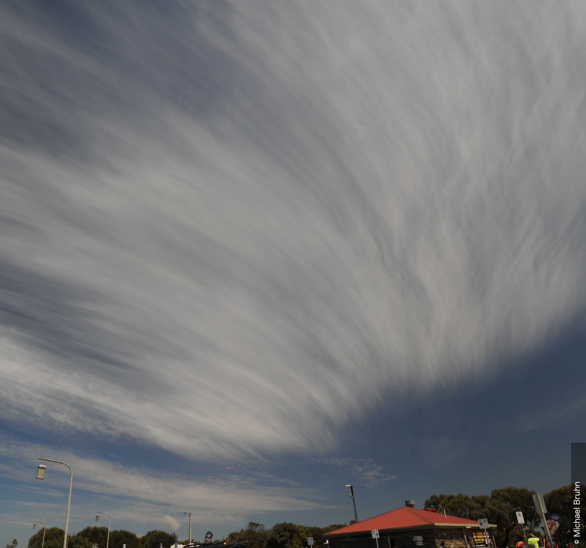
  
<strong>巻雲 毛状雲および巻雲 鈎状雲の厚い層</strong> 
  この巻雲 毛状雲の厚い層はその場で発達した。繊維は画像の左側ではほぼ直線状であるが、右側に向かうにつれて不規則に湾曲し、もつれている。巻雲は厚みを増し始めていたが、繊維が非常に明確であり、灰色がかって見えるほど十分に密度が高くないため、濃密雲（spissatus）とは識別されない。種が鈎状雲（uncinus）である房状の巻雲が風下側の縁で発達しており、地平線上にある高積雲の小さな塊から短命の氷晶の尾流雲（virga）が形成されていた。

### 巻雲 鈎状雲 (Ci unc) - Maze 1889(Section 2.3.1.2.2)
灰色の部分を持たない巻雲で、しばしばコンマのような形をしており、上部が鉤状または房状で終わっており、その上部は隆起（丸みを帯びた突起）の形をしていない。

  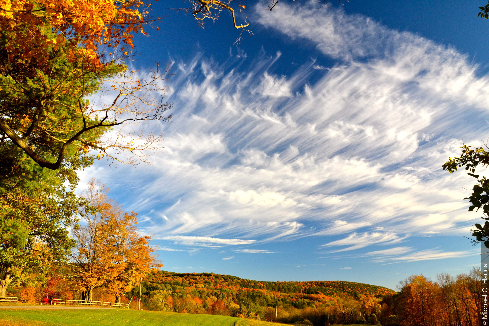
  
<strong>巻雲 鈎状雲、房状雲、塔状雲、毛状雲および濃密雲</strong> 
  この非常に素晴らしい画像は、同じ空に5つの種の巻雲を捉えている。主な種は鈎状雲（uncinus）であり、繊維はしばしばコンマのような形をしており、上部が鉤状または房状で終わっているが、丸みを帯びた隆起の形ではない。 
  その他の種は順不同で以下の通りである: 
  毛状雲（fibratus）は右下に数本の繊維がある。塔状雲（castellanus）は地平線の中央左に孤立した線として存在している。房状雲（floccus）は複数の場所、特にこことここに見られる。最後に濃密雲（spissatus）は、右端近くに絹のような光沢を持ついくつかの塊として存在する。 
  この巻雲は、西に900 km離れた場所に接近している寒冷前線の最初の目に見える兆候であった。しかし、この巻雲はその場で発達し、風上の地平線まで広がっていなかったため、侵入中（invading）とは分類されない。 
  巻雲は北東に晴れ上がり、4〜6時間後には前線の雲の帯の先端が西の地平線に現れた。10月13日の早朝、この地域で小雨が観測された。 

### 巻雲 濃密雲 (Ci spi) - CCH 1953(Section 2.3.1.2.3)
斑状の巻雲で、太陽の方向を見たときに灰色がかって見えるほど十分に密度が高いもの。また、太陽を覆い隠したり、その輪郭をぼやかしたり、あるいは完全に見えなくすることもある。巻雲 濃密雲はしばしば積乱雲の上部から生じる。

  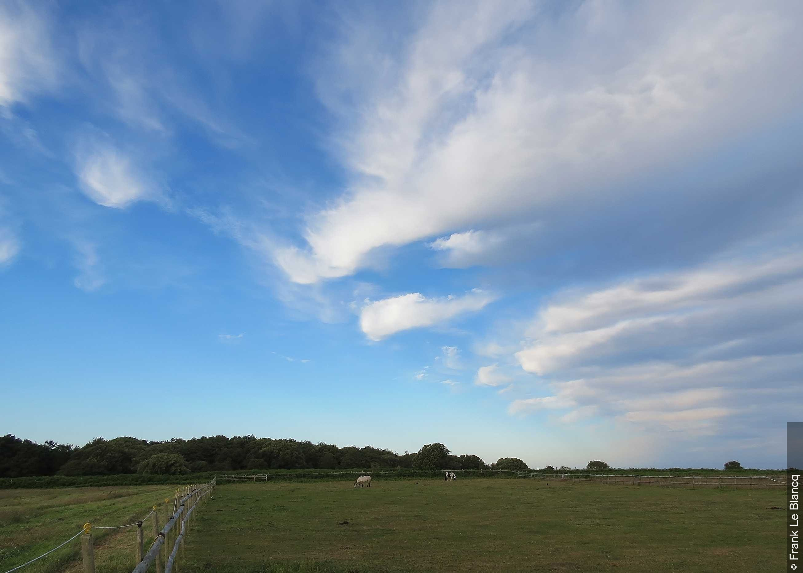
  
<strong>巻雲 濃密雲 乳房雲および巻雲 房状雲</strong> 
  地上の寒冷前線通過後の巻雲 濃密雲の密集した塊。これらの塊は上層の風に対して横方向に並んでおり、対流による発達の兆候も示していることから、その高度における不安定性が示唆される。これは、尾を引く巻雲 房状雲の特徴的な塊や、発達初期段階の巻雲 房状雲によって確認される。いくつかの不明瞭な乳房雲（mamma）がその状況を完全に物語っている。

### 巻雲 塔状雲 (Ci cas) - CCH 1953(Section 2.3.1.2.4)
共通の底面から立ち上がる小さな丸みを帯びた繊維状の塔や塊の形をしたかなり密度の高い巻雲で、時として城壁（crenellated）のような外観を持つ。水平線から30度以上の角度で観測した場合、塔のような隆起の見かけの幅は1度より小さいことも大きいこともある。幅が1度未満である巻積雲 塔状雲とは明確に区別される。

  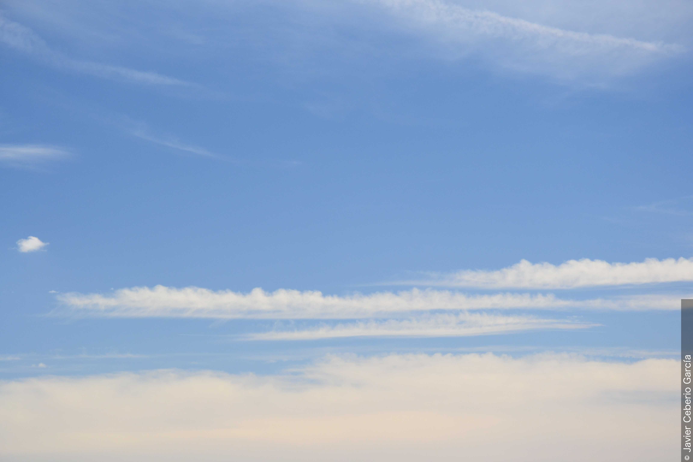
  
<strong>巻雲 塔状雲</strong> 
  この画像は、1と2の位置に共通の底面から伸びる小さな丸みを帯びた塔または城壁のような部分を持つ巻雲を示しており、これにより種が塔状雲（castellanus）であることが識別される。色は白いが、高積雲 塔状雲とは異なり、陰影や影を持たない。画像の下部には巻層雲 霧状雲のベールが見られるが、明確な詳細はない。4と5の位置に2つの航空機の飛行機雲（condensation trails）が見える。どちらも非常に高くて細かな巻雲および巻層雲の中にある。

### 巻雲 房状雲 (Ci flo) - Vincent 1903, CEN 1930(Section 2.3.1.2.5)
多かれ少なかれ孤立した、小さく丸みを帯びた房状の形をした巻雲で、しばしば尾を引く。水平線から30度以上の角度で観測した場合、房の見かけの幅は1度より小さいことも大きいこともある。幅が1度未満である巻積雲 塔状雲とは明確に区別される。

  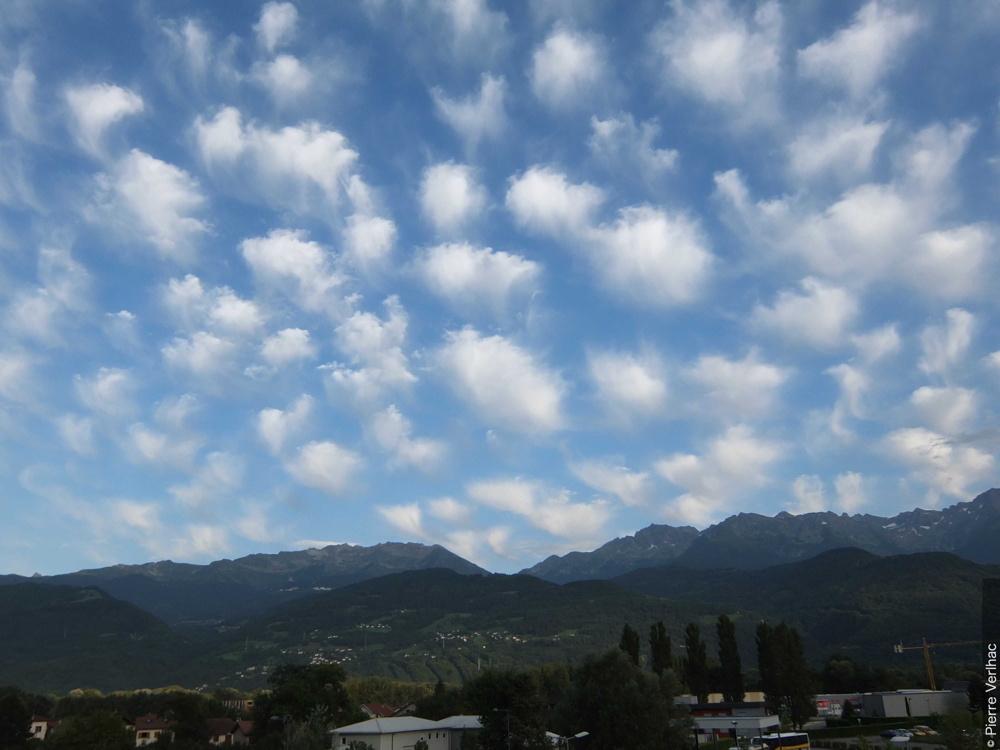
  
<strong>巻雲 房状雲</strong> 
  この写真は、キャンバス上の画家の筆のタッチに似た、分離された丸みを帯びた巻雲の房の優れた例を示しており、これにより巻雲 房状雲と同定される。房状の雲の下にはしばしば尾流が存在する。

## 変種(Section 2.3.1.3)

### 巻雲 もつれ雲 (Ci in) - CCH 1953(Section 2.3.1.3.1)
繊維が非常に不規則に湾曲しており、しばしば不規則な形で絡み合っているように見える巻雲。

  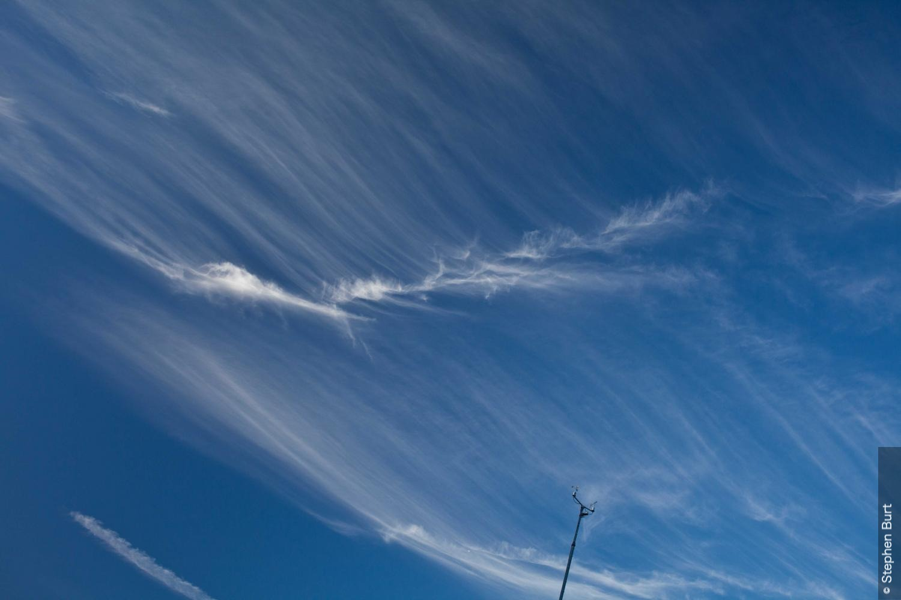
  
<strong>巻雲 毛状雲、増加中</strong> 
  晴れて暖かい午後の後、1と2の巻雲 毛状雲が閉塞前線に先行して西から空全体に急速に広がった。中央には変種であるもつれ雲（intortus）の密集して絡み合った繊維が見られ、画像の左下には航空機の飛行機雲が見える。

### 巻雲 放射状雲 (Ci ra) - CEN 1926(Section 2.3.1.3.2)
平行な帯状に配置された巻雲で、遠近法の効果により、地平線の一点または反対側の二点に向かって収束しているように見えるもの。これらの帯はしばしば部分的に巻積雲や巻層雲で構成される。

  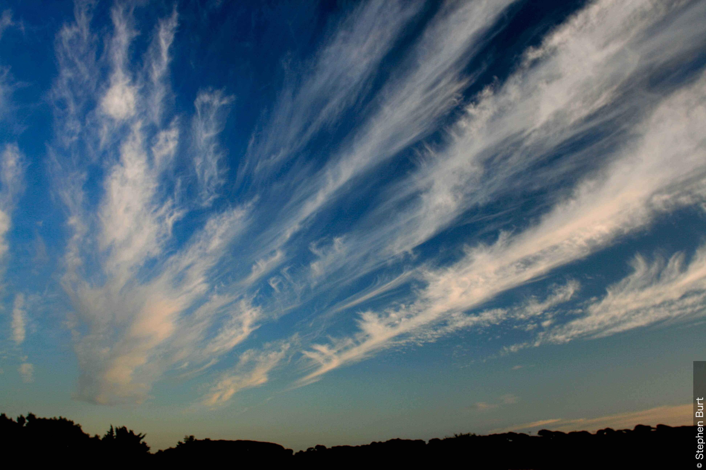
  
<strong>巻雲 濃密雲 放射状雲、巻雲 鈎状雲 放射状雲、巻雲 房状雲および巻積雲 房状雲</strong> 
  この画像は、巻積雲 房状雲が巻雲 鈎状雲へと発達し、それが部分的に巻雲 濃密雲へと融合している様子を示している。巻雲 房状雲の要素もいくつか存在する。南南西の強風により巻雲が平行な帯状に配置され、地平線の一点に収束しているように見えるため、巻雲 鈎状雲と濃密雲は変種の放射状雲（radiatus）である。

### 巻雲 肋骨雲 (Ci ve) - Maze 1889, Osthoff 1905(Section 2.3.1.3.3)
雲の要素が、脊椎、肋骨、または魚の骨格を思わせるように配置されている巻雲。

  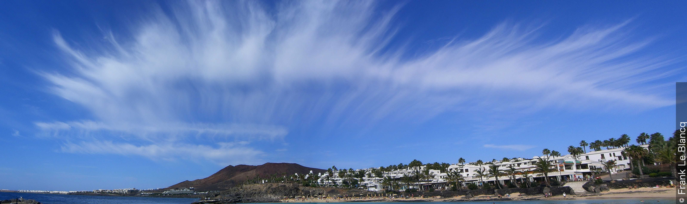
  
<strong>巻雲 毛状雲 肋骨雲</strong> 
  要素が魚の骨格に似ている巻雲 毛状雲 変種 肋骨雲の優れた例。飛行機雲は見られなかった。地上の風は約5 ktの東風であった。スペインのカナリア諸島テネリフェ島にある最寄りの高層気象観測所のデータから推定すると、巻雲の高度における風は約320度から25 ktであった。1 030 hPaの高気圧がマドリード付近を中心としていた。

### 巻雲 二重雲 (Ci du) - Maze 1889(Section 2.3.1.3.4)
わずかに異なる高度で重なり合った層状に配置された巻雲で、時折所々で融合している。巻雲 毛状雲および巻雲 鈎状雲の大部分はこの変種に属する。

  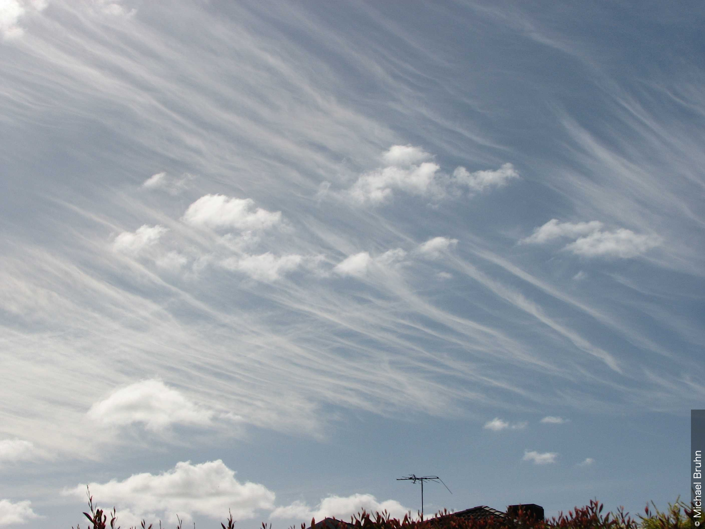
  
<strong>巻雲 毛状雲 二重雲、積雲 扁平雲および断片雲</strong> 
  これは2つの層になった種が毛状雲の巻雲（ほぼ直線状または多かれ少なかれ不規則に湾曲した繊維によって示される）である。下層の優勢な層は東西に並んでおり、上層は南北に並んでいる。晴天の積雲 断片雲および積雲 扁平雲も存在する。

## 部分的な特徴および付随雲(Section 2.3.1.4)
巻雲は、通常は種が濃密雲であり、時折乳房雲やKH波雲（fluctus）を示すことがある。

  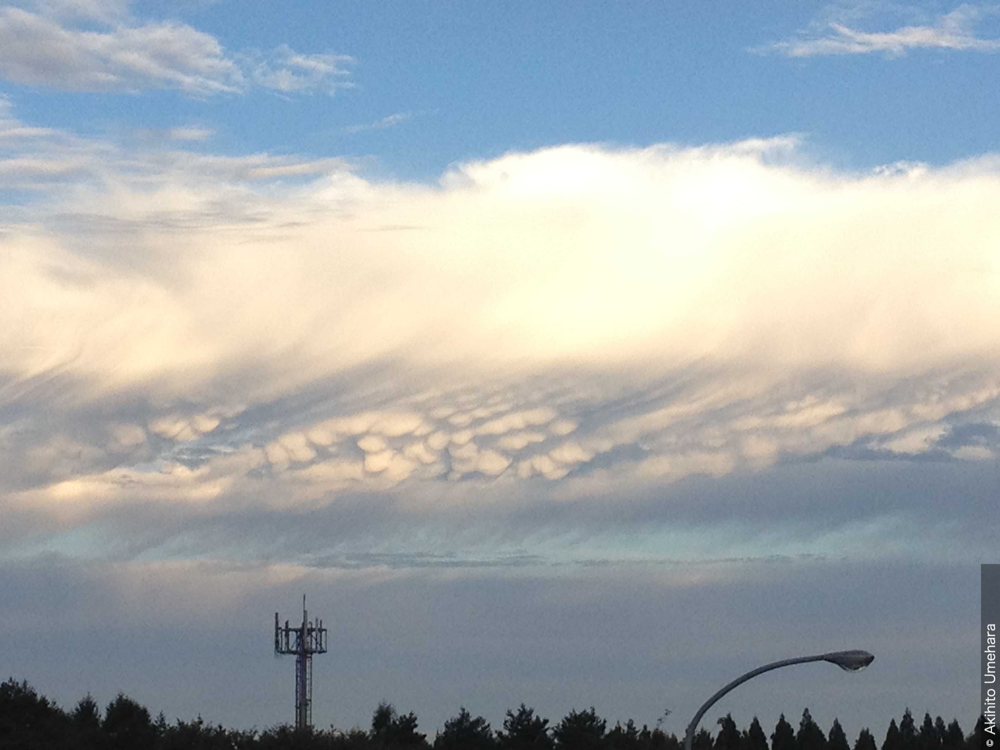
  
<strong>巻雲 濃密雲 乳房雲</strong> 
  これは乳房雲を伴う非常に厚く密度が高い大きな巻雲 濃密雲の塊の際立った例である。巻雲の観測は、巻雲状の上部、氷晶の筋、陰影（厚い濃密雲に共通の特徴）、そして近くの高層気象観測が7 000 mの雲を示していることによって確認される。  後縁には氷晶の尾流が見られる。この巻雲は積乱雲の上部の残骸のように見えるが、この地域に積乱雲の活動はなかった。また、多数の小さな薄い高積雲の塊も存在している。

  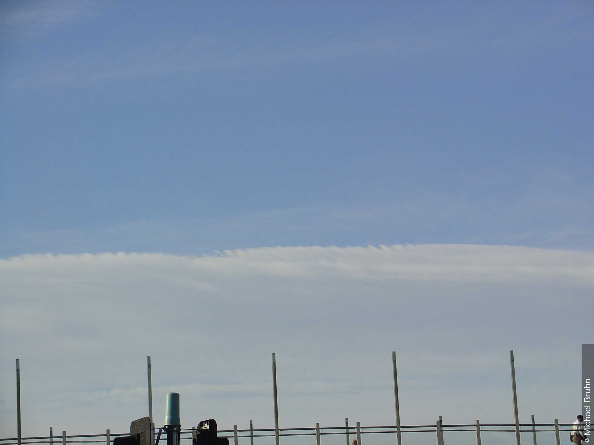
  
<strong>巻雲 濃密雲 KH波雲</strong> 
  この写真では、広範囲にわたるかなり密度の高い白みがかった雲の塊の形をした巻雲が主に見られ、これにより種が濃密雲であると同定される。太陽の方向を見ると、濃密雲は灰色がかって見え、太陽を完全に見えなくするほど密度が高いこともある。雲の上縁に沿って、部分的な特徴であるKH波雲（fluctus）が見られる。KH波雲は通常、雲の上面に見られる短命の波の形成であり、カールや砕波の形をしている。これは「ケルビン・ヘルムホルツ波」としても知られているが、この画像では特に顕著には発達していない。

## 巻雲が形成されうる雲(Section 2.3.1.5)
巻雲はしばしば以下から発達する:

- 巻積雲の尾流雲 (Ci cirrocumulogenitus)
- 高積雲の尾流雲 ( Ci altocumulogenitus)
- 積乱雲の上部 (Ci cumulonimbogenitus)

巻雲はまた、不均一な巻層雲の薄い部分が蒸発することによる変形の結果として形成されることもある（Ci cirrostratomutatus）。

  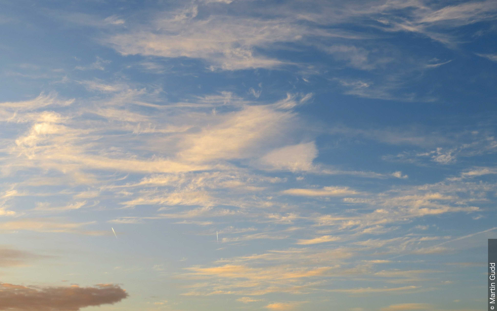
  
<strong>巻雲 鈎状雲 巻積雲起源、巻積雲 塔状雲 波状雲および尾流雲を伴う房状雲</strong> 
  ここでは巻積雲と巻雲が、混然とした空模様のようにも見える中の2つの主要な雲形である。共通の底面から立ち上がる鋸歯状の非常に小さな塔は巻積雲 塔状雲である。これらの底面は部分的に平行な線状に配置されており、変種である波状雲（undulatus）を示唆しており、これは巻雲状の雲の推定高度における東風の観測によって裏付けられている。一部の場所では、巻積雲 塔状雲の底面が氷晶の尾流雲によって消散したところから巻積雲 房状雲が発達している。巻積雲 房状雲は徐々に鉤状のコンマ（巻雲 鈎状雲）へと発達している。画像の上部には不規則に湾曲した繊維（巻雲 毛状雲）もある。要約すると、巻積雲よりも巻雲 鈎状雲および毛状雲の方が多く存在しているため、CH = 1とコード化される。  高積雲の塊も存在し、6、7、8の位置に少なくとも4つの飛行機雲が見られる。場所は暖気の中にあり、非常に弱い短波の上部対流圏気圧の谷の影響下にあった。

  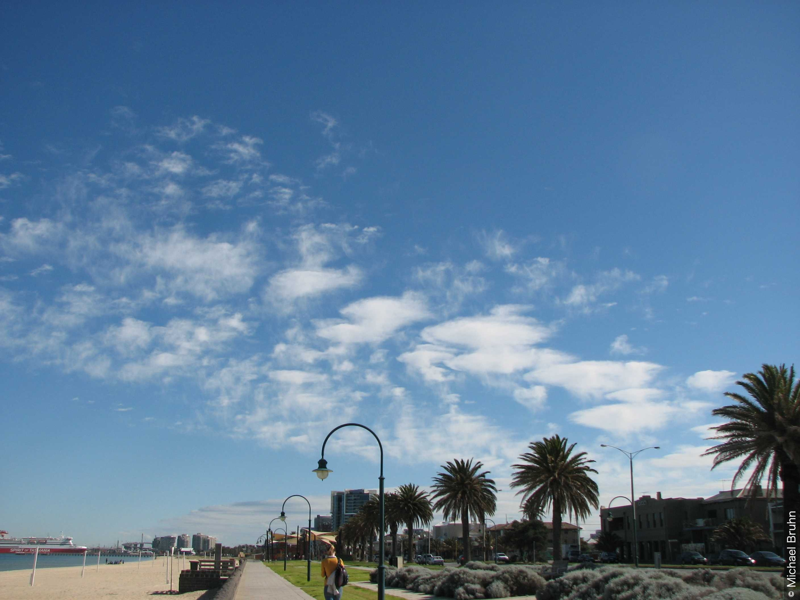
  
<strong>巻雲 房状雲 高積雲起源</strong> 
  ぼろぼろの下部と繊維状の尾流（氷晶の尾流雲）により、これらの大きな房は種が房状雲であると同定される。房状雲は、左側の繊維状の外観、中央左の繊維状の外観と乳白色の光沢、そして右側の乳白色の光沢によって証明されるように、高積雲から巻雲へと変化（水滴が全体的に凍結）した。  地平線上にある遠ざかる高積雲の層は巻雲 房状雲と同じ高度にある。時折、同じ空で高積雲よりも低い雲底を持つ巻雲 房状雲 高積雲変形（altocumulomutatus）が観測されることがある。  全天の観測では、スピリット・オブ・タスマニア（Spirit of Tasmania）の右側に1つか2つの積雲 扁平雲のセルが検出される。

  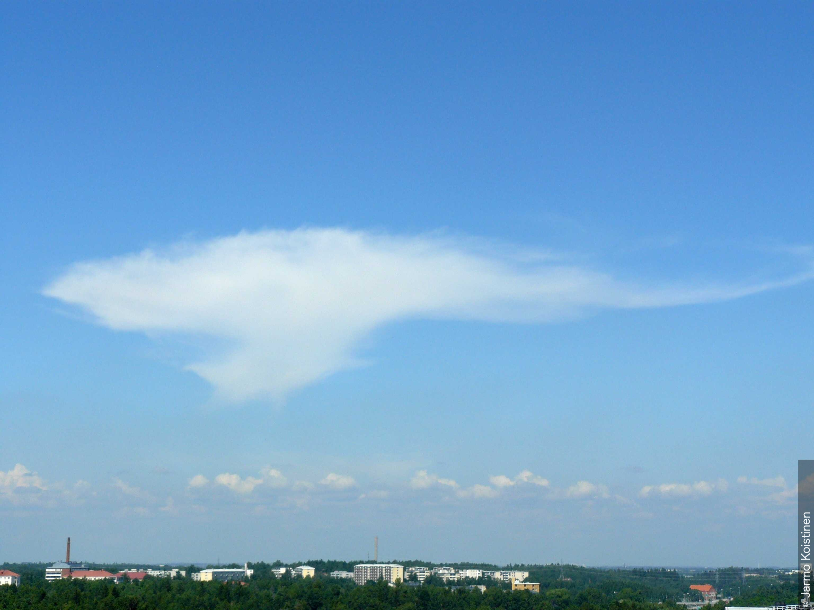
  
<strong>巻雲 濃密雲 積乱雲起源および積雲 並雲</strong> 
  依然としてかなとこ状であるこの巻雲 濃密雲 積乱雲起源は、約45分前の小さく孤立した積乱雲 多毛雲 かなとこ雲の残骸である。  主に種が並雲である積雲が、この雲の観測を完全なものにしている。  これは拡大図である。詳細については付属の画像を参照のこと。

## 巻雲と他の類の類似した雲との主な違い(Section 2.3.1.6)

### Ci（巻雲）とCc（巻積雲）の比較(Section 2.3.1.6.1)
巻雲は以下の点で巻積雲と区別される:

- 主に繊維状または絹のような光沢のある外観
- 粒やさざ波などの形をした小さな雲の要素がないこと
- 光冠や彩雲がないこと
- 厚い巻雲では陰影が生じる可能性があるが、巻積雲では陰影がないこと
- 尾流雲がないこと

### Ci（巻雲）とCs（巻層雲）の比較(Section 2.3.1.6.2)
巻雲は以下の点で巻層雲と区別される:

- 不連続な構造、または斑状や帯状である場合、その連続部分の水平方向の広がりが小さいか狭いこと
- 時には太陽や月を覆い隠すほど厚くなること（巻層雲は常に太陽や月の円盤が見えるほど薄い）
- 波打ち（起伏）がないこと
- 可能性のある乳房雲（通常は種が濃密雲の場合）
- 光冠がないこと
- 多くても部分的な円形のハロしか持たないこと

地平線付近の巻雲は、遠近法の効果により巻層雲と区別するのが難しい場合がある。

### Ci（巻雲）とAc（高積雲）の比較(Section 2.3.1.6.3)
巻雲は以下の点で高積雲と区別される:

- 主に繊維状または絹のような光沢のある外観
- 薄層やロール状などの形をした雲の要素がないこと
- 通常はいかなる陰影もなく、種が濃密雲の場合のみ部分的な陰影があること
- 波打ち（起伏）がないこと
- 尾流雲がないこと
- 光冠がないこと

### Ci（巻雲）とAs（高層雲）の比較(Section 2.3.1.6.4)
厚い巻雲は、以下の点で高層雲の塊と区別される:

- 水平方向の広がりがより小さいこと
- 大部分が白い外観
- 降水や尾流雲がないこと
- 波打ち（起伏）がないこと

## 物理的構成(Section 2.3.1.7)
巻雲はほぼ完全に氷晶で構成されている。これらの結晶は一般的に非常に小さく、まばらであることと相まって、ほとんどの巻雲の透明性を説明している。

密集した巻雲の塊や房状の巻雲には、かなりの終端速度を得るのに十分な大きさの氷晶が含まれることがある。巻雲の底からは、かなりの垂直的な広がりを持つ尾流が落下する。

まれに、尾流内の氷晶が溶けて小さな水滴になることがある。その際、尾流は通常の白い外観とは対照的に灰色がかる。虹が形成されることもある。

尾流は、ウインドシアや構成粒子の大きさのばらつきの結果として不規則に曲がったり傾いたりする。その結果、地平線付近の巻雲の繊維は地平線と平行には見えない。

ハロ現象が発生することがある。巻雲は幅が狭いため、円形のハロが完全な環を示すことはほとんどない。

## 説明的注釈および特殊な雲(Section 2.3.1.8)
上部が丸みを帯びた巻雲の房は、晴天の空で形成されることが多い。房の下に繊維状の尾流が現れることがあり、その際、上部の丸みは徐々に失われる。その後、房は完全に消滅することもある。その場合、雲は繊維状（種が毛状雲または鈎状雲）の形になる。

繊維状の形をした巻雲は、巻雲の密集した塊、高積雲 塔状雲および房状雲、また極めて低い温度では積雲 雄大雲から発達することもある。

巻雲は、少なくとも10分間持続した航空機の飛行機雲（Ci homogenitus：巻雲 人工起源雲）から形成されることもある。新しく、あるいは最近形成された航空機の飛行機雲は通常、急速に状態が変化し、様々な一時的な形状を示すため、巻雲 人工起源雲には種、変種、または部分的な特徴は識別されない。

持続する飛行機雲（Ci homogenitus）は、時間とともに、そして強い上層の風の影響を受けて、巻雲の種および/または変種の形をとることがある。これが起こる場合、その巻雲は関連する種および変種の後に「homomutatus（人工変形雲）」を付けて識別される（例えば、巻雲 人工変形雲）。

色
日中のいつでも、地平線に近すぎない巻雲は白く、空の同じ部分にある他のどの雲よりも白い。

太陽が地平線上にあるとき、巻雲は白みを帯びているが、より低い雲は黄色やオレンジ色に色づいている場合がある。

太陽が地平線の下に沈むと、空高くにある巻雲は黄色、次にピンク色、赤色、そして最後に灰色になる。この色の順序は夜明けには逆になる。

地平線付近の巻雲は、雲から観測者に光が届く際に通過する空気の層が非常に厚いため、しばしば黄色みを帯びたり、オレンジ色に色づいたりする。これらの色合いは、下層および中層の雲ではそれほど目立たない。

## 検索画像ギャラリーから

  
  
<strong>巻雲 毛状雲 もつれ雲、巻雲 濃密雲および高積雲</strong> 
  巻雲 毛状雲の非常に不規則に湾曲した白い繊維がこの画像を支配している。繊維は、変種であるもつれ雲（intortus）の軽度な形態を示唆するほど十分に不規則に湾曲し、絡み合っている。巻雲 毛状雲は巻雲 房状雲から発達したように見え、地平線低くにその要素がいくつか見られる。また、巻雲 塔状雲の小さな線、高積雲の薄い層、そして地平線上に2つの飛行機雲がある。イギリス諸島の南西に低気圧があり、イングランド（イギリス）に気圧の谷が伸びていたため、この日はイングランド南西部で俄雨が降り、朝には雷雨と広範囲にわたる対流雲が見られた。極端な沿岸地域は午後もほとんど晴れたままであった。

  
  
<strong>巻雲 毛状雲 二重雲、鈎状雲、濃密雲および房状雲</strong> 
  この画像には巻雲の4つの種と1つの変種が示されている。この日に発達した順に種を挙げると、房状雲、鈎状雲、毛状雲、濃密雲である。変種は二重雲（duplicatus）である。  
  丸みを帯びた隆起（積雲状の上部）は、1と2で種が房状雲であることを示している。発達の次の段階では、丸みを帯びた隆起が消散し始め、房状へと移行する。これはここに示されるような種である鈎状雲の始まりに特徴的である。この段階の後、鈎状雲の房は消散し、上部が鉤状で終わるコンマ形を残す。珍しいことに、この画像にはこの段階の明確な鈎状雲の例はない。次に、風が鉤状を不規則に湾曲した、あるいはほぼ直線状の繊維（種は毛状雲）へと歪める。時間の経過とともに、毛状雲は密集した塊（種は濃密雲）へと融合する。  
  変種である二重雲（duplicatus）は、巻雲が2つの異なる高度に配置されていることを示すために使用される。上層は、細かく、ほぼ直線状またはわずかに湾曲した繊維（巻雲 毛状雲）で構成されている。  
  種が鈎状雲および毛状雲の巻雲が優勢であるため、CH = 1とコード化される。

  
  
<strong>巻雲 毛状雲 放射状雲および積雲 扁平雲</strong> 
  この画像の主な特徴は、観測された上空の北西風と平行に、北西から南東に並ぶ巻雲 毛状雲の長い帯である。個々の毛状雲の繊維は風に対して横方向にある。それらは脊椎、肋骨、または魚の骨格を思わせるように配置された外観を持つ。これは変種である肋骨雲（vertebratus）である。  
  衛星画像では、この巻雲 毛状雲 肋骨雲の帯は長さが900 kmを超えている。この画像にはさらに小さな帯もいくつか存在し、すべての帯が地平線の一点に向かって収束しているように見える。これは部分的な特徴である放射状雲（radiatus）である。  
  積雲 扁平雲も存在し、複数の飛行機雲も（6と7に）見られる。

  
  
<strong>巻雲 鈎状雲</strong> 
  これは、通常の横からや斜めからの視点ではなく、ほぼ真下から見た巻雲の種である鈎状雲の珍しい例である。  
  雲は白く、コンマのような形をしており、上部が鉤状または房状で終わっており、その上部は丸みを帯びた隆起の形をしていない。上部が丸みを帯びた隆起の形で終わっている場合、それは巻雲 房状雲と同定される。

  
  
<strong>巻雲 毛状雲および房状雲</strong> 
  非常に高くて細かな巻雲 毛状雲のほぼ直線状の繊維がこの画像を支配している。不明瞭な巻雲 房状雲が右上の角で消散している。晴天の積雲 断片雲が右下に1つ隠れようとしている。

  
  
<strong>巻雲 鈎状雲 巻積雲起源および巻積雲 房状雲</strong> 
  この画像で優勢な雲は巻雲 鈎状雲である。この鈎状雲は白く、コンマの形をしており、上部が鉤状または房状で終わっており、その上部は丸みを帯びた隆起の形ではない。  
  また、巻雲 鈎状雲の発達元である巻積雲 房状雲も存在する。巻積雲 房状雲は、非常に小さな要素からなるいくつかの薄く白い塊として明らかであり、そのうちのいくつかの下部はぼろぼろになっている。  
  風が鈎状雲のコンマ形を不規則に湾曲した、あるいはほぼ直線状の繊維へと歪めたところでは、巻雲 毛状雲も発達している。

  
  
<strong>巻雲 濃密雲および毛状雲と部分的な22°の太陽ハロ</strong> 
  この画像の注目すべき特徴は、巻雲 濃密雲および巻雲 毛状雲に発生している部分的な22°ハロである。巻雲 濃密雲は厚みを増し始めているが、太陽の方向を見たときに灰色がかって見えるほどまだ厚くはない。毛状雲の繊維は不規則に湾曲しているかほぼ直線状であり、白く、繊維状（髪の毛のような）の外観よりも絹のような光沢を持っている。5と6の位置には複数の飛行機雲も見られる。

  
  
<strong>巻雲 毛状雲 肋骨雲 二重雲および積雲 扁平雲</strong> 
  巻雲 毛状雲の2つの層が見られる。下層は、写真の上部にあるわずかに絡み合った不規則に湾曲した繊維と、繊維が魚の骨格の片側を思わせるように配置された線で構成されている。後者は変種である肋骨雲（vertebratus）である。上層は、ほぼ直線状およびいくつかの不規則に湾曲した繊維で構成されている。複数の巻雲の層の存在は、変種である二重雲（duplicatus）を示している。下部の離れた、陰影のある底面を持つ丸みを帯びたセルは積雲 扁平雲である。それらは垂直方向の広がりが小さいが、平らに押し潰されたようには見えない。さらに垂直方向に発達すれば、そのいくつかは積雲 並雲になる可能性がある。

  
  
<strong>巻雲 鈎状雲、巻雲 房状雲および巻積雲 房状雲</strong> 
  これは乳白色の光沢を持つ巻雲の際立った例である。種が房状雲および鈎状雲の巻雲が存在し、鈎状雲が融合している箇所では種が濃密雲へと発達している証拠がある。左側の屋根の後ろと上にあるさらに小さな雲の要素は、巻積雲 房状雲となるほど十分に小さい。また、それらは巻積雲 房状雲の特徴であるぼろぼろの底面も持っている。巻雲 鈎状雲が空を支配しているため、CH = 1とコード化される。

  
  
<strong>巻雲 塔状雲および高積雲</strong> 
  この画像は、雲全体の氷結化を通じて高積雲 塔状雲から発達した、孤立した密度の高い巻雲 塔状雲 高積雲起源を示している。したがって、雲の共通の底面は完全な水平ではなく、短く尾流のような隆起を含んでいる。この雲の履歴から、その高度は巻雲としては異常に低いと推測できる。巻雲 毛状雲の薄い層が観測者の近くに存在する。これは、画像の上部に存在し、観測者の後ろや横の空に広く広がっているが画像には見えない、前線性高積雲 層状雲 半透明雲の後縁の氷結化によって生成されたものである。撮影場所の北北東30 kmにある雲高計で測定された中層雲の高度は、それぞれのゾンデの気温とあまりよく一致していない。雲高計による450〜800 mの高さの積雲は、大部分がぼろぼろの積雲 断片雲であるが、背景のいくつかの白みがかった雲はより密度が高く、積雲 並雲のように見える。

  
  
<strong>巻雲 濃密雲</strong> 
  この写真は、弱まり衰退しつつある温暖前線から生じた、広範囲にわたる美しい密集した巻雲（種は濃密雲）の束を示している。  

  
  
<strong>巻雲 濃密雲 乳房雲を伴う</strong> 
  巻雲は、白く繊細な毛状、あるいは白またはほとんど白い斑状や細い帯状の形をした離れた雲である。これらは繊維状（髪の毛のような）の外観、または絹のような光沢、あるいはその両方を持つ。この印象的な画像では、巻雲は滑らかな表面を持つ厚い塊になっており、太陽の方向を見たときに灰色がかって見えるほど十分に密度が高く、これにより種が濃密雲であると同定される。この塊は太陽を覆い隠したり、その輪郭をぼやかしたり、あるいは完全に見えなくすることもある。注目すべきは、2と3に見られる、雲の底面に乳房のような垂れ下がった隆起を持つ、小さいがはっきりとした2つの領域である。これらは部分的な特徴である乳房雲（mamma）である。

