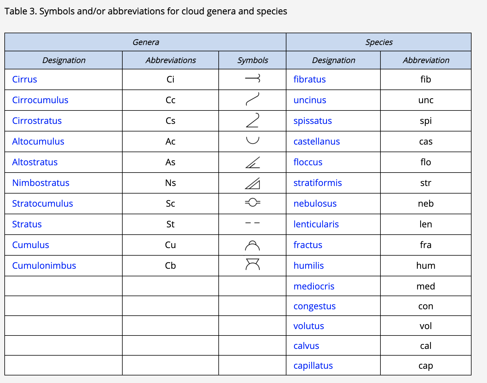
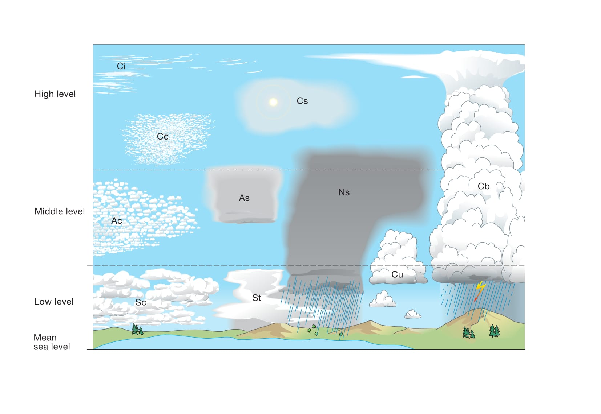

# 雲の分類の導入と原則(セクション2.1)

## 目次

- [雲の定義(セクション2.1.1)](#雲の定義セクション211)
- [雲の外観(セクション2.1.2)](#雲の外観セクション212)
  - [輝度(セクション2.1.2.1)](#輝度セクション2121)
  - [色(セクション2.1.2.2)](#色セクション2122)
- [雲の分類の原則と定義(セクション2.1.3)](#雲の分類の原則と定義セクション213)
  - [類](#類)
  - [種(セクション2.1.3.2)](#種セクション2132)
  - [変種(セクション2.1.3.3)](#変種セクション2133)
  - [部分的な特徴(セクション2.1.3.4)](#部分的な特徴セクション2134)
  - [付随雲(セクション2.1.3.5)](#付随雲セクション2135)
  - [母雲(セクション2.1.3.6)](#母雲セクション2136)
  - [特殊な雲(セクション2.1.3.7)](#特殊な雲セクション2137)
- [雲の分類の要約(セクション2.1.4)](#雲の分類の要約セクション214)
- [雲の略語と記号(セクション2.1.5)](#雲の略語と記号セクション215)
- [役立つ概念](#役立つ概念)
  - [高さ、高度、垂直方向の広がり(セクション2.2.1.1)](#高さ高度垂直方向の広がりセクション2211)
  - [層（レベル）(セクション2.2.1.2)](#層レベルセクション2212)

## 雲の定義(セクション2.1.1)
雲とは、大気中に浮遊し、通常は地面に接していない、微小な液体の水や氷、あるいはその両方の粒子からなる水象である。また、より大きな液体の水や氷の粒子のほか、煙霧、煙、あるいは塵などに含まれるような非水系の液体や固体の粒子が含まれることもある。

## 雲の外観(セクション2.1.2)
雲の外観は、その寸法、形状、構造、きめ（テクスチャ）、輝度、および色によって最もよく説明される。これらの要因について、以下に雲の特徴的な形態ごとに考察する。

### 輝度(セクション2.1.2.1)
雲を構成する粒子によって反射、散乱、透過される光が、雲の輝度を決定する。この光は、大部分が発光体（太陽、月、または星）または空から直接届く；また、地球の表面から届くこともあり、氷原、雪原、または水域が太陽光や月光を反射する場合に特に強くなる。

雲の輝度は、介在する煙霧によって変化することがある。観測者と雲の間に煙霧が存在する場合、その厚さや入射光の方向に応じて、雲の輝度を低下させることもあれば、増加させることもある。また、煙霧は雲の形状、構造、きめを明らかにするコントラストを低下させる。輝度は、暈（ハロ）、虹、光冠（コロナ）、光輪（グローリー）などの光象によっても変化することがある。

日中、雲の輝度は十分に高いため、容易に観測できる。月明かりのある夜、月が半月より大きい場合、雲は視認できる。月が欠けて暗い時期には、特に雲が薄い場合、月から離れた雲を照らし出すほどの明るさはない。月のない夜、雲は一般に見えない；しかしながら、星（地平線に近い星は煙霧によって隠れることがある点に留意）、極光（オーロラ）、黄道光などが隠されることから、その存在が推測されることがある。

十分な強さの人工照明がある地域では、夜間でも雲が見える。大都市の上空では、下方からの直接照明によって雲が浮かび上がることがある。人工的に照明された雲層は、より低い位置にある雲の断片を際立たせる明るい背景となることがある。

わずかに不透明な雲が背後から照らされるとき、その輝度は発光体の方向で最大になる。輝度は発光体から離れるにつれて減少する；雲が薄いほど、減少は急速である。光学的厚さ（雲が光の通過を遮る度合いの尺度）がより大きい雲は、発光体からの距離による輝度の減少がわずかである。厚さと不透明度がさらに増すと、発光体の位置を特定することさえ不可能になる。太陽または月が密度の高い孤立した雲の背後にあるとき、その雲は明るく照らされた縁を持ち、その周囲に明るい筋と影の帯が交互に見えることがある。

雲層の光学的厚さは、層の一部と別の部分で異なることが多いため、発光体は雲の特定の部分を通しては知覚できるが、別の部分を通しては知覚できないことがある。雲層の様々な光学的厚さと輝度は、特に太陽や月から短い角距離にある場合、雲の動きによって時間とともに大きく変化する可能性がある。

均一で十分に不透明な雲層の場合、発光体が天頂からあまり離れていないときは知覚できるかもしれないが、地平線に近いときは完全に隠されることがある。十分に不透明な雲層は、太陽や月の高度が低いときに、天頂で最大の輝度を示すことがある。

雲から観測者に反射される光は、雲が発光体の反対側にあるときに最大になる。輝度は、雲の密度と視線方向の厚さが大きいほど強くなる。十分に密度が高く深い場合、雲は多かれ少なかれ明確な起伏を示す灰色の陰影を現す；照明の方向が接線に近いほど、陰影の範囲は広くなる。

最後に、水滴で構成される雲と氷晶で構成される雲の間には、輝度に顕著な違いが存在する。氷晶の雲は、通常、その薄さと氷粒子のまばらさのため、水滴の雲よりも透明である。しかし、特定の氷晶の雲は厚い塊として発生し、氷粒子が高濃度になることがある。これらの雲が背後から照らされると、顕著な陰影を示す。しかし、反射光の下では輝くような白色となる。

### 色(セクション2.1.2.2)
すべての波長の光が雲によってほぼ等しく強く拡散されるため、雲の色は主に入射光の色に依存する。観測者と雲の間の煙霧は雲の色を変化させる可能性がある；例えば、遠くの雲を黄色、オレンジ色、または赤色に見せる傾向がある。雲の色は、特別な発光現象（光象）の影響も受ける。

太陽が地平線より十分に高いとき、主に太陽からの光を拡散する雲または雲の部分は白色または灰色である。主に青空から光を受け取る部分は青灰色である。太陽と空による照明が極めて弱いとき、雲はその下にある表面の色を帯びる傾向がある。

太陽が地平線に近づくにつれて、その色は黄色からオレンジ色、そして赤色へと変化することがある；太陽の近くの空と雲は、それに対応する着色を示す。空の青さと下層の表面の色は、依然として雲の色に影響を与える可能性がある。雲の色は、雲の高さ、観測者と太陽に対する相対的な位置によっても変化する。

太陽が地平線に近いとき、高い雲はほぼ白色に見えることがあるが、低い雲は強いオレンジ色または赤色の着色を示す。これらの色の違いにより、雲の相対的な高度を把握することができる（同じ高さの雲でも、太陽に向かって見る場合よりも太陽に背を向けて見る場合の方が赤みが少なく見えることに注意）。

太陽が地平線のすぐ上または地平線上にあるとき、雲の下面を赤く染めることがある；この表面が波打っている場合、その着色は明るい色（黄色がかった色または赤みがかった色合い）と暗い色（その他の色合い）が交互に並ぶ帯状に分布し、起伏をより明確にする。

太陽が地平線のすぐ下にあるとき、地球の影にある最も低い雲は灰色である；中層の雲はバラ色になり、非常に高い雲は白っぽくなることがある。

夜間、雲の輝度は通常弱すぎて色を識別できない；認識できるすべての雲は黒から灰色に見えるが、月に照らされた雲は白っぽく見える。特殊な照明（火災、大都市の明かり、極光など）は、特定の雲に多かれ少なかれ顕著な色を与えることがある。

## 雲の分類の原則と定義(セクション2.1.3)
雲は絶えず進化し、無限に多様な形態で現れる。しかし、世界中で頻繁に観測される特徴的な形態の数は限られており、それらを分類体系の中で大まかにグループ化することができる。この体系では、類 (Genera)、種 (Species)、変種 (Varieties) を使用する。これは植物や動物の分類で使用されるシステムに似ており、同様にラテン語名を使用する。

かなり頻繁に観測されるものの、分類体系には記述されていない中間的または過渡的な形態の雲が存在する。過渡的な形態はあまり重要ではない；それらは安定性に欠け、外観も特徴的な形態の定義と大きく異なることはない。

さらに、「特殊な雲」と「超高層雲」という2つの追加の雲分類がある。これらはまれにしか、あるいは時折しか観測されず、場合によっては世界の特定の地域でしか観測されない傾向がある。

### 類
雲の分類には、類 (Genera) と呼ばれる10の主要なグループがある。観測されたそれぞれの雲は、いずれか1つの類にのみ属する。

雲の最も典型的な形態を考慮すると、10の類が認識される。以下に示す類の定義は、考えられるすべての側面を網羅しているわけではなく、主要なタイプの記述と、与えられた類を外観がいくらか似ている類から区別するために必要な本質的な特徴に限定されている。

#### 巻雲
白く繊細な筋状、あるいは白または主に白色のパッチ状や細い帯状の形をした、離れ離れの雲。これらの雲は、繊維状（髪の毛のような）の外観、または絹のような光沢、あるいはその両方を持っている。

#### 巻積雲
陰影のない薄く白いパッチ状、シート状、または層状の雲で、粒状、波紋状などの非常に小さな要素で構成され、融合しているか分離しているかを問わず、多かれ少なかれ規則的に配置されている；要素の大部分は視角が1°未満である。

#### 巻層雲
繊維状（髪の毛のような）または滑らかな外観を持つ、透明で白っぽい雲のベールで、空を部分的または完全に覆い、一般に暈（ハロ）現象を生じさせる。

#### 高積雲
白色または灰色、あるいはその両方の色をしたパッチ状、シート状、または層状の雲で、一般に陰影があり、薄層（ラミナ：単層または複数層）、丸みのある塊、ロール状などで構成され、これらは時として部分的に繊維状または拡散しており、融合していることもあればそうでないこともある；規則的に配置された小さな要素の大部分は、通常、視角が1°から5°の間である。

#### 高層雲
灰色がかった、または青色がかった雲のシートまたは層で、筋状（空気の流れに平行に配置された、雲の形成における溝や経路）、繊維状、または均一な外観を持ち、空を部分的または完全に覆い、すりガラスや曇りガラス越しのように少なくともおぼろげに太陽が透けて見えるほど薄い部分がある。高層雲は暈（ハロ）現象を示さない。

#### 乱層雲
灰色の雲層で、多くの場合暗く、多かれ少なかれ継続的に降る雨や雪によって外観がぼやけており、その降水はほとんどの場合地面に達する。太陽を完全に覆い隠すのに十分な厚さが全体にある。

この層の下には、低くちぎれた雲が頻繁に発生し、乱層雲と融合することもあればそうでないこともある。

#### 層積雲
灰色または白っぽい、あるいはその両方の色をしたパッチ状、シート状、または層状の雲で、ほぼ常に暗い部分があり、モザイク状、丸みのある塊、ロール状などで構成され、これらは非繊維状（尾流雲を除く）であり、融合していることもあればそうでないこともある；規則的に配置された小さな要素の大部分は、視角が5°を超えている。

#### 層雲
一般に灰色の雲層で、かなり均一な底面を持ち、霧雨、雪、または細氷を降らせることがある。太陽が雲を通して見えるとき、その輪郭ははっきりと識別できる。層雲は、非常に低い気温の場合を除いて、暈（ハロ）現象を生じさせない。

時に層雲は、ちぎれたパッチ状として現れることがある。

#### 積雲
一般に密度が高く、はっきりとした輪郭を持つ離れ離れの雲で、隆起した塚、ドーム、または塔の形で垂直に発達し、その膨らんだ上部はカリフラワーに似ていることが多い。これらの雲の太陽に照らされた部分は大部分がまばゆい白色である；その底面は比較的暗く、ほぼ水平である。

時に積雲はちぎれた形状になる。

#### 積乱雲
かなり垂直に発達した、山や巨大な塔のような形をした重く密度の高い雲。少なくともその上部の一部は通常滑らか、あるいは繊維状または筋状で、ほぼ常に平らになっている；この部分はしばしば、かなとこや巨大な羽毛の形に広がる。

この雲の底面の下は非常に暗いことが多く、そこに融合している、または融合していない低くちぎれた雲が頻繁に存在し、降水が尾流雲の形で降ることもある。

### 種(セクション2.1.3.2)
ほとんどの類は、雲の形や内部構造に基づいて種 (Species) に細分化される。空で観測され、特定の類として識別された雲は、1つの種の名前しか持つことができない。

ほとんどの雲の類は、雲の形状の特異性や内部構造の違いによって種に細分化されている。

ある特定の類に属する雲は、1つの種の名前しか持つことができない；これは、種が相互に排他的であることを意味する。その一方で、特定の種が複数の類に共通する場合もある。種の定義のいずれもその類に該当しない場合、種は示されない。

#### 毛状雲(セクション2.2.2.2.1)
離れ離れの雲、または薄い雲のベールで、ほぼ直線状、または多かれ少なかれ不規則に曲がったフィラメントで構成され、先端が鉤状または房状になっていないもの。

この用語は主に巻雲と巻層雲に適用される。

#### 鈎状雲(セクション2.2.2.2.2)
灰色の部分を持たない巻雲で、コンマのような形をしていることが多く、上部が鉤状、または房状で終わっており、その上部は丸い突起状ではない。

#### 濃密雲(セクション2.2.2.2.3)
パッチ状の巻雲で、太陽に向かって見たときに灰色がかって見えるほど十分に密度が高い；また、太陽をベールで覆ったり、輪郭をぼやかしたり、あるいは太陽を隠したりすることもある。濃密雲は多くの場合、積乱雲の上部から発生する。

#### 塔状雲(セクション2.2.2.2.4)
上部の少なくとも一部に、小塔や塔（銃眼状）の形をした積雲状の突起を示す雲で、その一部は幅よりも高さがあり、共通の底面で繋がっていて、列をなしているように見えるもの。塔状雲の特徴は、雲を横から見たときに特に顕著である。

この用語は、巻雲、巻積雲、高積雲、および層積雲に適用される。

#### 房状雲(セクション2.2.2.2.5)
それぞれの雲の単位が積雲状の外観を持つ小さな房であり、その下部が多かれ少なかれちぎれており、しばしば尾流雲を伴う種。

この用語は、巻雲、巻積雲、高積雲、および層積雲に適用される。

#### 層状雲(セクション2.2.2.2.6)
広大な水平のシートまたは層状に広がった雲。

この用語は、高積雲、層積雲、および時として巻積雲に適用される。

#### 霧状雲(セクション2.2.2.2.7)
明確な詳細を示さない、霧状の、または輪郭のはっきりしないベールや雲の層のような雲。

この用語は主に巻層雲と層雲に適用される。

#### レンズ雲(セクション2.2.2.2.8)
レンズやアーモンドの形をした雲で、非常に細長いことが多く、通常はっきりとした輪郭を持つ；これらは時折彩雲現象を示すことがある。このような雲は地形性の起源を持つ雲の形成に最もよく現れるが、明確な地形のない地域でも発生することがある。

この用語は主に巻積雲、高積雲、および層積雲に適用される。

#### ロール雲(セクション2.2.2.2.9)
長く、典型的には低い位置にある、水平で離れ離れのチューブ状の雲の塊で、水平軸を中心にゆっくりと回転しているように見えることが多い。ロール雲 (volutus) は、他の雲に付着していないソリトンであり、波状段波 (undular bore) の一例である。

この種は主に層積雲に適用され、まれに高積雲に適用される。

#### 断片雲(セクション2.2.2.2.10)
不規則な切れ端の形をした雲で、明らかにちぎれた外観を持つもの。

この用語は層雲と積雲のみに適用される。

#### 扁平雲(セクション2.2.2.2.11)
垂直方向への発達が小さく、全体的に平らに見えることが特徴の積雲。

#### 並雲(セクション2.2.2.2.12)
中程度の垂直方向の発達を持つ積雲で、頂部に小さな突起や芽吹きがあるもの。

#### 雄大雲(セクション2.2.2.2.13)
強く芽吹き、一般的にはっきりとした輪郭を持ち、多くの場合垂直方向に大きく発達した積雲。雄大雲の膨らんだ上部はカリフラワーに似ていることが多い。

#### 無毛雲(セクション2.2.2.2.14)
上部の突起の少なくとも一部が積雲状の輪郭を失い始めているが、巻雲状の部分はまだ識別できない積乱雲。突起や芽吹きは白っぽい塊を形成する傾向があり、多かれ少なかれ垂直の筋（空気の流れに平行に配置され、空気の流れを描写する雲の形成における溝や経路）を伴う。

#### 多毛雲(セクション2.2.2.2.15)
積乱雲で、主にその上部に、明らかに繊維状または筋状の構造を持つ明確な巻雲状の部分が存在することを特徴とし、かなとこ、羽毛、または多かれ少なかれ乱れた髪の毛の巨大な塊のような形をしていることが多い。多毛雲は通常、にわか雨や雷雨を伴い、しばしばスコールを伴い、時には雹を伴う；また、非常に明確な尾流雲を頻繁に生成する。

#### 種とそれが最も頻繁に発生する類の表(セクション2.2.2.2.16)

**表7. 雲の種とそれが最も頻繁に発生する類**

| 種 \ 類        | *Ci*  | *Cc*  | *Cs*  | *Ac*  | *As*  | *Ns*  | *Sc*  | *St*  | *Cu*  | *Cb*  |
| :------------- | :---: | :---: | :---: | :---: | :---: | :---: | :---: | :---: | :---: | :---: |
| 毛状雲 (fib)   |   ●   |       |   ●   |       |       |       |       |       |       |       |
| 鈎状雲 (unc)   |   ●   |       |       |       |       |       |       |       |       |       |
| 濃密雲 (spi)   |   ●   |       |       |       |       |       |       |       |       |       |
| 塔状雲 (cas)   |   ●   |   ●   |       |   ●   |       |       |   ●   |       |       |       |
| 房状雲 (flo)   |   ●   |   ●   |       |   ●   |       |       |   ●   |       |       |       |
| 層状雲 (str)   |       |   ●   |       |   ●   |       |       |   ●   |       |       |       |
| 霧状雲 (neb)   |       |       |   ●   |       |       |       |       |   ●   |       |       |
| レンズ雲 (len) |       |   ●   |       |   ●   |       |       |   ●   |       |       |       |
| ロール雲 (vol) |       |       |       |   ●   |       |       |   ●   |       |       |       |
| 断片雲 (fra)   |       |       |       |       |       |       |       |   ●   |   ●   |       |
| 扁平雲 (hum)   |       |       |       |       |       |       |       |       |   ●   |       |
| 並雲 (med)     |       |       |       |       |       |       |       |       |   ●   |       |
| 雄大雲 (con)   |       |       |       |       |       |       |       |       |   ●   |       |
| 無毛雲 (cal)   |       |       |       |       |       |       |       |       |       |   ●   |
| 多毛雲 (cap)   |       |       |       |       |       |       |       |       |       |   ●   |

### 変種(セクション2.1.3.3)
変種 (Varieties) とは、雲の目に見える要素のさまざまな配列と、透明度の度合いである。

1つの変種が複数の類に共通する場合があり、また、1つの雲が複数の変種の特徴を示すこともある。この場合、観測されたすべての変種が雲の名前に含まれる。

変種は、巨視的な要素の配置および類の透明度の度合いである。以下の点が適用される：

- ある特定の雲が異なる変種の名前を持つことがある。つまり、変種は相互に排他的ではない。
- この例外は半透明雲 (translucidus) と不透明雲 (opacus) であり、この両者は相互に排他的である。
- その一方で、特定の変種が複数の類に存在することもある。
- 多数の変種が設定されているという事実は、特定の雲が必ず1つ以上の変種の名前を受けなければならないことを意味するものではない。

#### もつれ雲(セクション2.2.2.3.1)
巻雲の一種で、そのフィラメントが非常に不規則に曲がっており、気まぐれで予測不可能な形で絡み合っているように見えることが多い。
#### 肋骨雲(セクション2.2.2.3.2)
雲の要素が、脊椎動物の骨、肋骨、または魚の骨格を思わせるように配列されている雲。

この用語は主に巻雲に適用される。
#### 波状雲(セクション2.2.2.3.3)
パッチ状、シート状、または層状の雲で、波打ち（起伏）を示しているもの。

これらの波打ちは、かなり均一な雲の層で観測されることもあれば、分離または融合した要素からなる雲で観測されることもある。時として二重の波状システムが見られることがある。

この用語は主に巻積雲、巻層雲、高積雲、高層雲、層積雲、層雲に適用される。
#### 放射状雲(セクション2.2.2.3.4)
広い平行な帯を示す、あるいは平行な帯状に配置された雲で、遠近法の効果により、地平線上の一点、または帯が空全体を横切っている場合は地平線上の対向する二点（「放射点」と呼ばれる）に向かって収束しているように見えるもの。

この用語は主に巻雲、高積雲、高層雲、層積雲、積雲に適用される。
#### 蜂の巣状雲(セクション2.2.2.3.5)
雲のパッチ、シート、または層で、通常はかなり薄く、多かれ少なかれ規則的に分布した丸い穴が特徴であり、その多くは縁が房状になっている。雲の要素と隙間が、網や蜂の巣を思わせる形で配置されていることが多い。

この用語は主に巻積雲と高積雲に適用される；また、非常にまれではあるが、層積雲に適用されることもある。
#### 二重雲(セクション2.2.2.3.6)
わずかに異なる高度にある2層以上の雲のパッチ、シート、または層で、時に部分的に融合している。

この用語は主に巻雲、巻層雲、高積雲、高層雲、層積雲に適用される。
#### 半透明雲(セクション2.2.2.3.7)
広大なパッチ、シート、または層状の雲で、その大部分が太陽や月の位置がわかるほど十分に半透明であるもの。

この用語は高積雲、高層雲、層積雲、層雲に適用される。
#### すきま雲(セクション2.2.2.3.8)
広大な雲のパッチ、シート、または層で、要素の間に明確な、しかし時に非常に小さな隙間があるもの。この隙間から、太陽、月、空の青さ、または上層の雲を見ることができる。変種である半透明雲 (translucidus) または不透明雲 (opacus) と組み合わせて観測されることもある。

この用語は高積雲と層積雲に適用される。

#### 不透明雲(セクション2.2.2.3.9)
広大な雲のパッチ、シート、または層で、その大部分が太陽や月を完全に隠すほど十分に不透明であるもの。

この用語は高積雲、高層雲、層積雲、層雲に適用される。

#### 変種とそれが最も頻繁に発生する類の表(セクション2.2.2.3.10)

**表8. 雲の変種とそれが最も頻繁に発生する類**

| 変種 \ 類       | *Ci*  | *Cc*  | *Cs*  | *Ac*  | *As*  | *Ns*  | *Sc*  | *St*  | *Cu*  | *Cb*  |
| :-------------- | :---: | :---: | :---: | :---: | :---: | :---: | :---: | :---: | :---: | :---: |
| もつれ雲 (in)   |   ●   |       |       |       |       |       |       |       |       |       |
| 肋骨雲 (ve)     |   ●   |       |       |       |       |       |       |       |       |       |
| 波状雲 (un)     |       |   ●   |   ●   |   ●   |   ●   |       |   ●   |   ●   |       |       |
| 放射状雲 (ra)   |   ●   |       |       |   ●   |   ●   |       |   ●   |       |   ●   |       |
| 蜂の巣状雲 (la) |       |   ●   |       |   ●   |       |       |   ●   |       |       |       |
| 二重雲 (du)     |   ●   |       |   ●   |   ●   |   ●   |       |   ●   |       |       |       |
| 半透明雲 (tr)   |       |       |       |   ●   |   ●   |       |   ●   |   ●   |       |       |
| すきま雲 (pe)   |       |       |       |   ●   |       |       |   ●   |       |       |       |
| 不透明雲 (op)   |       |       |       |   ●   |   ●   |       |   ●   |   ●   |       |       |

### 部分的な特徴(セクション2.1.3.4)
雲は時に、部分的な特徴 (Supplementary features) が付着していたり、部分的に融合したりしていることがある。
#### かなとこ雲(セクション2.2.2.4.1)
積乱雲の上部が、滑らかな、繊維状または筋状の外観を持つかなとこの形に広がったもの。
#### 乳房雲(セクション2.2.2.4.2)
雲の底面にある、乳房のような垂れ下がった突起。

主に巻雲、巻積雲、高積雲、高層雲、層積雲、積乱雲で発生する。

#### 尾流雲(セクション2.2.2.4.3)
雲の底面に付着した垂直または傾斜した降水の跡（降水条）で、地球の表面に到達しないもの。

主に巻積雲、高積雲、高層雲、乱層雲、層積雲、積雲、積乱雲で発生する。
#### 降水雲(セクション2.2.2.4.4)
雲から落下し、地球の表面に到達する降水（雨、霧雨、雪、凍雨、雹など）。

主に高層雲、乱層雲、層積雲、層雲、積雲、積乱雲で見られる。
#### アーチ雲(セクション2.2.2.4.5)
密度の高い水平のロール状の雲で、多かれ少なかれボロボロの縁を持ち、特定の雲の前面下部に位置し、広範囲にわたる場合は暗く威圧的なアーチの外観を持つ。

積乱雲や、それより少ないが積雲で発生する。
#### 漏斗雲(セクション2.2.2.4.6)
雲底から突き出た雲の柱または逆さの雲の円錐で、多かれ少なかれ強烈な渦の雲としての現れを構成する。

積乱雲や、それより少ないが積雲で発生する。
#### アスペリタス(セクション2.2.2.4.7)
雲の下面にある、はっきりとした波状の構造；波状雲 (undulatus) という変種よりも無秩序で、水平方向の組織化が少ない。アスペリタスは、雲底の局所的な波に特徴があり、滑らかであったり、小さな特徴がまだらになっていたりして、まるで荒れた海面を下方から見ているかのように鋭い点に向かって下降していることもある。さまざまなレベルの照明や雲の厚さによって、劇的な視覚効果をもたらすことがある。

主に層積雲と高積雲で発生する。
#### KH波雲(セクション2.2.2.4.8)
通常、雲の上面に見られる比較的短命な波の形成で、カールした形や砕ける波の形（ケルビン・ヘルムホルツ波）をしている。

主に巻雲、高積雲、層積雲、層雲で発生し、時折積雲でも発生する。
#### 穴開き雲(セクション2.2.2.4.9)
過冷却水滴の雲の薄い層にある、はっきりとした一般に円形（時には直線状）の穴。尾流雲や巻雲の切れ端が、通常、穴の中心部分から落ちており、時間とともに穴が大きくなるのが一般的である。穴開き雲は、真下から見ると典型的には円形の特徴を持つが、遠くから見ると楕円形に見えることもある。

航空機と雲の相互作用から直接生じる場合、それは一般に直線状である（消散飛行機雲の形）。尾流雲は通常、徐々に広がる消散飛行機雲から落ちる。

高積雲と巻積雲で発生し、まれに層積雲で発生する。
#### 壁雲(セクション2.2.2.4.10)
積乱雲の底面からの局所的で持続的な、そしてしばしば急激な雲の低下であり、そこから漏斗雲 (spouts) が形成されることがある。

通常、スーパーセルまたはシビアマルチセルストームに関連している；典型的には積乱雲の降水のない部分に発達し、強い上昇気流の領域を示す。顕著な回転と垂直方向の動きを示す壁雲は、漏斗雲 (spouts) の形成をもたらす可能性がある。一般に「ウォールクラウド（wall cloud）」として知られている。
#### 尻尾雲(セクション2.2.2.4.11)
スーパーセル積乱雲の主降水域から壁雲 (murus) に向かって低層に伸びる、水平の尾の形をした雲（漏斗ではない）。通常は壁雲に付着しており、両者の底面は典型的には同じ高さにある。

雲の動きは降水域から離れて壁雲に向かっており、尾雲と壁雲の接合部近くでは急速な上昇運動がしばしば観察される。一般に「テールクラウド（tail cloud）」として知られている。
#### 部分的な特徴とそれが最も頻繁に発生する類の表(セクション2.2.2.4.12)

**表9. 雲の部分的な特徴とそれが最も頻繁に発生する類**

| 部分的な特徴 \ 類  | *Ci*  | *Cc*  | *Cs*  | *Ac*  | *As*  | *Ns*  | *Sc*  | *St*  | *Cu*  | *Cb*  |
| :----------------- | :---: | :---: | :---: | :---: | :---: | :---: | :---: | :---: | :---: | :---: |
| かなとこ雲 (inc)   |       |       |       |       |       |       |       |       |       |   ●   |
| 乳房雲 (mam)       |   ●   |   ●   |       |   ●   |   ●   |       |   ●   |       |       |   ●   |
| 尾流雲 (vir)       |       |   ●   |       |   ●   |   ●   |   ●   |   ●   |       |   ●   |   ●   |
| 穴開き雲 (cav)     |       |   ●   |       |   ●   |       |       |   ●   |       |       |       |
| KH波雲 (flu)       |   ●   |       |       |   ●   |       |       |   ●   |   ●   |   ●   |       |
| アスペリタス (asp) |       |       |       |   ●   |       |       |   ●   |       |       |       |
| 降水雲 (pra)       |       |       |       |       |   ●   |   ●   |   ●   |   ●   |   ●   |   ●   |
| アーチ雲 (arc)     |       |       |       |       |       |       |       |       |   ●   |   ●   |
| 壁雲 (mur)         |       |       |       |       |       |       |       |       |       |   ●   |
| 漏斗雲 (tub)       |       |       |       |       |       |       |       |       |   ●   |   ●   |
| 尻尾雲 (cau)       |       |       |       |       |       |       |       |       |       |   ●   |

### 付随雲(セクション2.1.3.5)
雲は時に、付随雲 (accessory clouds) として知られる他の通常はより小さな雲を伴うことがあり、これらは雲の本体から分離しているか、あるいは部分的に融合している。

#### 頭巾雲(セクション2.2.2.5.1)
水平方向への広がりが小さい付随雲で、帽子やフードのような形をしており、積雲状の雲の頂部の上にあるか、またはその上部に付着していて、しばしばその雲を貫通している。重なり合ったいくつかの頭巾雲が観測されることもかなり多い。

主に積雲および積乱雲で発生する。
#### ベール雲(セクション2.2.2.5.2)
水平方向に大きく広がるベール状の付随雲で、1つまたは複数の積雲状の雲のすぐ上にあるか、その上部に付着しており、それらの雲がベール雲を貫通していることが多い。

主に積雲および積乱雲で発生する。
#### ちぎれ雲(セクション2.2.2.5.3)
時に連続した層を構成するボロボロの切れ端で、他の雲の下に位置し、それに付着していることもある。

主に高層雲、乱層雲、積雲、積乱雲で発生する。
#### 流入帯雲(セクション2.2.2.5.4)
スーパーセル型の激しい対流嵐（積乱雲）に伴う低い雲の帯で、下層風と平行に配置され、スーパーセルに向かって、あるいはスーパーセルの中に移動するもの。

これらの付随雲は、疑似温暖前線に沿ったスーパーセルストームへの流入帯に形成される。雲の要素はスーパーセルの上昇気流に向かって移動し、底面は上昇気流の底面とほぼ同じ高さにある。流入帯雲は壁雲 (murus) には付着しておらず、雲底は壁雲よりも高いことに注意すること。

流入帯の雲の特定の種類の一つが、いわゆる「ビーバーの尻尾」である。これは、ビーバーの尻尾を思わせる、比較的幅広く平らな外観によって区別される。
#### 付随雲とそれが最も頻繁に発生する類の表(セクション2.2.2.5.5)

**表10. 付随雲とそれが最も頻繁に発生する類**

| 付随雲 \ 類    | *Ci*  | *Cc*  | *Cs*  | *Ac*  | *As*  | *Ns*  | *Sc*  | *St*  | *Cu*  | *Cb*  |
| :------------- | :---: | :---: | :---: | :---: | :---: | :---: | :---: | :---: | :---: | :---: |
| 頭巾雲 (pil)   |       |       |       |       |       |       |       |       |   ●   |   ●   |
| ベール雲 (vel) |       |       |       |       |       |       |       |       |   ●   |   ●   |
| ちぎれ雲 (pan) |       |       |       |       |   ●   |   ●   |       |       |   ●   |   ●   |
| 流入帯雲 (flm) |       |       |       |       |       |       |       |       |       |   ●   |

### 母雲(セクション2.1.3.6)
雲は澄んだ空気の中で形成されることがある。また、「母雲 (mother-clouds)」と呼ばれる他の雲から形成されたり、成長したりすることもある。変化に応じて、次の2つの接尾辞のいずれかが使用される：

(a) 「Genitus（発生雲）」: 雲の一部が発達し、多かれ少なかれ顕著な延長部分が形成されることがある。これらの延長部分は、母雲に付着しているかどうかにかかわらず、母雲とは異なる類の雲になることがある。 その場合、母雲の類の名前に接尾辞「genitus」を加えたものに続けて、該当する類の名前が与えられる（例えば、Cirrus altocumulogenitus または Stratocumulus cumulogenitus）。

(b) 「Mutatus（変化雲）」: 雲の全体または大部分が完全な内部変容を受け、ある類から別の類へ変化することがある。この新しい雲には、母雲の類の名前に接尾辞「mutatus」を加えたものに続けて、該当する類の名前が与えられる（例えば、Cirrus cirrostratomutatus または Stratus stratocumulomutatus）。この内部変容は、雲と観測者の相対的な動きによって生じる外観の変化と混同してはならない。
### 特殊な雲(セクション2.1.3.7)
さらに、特定の、しばしば局所的な発生要因の結果として雲が形成されたり成長したりする特殊なケースがある。これらは自然現象である場合もあれば、人間の活動の結果である場合もある。「特殊な雲」にはいくつかのケースが区別される：

## 雲の分類の要約(セクション2.1.4)
様々な雲の分類が表2にまとめられている。

| 類                | 種                                                                | 変種                                                                                     | 部分的な特徴                                                | 付随雲                              | 母雲および特殊な雲 (Genitus)                                             | 母雲および特殊な雲 (Mutatus)                 |
## 表2. 雲の分類の要約

| 類               | 種                                                 | 変種                                                                           | 部分的な特徴                                                                     | 付随雲                                     | 母雲: Genitus                                                  | 母雲: Mutatus                        |
| :--------------- | :------------------------------------------------- | :----------------------------------------------------------------------------- | :------------------------------------------------------------------------------- | :----------------------------------------- | :------------------------------------------------------------- | :----------------------------------- |
| **(観測頻度順)** |                                                    |                                                                                |                                                                                  |                                            |                                                                |                                      |
| **巻雲**         | 毛状雲 鈎状雲 濃密雲 塔状雲 房状雲     | もつれ雲 放射状雲 肋骨雲 二重雲                                       | 乳房雲 KH波雲                                                                 |                                            | 巻積雲 高積雲 積乱雲 Homo                             | 巻層雲 Homo                       |
| **巻積雲**       | 層状雲 レンズ雲 塔状雲 房状雲             | 波状雲 蜂の巣状雲                                                           | 尾流雲 乳房雲 穴開き雲                                                     |                                            | -                                                              | 巻雲 巻層雲 高積雲 Homo     |
| **巻層雲**       | 毛状雲 霧状雲                                   | 二重雲 波状雲                                                               | -                                                                                |                                            | 巻積雲 積乱雲                                               | 巻雲 巻積雲 高層雲 Homo     |
| **高積雲**       | 層状雲 レンズ雲 塔状雲 房状雲 ロール雲 | 半透明雲 すきま雲 不透明雲 二重雲 波状雲 放射状雲 蜂の巣状雲 | 尾流雲 乳房雲 穴開き雲 KH波雲 アスペリタス                           |                                            | 積雲 積乱雲                                                 | 巻積雲 高層雲 乱層雲 層積雲 |
| **高層雲**       | -                                                  | 半透明雲 不透明雲 二重雲 波状雲 放射状雲                           | 尾流雲 降水雲 乳房雲                                                       | ちぎれ雲                                   | 高積雲 積乱雲                                               | 巻層雲 乱層雲                     |
| **乱層雲**       | -                                                  | -                                                                              | 降水雲 尾流雲                                                                 | ちぎれ雲                                   | 積雲 積乱雲                                                 | 高積雲 高層雲 層積雲           |
| **層積雲**       | 層状雲 レンズ雲 塔状雲 房状雲 ロール雲 | 半透明雲 すきま雲 不透明雲 二重雲 波状雲 放射状雲 蜂の巣状雲 | 尾流雲 乳房雲 降水雲 KH波雲 アスペリタス 穴開き雲                 |                                            | 高層雲 乱層雲 積雲 積乱雲                             | 高積雲 乱層雲 層雲             |
| **層雲**         | 霧状雲 断片雲                                   | 不透明雲 半透明雲 波状雲                                                 | 降水雲 KH波雲                                                                 |                                            | 乱層雲 積雲 積乱雲 Homo Silva Cataracta         | 層積雲                               |
| **積雲**         | 扁平雲 並雲 雄大雲 断片雲                 | 放射状雲                                                                       | 尾流雲 降水雲 アーチ雲 KH波雲 漏斗雲                                 | 頭巾雲 ベール雲 ちぎれ雲             | 高積雲 層積雲 Flamma Homo Cataracta                | 層積雲 層雲                       |
| **積乱雲**       | 無毛雲 多毛雲                                   | -                                                                              | 降水雲 尾流雲 かなとこ雲 乳房雲 アーチ雲 壁雲 尻尾雲 漏斗雲 | ちぎれ雲 頭巾雲 ベール雲 流入帯雲 | 高積雲 高層雲 乱層雲 層積雲 積雲 Flamma Homo | 積雲                                 |

## 雲の略語と記号(セクション2.1.5)
異なる類の略語と記号、および種の略語は表3に示されている。変種および部分的な特徴の略語は表4に、母雲および特殊な雲の略語は表5に示されている。

  

## 表4. 雲の変種、部分的な特徴、および付随雲の略語

| 変種: 名称 | 変種: 略語 | 部分的な特徴: 名称 | 部分的な特徴: 略語 | 付随雲: 名称 | 付随雲: 略語 |
| :--------- | :--------- | :----------------- | :----------------- | :----------- | :----------- |
| もつれ雲   | in         | かなとこ雲         | inc                | 頭巾雲       | pil          |
| 肋骨雲     | ve         | 乳房雲             | mam                | ベール雲     | vel          |
| 波状雲     | un         | 尾流雲             | vir                | ちぎれ雲     | pan          |
| 放射状雲   | ra         | 穴開き雲           | cav                | 流入帯雲     | flm          |
| 蜂の巣状雲 | la         | KH波雲             | flu                |              |              |
| 二重雲     | du         | アスペリタス       | asp                |              |              |
| 半透明雲   | tr         | 降水雲             | pra                |              |              |
| すきま雲   | pe         | アーチ雲           | arc                |              |              |
| 不透明雲   | op         | 壁雲               | mur                |              |              |
|            |            | 漏斗雲             | tub                |              |              |
|            |            | 尻尾雲             | cau                |              |              |

## 表5. 母雲および特殊な雲の略語

| Genitus: 名称       | Genitus: 略語 | Mutatus: 名称       | Mutatus: 略語 |
| :------------------ | :------------ | :------------------ | :------------ |
| cirrocumulogenitus  | ccgen         | cirromutatus        | cimut         |
| altocumulogenitus   | acgen         | cirrocumulomutatus  | ccmut         |
| altostratogenitus   | asgen         | cirrostratomutatus  | csmut         |
| nimbostratogenitus  | nsgen         | altocumulomutatus   | acmut         |
| stratocumulogenitus | scgen         | altostratomutatus   | asmut         |
| cumulogenitus       | cugen         | nimbostratomutatus  | nsmut         |
| cumulonimbogenitus  | cbgen         | stratocumulomutatus | scmut         |
| flammagenitus       | flgen         | stratomutatus       | stmut         |
| homogenitus         | hogen         | cumulomutatus       | cumut         |
| silvagenitus        | sigen         | homomutatus         | homut         |
| cataractagenitus    | cagen         |                     |               |

## 役立つ概念
### 高さ、高度、垂直方向の広がり(セクション2.2.1.1)
- 高さ: 地球の表面の観測地点から、測定対象の地点までの垂直距離。
- 高度: 平均海面から、測定対象の地点までの垂直距離。
- 雲底の高さ/高度: 地上観測の場合は、地面からの雲底の高さ；航空機観測の場合は、平均海面からの雲底の高度。
- 垂直方向の広がり: 雲の底面から頂部までの垂直距離。

### 層（レベル）(セクション2.2.1.2)
 雲は一般に、海面から対流圏の最上部（圏界面）までのさまざまな高度の範囲で遭遇する。対流圏は垂直方向に、かつて「étages」と呼ばれていた高層、中層、低層の3つの層（レベル）に分けることができる。各層は、特定の類の雲が最も頻繁に発生する高さの範囲によって定義される。これらの層は重なり合っており、その限界は緯度によって変化する（表6および図1を参照）。 
## 表6. 各層のおおよその高さ、および各層で発生する類

| 層       | 類                               | 極地域                                 | 温帯地域                               | 熱帯地域                               |
| :------- | :------------------------------- | :------------------------------------- | :------------------------------------- | :------------------------------------- |
| **高層** | 巻雲 巻積雲 巻層雲         | 3 – 8 km (10 000 – 25 000 ft)       | 5 – 13 km (16 500 – 45 000 ft)      | 6 – 18 km (20 000 – 60 000 ft)      |
| **中層** | 高積雲 高層雲 乱層雲       | 2 – 4 km (6 500 – 13 000 ft)        | 2 – 7 km (6 500 – 23 000 ft)        | 2 – 8 km (6 500 – 25 000 ft)        |
| **低層** | 層雲 層積雲 積雲 積乱雲 | 地表面から 2 km まで (0 – 6 500 ft) | 地表面から 2 km まで (0 – 6 500 ft) | 地表面から 2 km まで (0 – 6 500 ft) |

ほとんどの雲は自身の層の範囲内に限定されるが、以下のような注目すべきいくつかの例外がある：

(a) 高層雲は通常中層で見られるが、それより高く広がることが多い；

(b) 乱層雲はほぼ常に中層で見られるが、通常は他の2つの層にも広がる；

(c) 積雲と積乱雲は通常、底面が低層にあるが、その垂直方向の発達が非常に大きいため、頂部が中層や高層に達することがよくある。

特定の雲の高さが分かっている場合、層の概念は、観測者が雲を識別する際に役立つことがある。その高さに対応する層で通常遭遇する類の中から選択することによって、類を決定することができる。

  

図1: 割り当てられた1つまたは複数の層の範囲内にある10の類