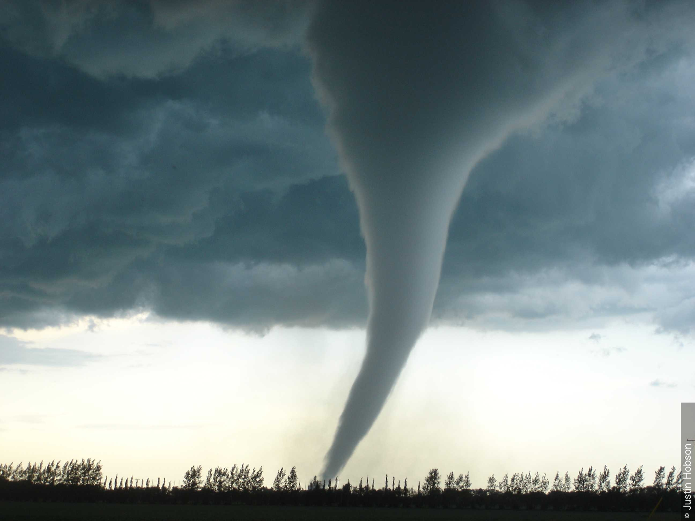
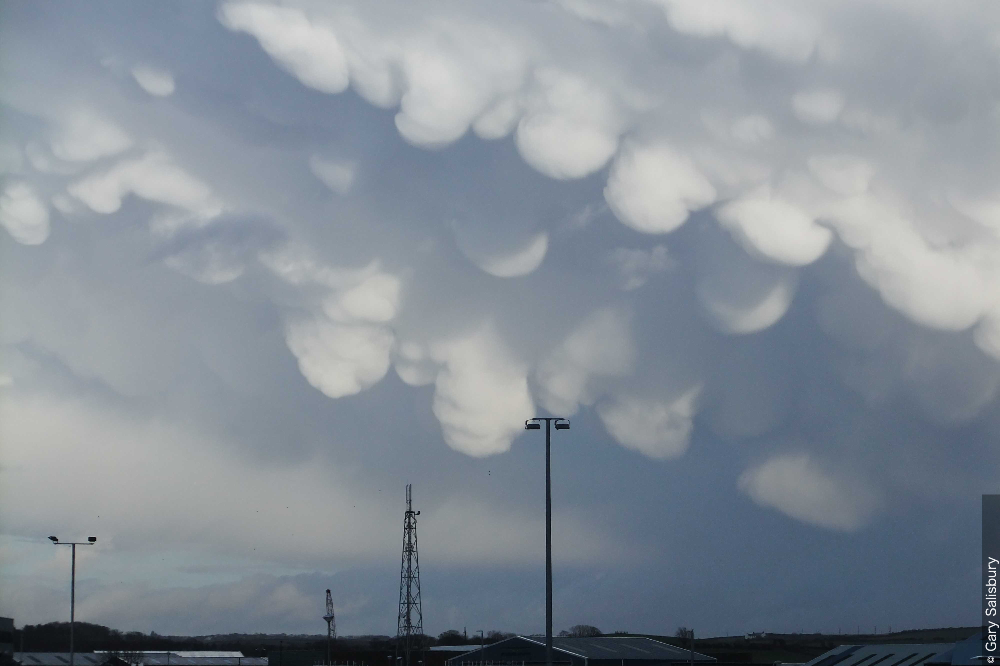
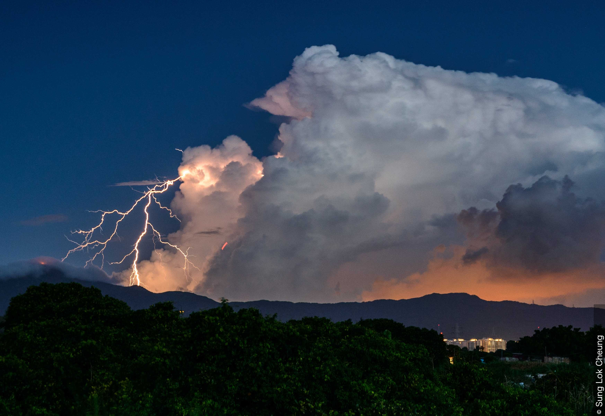

# 積乱雲 (Cb) (Weilbach 1880)(Section 2.3.10)

## 目次

- [積乱雲の定義(Section 2.3.10.1)](#積乱雲の定義section-23101)
- [種(Section 2.3.10.2)](#種section-23102)
- [積乱雲 多毛雲 (Cumulonimbus capillatus) (Cb cap) - CEN 1926(Section 2.3.10.2.2)](#積乱雲-多毛雲-cumulonimbus-capillatus-cb-cap---cen-1926section-231022)
- [変種(Section 2.3.10.3)](#変種section-23103)
- [部分的な特徴および付随雲(Section 2.3.10.4)](#部分的な特徴および付随雲section-23104)
  - [降水雲 (praecipitatio)](#降水雲-praecipitatio)
  - [かなとこ雲 (incus)](#かなとこ雲-incus)
  - [乳房雲 (mamma)](#乳房雲-mamma)
  - [頭巾雲 (pileus)](#頭巾雲-pileus)
  - [ベール雲 (velum)](#ベール雲-velum)
  - [アーチ雲 (arcus)](#アーチ雲-arcus)
  - [壁雲 (murus)](#壁雲-murus)
  - [尻尾雲 (cauda)](#尻尾雲-cauda)
  - [流入帯雲 (flumen)](#流入帯雲-flumen)
  - [漏斗雲 (tuba)](#漏斗雲-tuba)
- [積乱雲が形成される可能性のある雲(Section 2.3.10.5)](#積乱雲が形成される可能性のある雲section-23105)
- [積乱雲と他の類の類似の雲との主な違い(Section 2.3.10.6)](#積乱雲と他の類の類似の雲との主な違いsection-23106)
- [物理的構成(Section 2.3.10.7)](#物理的構成section-23107)
- [解説および特別な雲(Section 2.3.10.8)](#解説および特別な雲section-23108)
- [画像ギャラリーから (From Image Gallery)](#画像ギャラリーから-from-image-gallery)

## 積乱雲の定義(Section 2.3.10.1)
山や巨大な塔の形をした、鉛直方向に大きく発達する、厚く高密度の雲。上部の少なくとも一部は通常、平滑であるか、繊維状または筋状であり、ほとんど常に平らに広がっている。この部分はしばしば、かなとこや巨大な羽毛の形に広がる。

この雲の雲底はしばしば非常に暗く、その下には、雲本体と結合したり離れたりして、低くちぎれた雲が頻繁に存在し、時には尾流雲（Virga）の形で降水を伴う。

## 種(Section 2.3.10.2)

積乱雲 無毛雲 (Cumulonimbus calvus) (Cb cal) - CEN 1926(Section 2.3.10.2.1)
上部の隆起が不明瞭で平らになり、輪郭のはっきりしない白っぽい塊のような外観を持つ積乱雲。繊維状や筋状の部分は見られない。積乱雲 無毛雲は通常降水をもたらし、それが地上に達する場合はしゅう雨（しゅう雪）となる。

<strong>積乱雲 無毛雲 および 積雲 雄大雲</strong> 
積乱雲は、山や巨大な塔の形をした、鉛直方向にかなり発達する厚く高密度の雲である。上部の少なくとも一部は通常、平滑、繊維状、または筋状であり、ほぼ常に平らに広がっている。雲底はしばしば非常に暗い。この画像では、上部の隆起が2と3の箇所でやや不明瞭かつ平らになっており、これは無毛雲（calvus）の特徴である。主要な塔の間で雲はまだ発達中であり、よりはっきりとした輪郭とカリフラワーのような外観を持ち、積雲 雄大雲（Cumulus congestus）として識別される。部分的な特徴である降水雲（praecipitatio）が、しゅう雨として左側の雲から降っている。空のより高い位置には、巻雲 毛状雲（Cirrus fibratus）の繊維状の要素が見られる。

## 積乱雲 多毛雲 (Cumulonimbus capillatus) (Cb cap) - CEN 1926(Section 2.3.10.2.2)
上部に、はっきりとした繊維状または筋状の構造を持つ巻雲状の部分があり、しばしばかなとこ（積乱雲 多毛雲 かなとこ雲）、羽毛、または巨大で無秩序な髪の毛の塊の形をしている積乱雲。非常に冷たい気団では、繊維状の構造がしばしば雲のほぼ全体に広がる。

積乱雲 多毛雲は通常、しゅう雨（しゅう雪）や雷雨を伴い、しばしば突風を伴い、時にはひょうを伴う。また、非常に明瞭な尾流雲（Virga）を頻繁に生じさせる。

<strong>積乱雲 多毛雲 かなとこ雲</strong> 
この画像は、積乱雲 多毛雲 かなとこ雲（Cumulonimbus capillatus incus）から気団性のしゅう雨（雪）が降る冬の空を示している。この例では、繊維状の構造が雲のほぼ底部まで広がっていることからわかるように、積乱雲はほぼ完全に凍結している。この雲の巻雲状の繊維状の上部は、母雲である積乱雲にまだ付随しているため、巻雲 濃密雲 積乱雲由来（Cirrus spissatus cumulonimbogenitus）として識別することはできない。

左奥にも積乱雲 多毛雲のセルが見られる。

積乱雲の一部が広がって形成された層積雲（Stratocumulus）のパッチも存在する。

<strong>積乱雲 多毛雲 降水雲</strong> 
積乱雲は、山や巨大な塔の形をした、鉛直方向にかなり、あるいは大きく発達する厚く高密度の雲である。上部の少なくとも一部は通常、平滑、繊維状、または筋状であり、ほぼ常に平らに広がっている。この拡大画像では、上部の隆起の大部分が、積乱雲 無毛雲（calvus）から多毛雲（capillatus）の種に移行するにつれて、1と2の箇所で繊維状になり不明瞭になりつつある。上部の全体的な外観は依然として膨らんだドームのようであるが、かなとこ雲（incus）はまだ発達していない。多毛雲は通常、しゅう雨（しゅう雪）の形での降水（部分的な特徴である降水雲（praecipitatio））を伴い、ここでは右下の15〜20 km離れた場所に見られる。最も高い塔の頂上付近には、小さな高積雲 積乱雲由来（Altocumulus cumulonimbogenitus）のパッチがある。また、この画像には積雲 雄大雲（Cumulus congestus）のカリフラワーのような隆起、いくつかの積雲 並雲（Cumulus mediocris）、および遠近法によりカメラに近く見える、おそらく積雲 断片雲（Cumulus fractus）である雲も含まれている。

## 変種(Section 2.3.10.3)
積乱雲に変種はない。

## 部分的な特徴および付随雲(Section 2.3.10.4)
積乱雲は以下を示すことがある：

- 降水雲 (praecipitatio)（しゅう雨、しゅう雪、雪あられ、またはひょう）
- 尾流雲 (Virga)
- ちぎれ雲 (Pannus)
- かなとこ雲 (Incus)
- 乳房雲 (Mamma)（かなとこの張り出した部分の底面で頻繁に観察され、雲底ではそれほど頻繁には観察されない）
- 頭巾雲 (Pileus)、ベール雲 (velum)、アーチ雲 (arcus)、および壁雲 (murus)
- 尻尾雲 (Cauda)、流入帯雲 (flumen)、および漏斗雲 (tuba)（ただし、これらが観察されることはまれである）

### 降水雲 (praecipitatio)

<strong>積乱雲 多毛雲 降水雲</strong> 
この画像は、上昇する積乱雲の塔が鉛直方向に強く発達している様子を示している。頂部は夕日に照らされ、左側は明るい白色を呈しているが、雲の残りの部分はより暗い。右側の雲頂は繊維状であり、多毛雲（capillatus）の種であることを示し、かなとこが右側にせん断されている（部分的な特徴であるかなとこ雲（incus））。このセルが積雲 雄大雲（Cumulus congestus）から積乱雲へと移行するにつれて、（この視点から見た）雲頂は輪郭の鮮明さを失いつつある。雲の下では、太陽が強い降水柱（部分的な特徴である降水雲（praecipitatio））を照らしている。強力な対流雲をほぼ取り囲んでいる濃い灰色の雲は層積雲（Stratocumulus）であり、左上の白い繊維状の雲は巻雲 毛状雲（Cirrus fibratus）である。

### かなとこ雲 (incus)

<strong>積乱雲 多毛雲 降水雲 かなとこ雲 乳房雲 降水雲</strong> 
この写真は、よく発達した対称的なかなとこ（部分的な特徴であるかなとこ雲（incus））を持つ積乱雲 多毛雲のセルを示している。かなとこ雲の下面には乳房雲（mamma）の形成が見られる。左後方には、わずかにより新しい別のセルがある。1と2の箇所において、これら両方のセルから降水が落ちている。

左端には、積雲 雄大雲（Cumulus congestus）として識別される別の対流雲のセルがある。このセルはまさに積乱雲 無毛雲（calvus）に移行しようとしている。発達の様々な段階にあるさらに多くの積雲が、多くの領域で見られる。

積乱雲は、巻雲 濃密雲（Cirrus spissatus）、高積雲（Altocumulus）、高層雲（Altostratus）、または層積雲（Stratocumulus）のパッチを生み出す可能性がある「雲の工場」と表現される。

### 乳房雲 (mamma)

<strong>積乱雲 多毛雲 かなとこ雲 乳房雲</strong> 
この冬季の積乱雲 多毛雲 かなとこ雲の顕著な特徴は、雲の下面にある乳房に似た垂れ下がる隆起である。これが部分的な特徴である乳房雲（mamma）である。

### 頭巾雲 (pileus)

<strong>積乱雲 無毛雲 頭巾雲</strong> 
この雲の下部のカリフラワーのような外観は、積雲 雄大雲（Cumulus congestus）を示している。しかし、上部は輪郭の鮮明さと明瞭さを失いつつあり、これによりこの雲は積乱雲の種である無毛雲（calvus）となっている。付随雲である頭巾雲（pileus）の優れた例が、積乱雲全体に帽子のようにかぶさっている。頭巾雲は一般に水平方向の広がりが小さく、しばしばそれを貫通する対流雲の頂上より上にあるか、上部に付着する帽子やフードを形成する。この画像のように、4と5にあるような複数の重なり合った層がしばしば見られることがある。頭巾雲は、急速に成長する対流雲の上の湿った空気が凝結することによって形成され、寿命は短い。

### ベール雲 (velum)

<strong>積乱雲 多毛雲 かなとこ雲 ベール雲</strong> 
この写真では、水平方向に大きく広がる付随雲であるベール雲（velum）が、この積乱雲 多毛雲 かなとこ雲の上部に付着している。ベール雲の形成後、積乱雲の頂上がベール雲を貫通し、突き抜けた。上層の風がベール雲を風下へとせん断している。

強い下層の風によってせん断された積雲 断片雲（Cumulus fractus）および扁平雲（humilis）のセルが手前にある。積乱雲の一部が広がって形成された高積雲（Altocumulus）および巻層雲（Cirrostratus）が空を満たしている。 

### アーチ雲 (arcus)

<strong>積乱雲とアーチ雲</strong> 
積乱雲は、山や巨大な塔の形をした、鉛直方向にかなり発達する厚く高密度の雲である。雲の下面はしばしば非常に暗い。この画像で最も興味深いのは部分的な特徴であるアーチ雲（arcus）である。アーチ雲は、雲の前方下部にある高密度の水平なロール状の雲であり、広範囲にわたる場合、暗く威嚇的なアーチの外観を持つ。前端は滑らかな外観を持つことがあるが、縁は多かれ少なかれぼろぼろである。この写真では、下面がちぎれている。アーチ雲は、嵐の雲の前方に広がる冷たい空気の強い下降気流によって形成される。また、遠くにはしゅう雨の形での部分的な特徴である降水雲（praecipitatio）も見える。頭上には高層雲 不透明雲 積乱雲由来（Altostratus opacus cumulonimbogenitus）の厚い層がある。 

### 壁雲 (murus)

<strong>積乱雲 降水雲 壁雲 流入帯雲</strong> 
スーパーセル雷雨のこの写真の主な特徴は、大きな壁雲である。これは、積乱雲の雲底からの局所的で持続的、かつしばしば急激な雲の低下であり、部分的な特徴である壁雲（murus）である。これは通常、スーパーセルや激しいマルチセル雷雨の雨の降らない部分で発達し、強い上昇気流の領域を示す。顕著な回転と鉛直運動を示す壁雲（murus）は、漏斗雲や竜巻の形成につながる可能性がある。

また、画像の右側には流入帯（流入帯雲、flumen）が見える。これらの付随雲はスーパーセルへの流入を形成する。  

このスーパーセルが撮影者の位置に向かって進むにつれて、嵐はよりアウトフロー（流出気流）が支配的な特徴へと変化し始めており、次の1時間にわたってまもなく竜巻を発生させない状態になろうとしていた。メソサイクロンは、数マイル南にある弱い嵐からより冷たいアウトフローの空気を引き込んでおり、竜巻を発生させる能力を阻害していた。大粒のひょうもメソサイクロンの周りを覆い始めており、壁雲のすぐ後ろに降っているのが見えた。

### 尻尾雲 (cauda)

<strong>積乱雲 多毛雲 降水雲 壁雲 尻尾雲 流入帯雲 漏斗雲</strong> 
米国オクラホマ州南西部で午後遅くに見られたこのスーパーセル雷雨の壁雲（murus）の下に、巨大な、あるいは楔形の竜巻がここに見られる。楔形竜巻（wedge tornado）は、凝結漏斗が地上において水平方向に、地上から雲底までの高さと少なくとも同じくらい広い漏斗雲（spout）の一種である。

水平で尾の形をした雲が、主要な降水域から壁雲（murus）に向かって低い高度で伸びている。この部分的な特徴が尻尾雲（cauda）である。スーパーセルへの流入帯となって移動する下層雲の帯（流入帯雲、flumen）も存在する。

西から接近する上層のトラフ（気圧の谷）により、テキサス州北西部からオクラホマ州南西部にかけて南南西から北北東へと一連のスーパーセルが発達した。大粒のひょう（ゴルフボールからテニスボール大）を伴ったこの多降水型の嵐は、そのうちの1つであった。 

### 流入帯雲 (flumen)

<strong>積乱雲 降水雲 壁雲 流入帯雲</strong> 
スーパーセル雷雨のこの写真の主な特徴は、大きな壁雲である。これは、積乱雲の雲底からの局所的で持続的、かつしばしば急激な雲の低下であり、部分的な特徴である壁雲（murus）である。これは通常、スーパーセルや激しいマルチセル雷雨の雨の降らない部分で発達し、強い上昇気流の領域を示す。顕著な回転と鉛直運動を示す壁雲（murus）は、漏斗雲や竜巻の形成につながる可能性がある。

また、画像の右側には流入帯（流入帯雲、flumen）が見える。これらの付随雲はスーパーセルへの流入を形成する。  

このスーパーセルが撮影者の位置に向かって進むにつれて、嵐はよりアウトフロー（流出気流）が支配的な特徴へと変化し始めており、次の1時間にわたってまもなく竜巻を発生させない状態になろうとしていた。メソサイクロンは、数マイル南にある弱い嵐からより冷たいアウトフローの空気を引き込んでおり、竜巻を発生させる能力を阻害していた。大粒のひょうもメソサイクロンの周りを覆い始めており、壁雲のすぐ後ろに降っているのが見えた。

### 漏斗雲 (tuba)

<strong>漏斗雲：寒気漏斗</strong> 
この漏斗雲は、英国イングランド北東部上空のしゅう雨性の北風の気流内に位置し、トラフ（気圧の谷）に関連していた対流雲（積雲 雄大雲 または 積乱雲）の底から発達した。

すべての竜巻は、その後に地上に達する漏斗雲の発達から始まるが、ここに示されているような寒気漏斗（cold-air funnel）は、局所的な対流とシアー（風の鉛直・水平シア）の渦から生じ、大規模なメソサイクロンとは関連していない。寒気漏斗は通常、積雲 雄大雲 または 積乱雲から発達する。それらは通常地上には達しないが、到達した場合（竜巻として）、メソサイクロンに関連する竜巻よりもはるかに暴力性が低い。 

## 積乱雲が形成される可能性のある雲(Section 2.3.10.5)
積乱雲は最も一般的に以下から発達する：

- 上記で述べた通常の方法で形成された積雲 雄大雲（Cumulus congestus）（積雲由来積乱雲（Cb cumulogenitus）または積雲変異積乱雲（Cb cumulomutatus））。

積乱雲はまた、以下からも形成される：

- 高積雲 塔状雲（Altocumulus castellanus）（高積雲由来積乱雲（Cb altocumulogenitus））。積乱雲の雲底は異常に高い。
- 層積雲 塔状雲（Stratocumulus castellanus）（層積雲由来積乱雲（Cb stratocumulogenitus））。
- 高層雲（Altostratus）または乱層雲（Nimbostratus）の一部の変化および発達（高層雲由来積乱雲（Cb altostratogenitus）または乱層雲由来積乱雲（Cb nimbostratogenitus））。

これらの事例の大部分において、積乱雲への移行は積雲 雄大雲の段階を経る。

<strong>積乱雲 多毛雲 かなとこ雲 降水雲2</strong> 
積乱雲は、山や巨大な塔の形をした、鉛直方向にかなり、あるいは強く発達する厚く高密度の雲である。上部の少なくとも一部は通常、平滑、繊維状、または筋状であり、ほぼ常に平らに広がっている。この写真では、積雲から成長し、多毛雲（capillatus）の種である巻雲状の頂部を特徴とする、急速に発達している積乱雲が見られる。上部は広がって見事なかなとこ（部分的な特徴であるかなとこ雲（incus））を形成しており、特に風下（右側）の縁で繊維状の外観をしている。風上（左側）では、かなとこはわずかにこぶ状、あるいは積雲状の外観をしている。雲の下には狭い降水柱（部分的な特徴である降水雲（praecipitatio））があり、一方、活発な対流によって少量の層積雲 積乱雲由来（Stratocumulus cumulonimbogenitus）が生成されている。巻雲 濃密雲（Cirrus spissatus）、積雲 並雲（Cumulus mediocris）、高積雲 積乱雲由来（Altocumulus cumulonimbogenitus）、および積雲 断片雲（Cumulus fractus）を含む、少量の他の雲も確認される。

<strong>降水雲を伴う積乱雲 高積雲由来</strong> 
この写真は積乱雲の下面の特徴的な暗さを示している。雲底の高さは中層雲の高度にあたる 3 000 m（9 000 ft）と推定された（注：原文には「3 00 m」とあるが、フィート換算から3000mと解釈）。これは、積乱雲が高積雲 塔状雲（Altocumulus castellanus）から発達した結果であり、異常に高い。その起源により、これは高積雲由来積乱雲（Cumulonimbus altocumulogenitus）である。遠くに降水柱が見える。

<strong>しゅう雨における尾流雲と降水条</strong> 
この写真は積乱雲 多毛雲（Cumulonimbus capillatus）の雲底を示している。これは、視野の大部分に広がる、広大で暗い、どちらかといえば特徴のない雲の塊である。しかし、それは降水（部分的な特徴である降水雲（praecipitatio））によって部分的に遮られており、その降水は所々で、主に雪あられ、または雨と雪の混合物として地上に達している。午後遅くの太陽光に照らされた他の降水条は、地表に達する前に蒸発している。これらは部分的な特徴である尾流雲（virga）である。層積雲（Stratocumulus）のちぎれた層も存在し、地平線付近に見える。よく分散した積雲 雄大雲（Cumulus congestus）と積乱雲が発達しており、時には層積雲の層に埋もれており、層積雲由来積乱雲（Cumulonimbus stratocumulogenesis）の一例となっている。画像の右下隅にある木の後ろで遠くの積雲 雄大雲が発達しているのを見ることができる。 

## 積乱雲と他の類の類似の雲との主な違い(Section 2.3.10.6)
積乱雲が空の広い範囲を覆う場合、特に下面の外観のみに基づいて識別が行われると、乱層雲（Nimbostratus）と容易に混同される可能性がある。降水の性質は、積乱雲と乱層雲を区別するのに役立つ場合がある。降水がしゅう雨性のタイプである場合、または雷光、雷鳴、あるいはひょうを伴う場合、その雲は積乱雲である。

特定の積乱雲は、積雲 雄大雲（Cumulus congestus）とほぼ同一に見える。その雲は、上部の少なくとも一部が輪郭の鮮明さを失うか、繊維状または筋状の質感を示した時点で、積乱雲として識別される。上記の基準に基づいて雲が積乱雲か積雲かを決定することが不可能な場合、それが雷光、雷鳴、またはひょうを伴っていれば、積乱雲として識別される。

## 物理的構成(Section 2.3.10.7)
積乱雲は水滴、および特にその上部において氷晶で構成されている。また、大きな雨粒を含み、しばしば雪片、雪あられ、またはひょうを含む。水滴と雨粒は大幅に過冷却されている場合がある。

## 解説および特別な雲(Section 2.3.10.8)
積乱雲が発生する条件は、積雲 雄大雲の発達に有利な条件と似ている。積雲 雄大雲から積乱雲への移行は、その上部に氷粒子が形成されるためである。氷粒子の存在は、上部の一部または全体が輪郭の鮮明さを失うか、繊維状または筋状の質感を帯びたときに明白になる。

積乱雲は、孤立した雲として現れるか、あるいは非常に広大な壁に似た連続した雲の列の形で現れることがある。

特定の事例では、積乱雲の上部が積雲 雄大雲や乱層雲と融合することがある。積乱雲はまた、高層雲や乱層雲の全体的な塊の内部で発達することもある。

低くちぎれた付随雲（ちぎれ雲、pannus）が積乱雲の下にしばしば発達する。これらの雲は最初は互いに離れているが、後に融合して連続した層を形成し、部分的または完全に積乱雲の雲底に接触することがある。

積乱雲は「雲の工場」と表現されることがある。上部が広がり、下部が消散することによって、巻雲 濃密雲（Cirrus spissatus）、高積雲、高層雲、または層積雲の厚いパッチや層を生成できる。最も高い部分が広がることで、通常はかなとこの形成につながる。高度とともに風が強く増加する場合、雲頂は風下にのみ広がり、半分のかなとこの形、あるいは場合によっては巨大な羽毛の形をとる。

積乱雲は極域ではまれであり、温帯および熱帯地域でより頻繁に見られる。

積乱雲は、森林火災、野火、または火山噴火活動の熱によって引き起こされた対流から発達することがある。局所的な自然の熱源の結果として発生したことが明確に観察される積乱雲は、適切な種、変種、および部分的な特徴によって分類され、その後に「flammagenitus（燃焼由来）」が続く。

## 画像ギャラリーから (From Image Gallery)

<strong>積乱雲 無毛雲 頭巾雲</strong> 
この対流雲は、積雲 雄大雲（Cumulus congestus）と積乱雲 無毛雲（Cumulonimbus calvus）の中間であるように見える。上部の一部が多かれ少なかれ不明瞭であり、輪郭のはっきりしない白っぽい塊のような外観を持ち始めているため、これは積乱雲 無毛雲である。

付随雲である頭巾雲（pileus）を、対流雲の頂部の平坦化、あるいは輪郭のはっきりしない白っぽい塊の確認と誤認しないことが重要である。

<strong>積乱雲 多毛雲からの雷光</strong> 
地上への落雷（対地放電として知られる）が、この積乱雲の下部から見られる。この雲は、雲の繊維状の頂部とかなとこにより、明確に積乱雲 多毛雲 かなとこ雲（Cumulonimbus capillatus incus）として識別される（国際雲形記号 CL = 9）。他の雷活動が雷雲の内部で発生しており（雲内雷）、一部の雲放電が内部を照らしている。1つの雷閃光（アンビルクローラー）が、雲の上部、かなとこの下から発生し、いくらかの距離を水平に移動して、いくつかの枝分かれを生成している。  

<strong>漏斗雲 (竜巻)</strong> 
この写真は、米国コロラド州カンポ付近で発生した竜巻（改良藤田スケールで強度EF2）を示している。竜巻は漏斗雲（spout）の特定のタイプである。

漏斗雲は、積乱雲または積雲の雲底から突き出た雲の柱または逆円錐（漏斗雲、funnel cloud）の存在、および海面から巻き上げられた水滴、あるいは地上から巻き上げられた塵、砂、またはごみで構成される「茂み（bush）」の存在によって明らかになる、激しい旋風と定義される。

<strong>積乱雲 多毛雲 および 巻雲 濃密雲 積乱雲由来</strong> 
低気圧のトラフ（気圧の谷）の上およびその前方の不安定な空気の中に形成された、積雲および積乱雲 多毛雲（Cumulonimbus capillatus）の列。その上部の一部が明らかに繊維状の構造を持つ巻雲状の部分を有している（雲頂の一部が凍結し始めている）ため、主要なセルは積乱雲 多毛雲として識別される。このセルの側面には、ライフサイクルの異なる段階にあるため様々な鉛直方向の広がりを示す積雲 雄大雲（Cumulus congestus）のセルが1、2、および3の箇所にある。

対流雲の列の一部が広がって形成された層積雲（Stratocumulus）、高積雲（Altocumulus）、および巻雲（Cirrus）が存在する。母雲が積乱雲の段階に達する前に形成されたとしても、その層積雲および高積雲は積乱雲由来（cumulonimbogenitus）として識別される。

<strong>竜巻 (画像2)</strong> 
2010年5月31日の米国コロラド州カンポの竜巻のこの画像は、前の画像の3分後に撮影された。壁雲（murus）が写真の上部全体を占めている。前の画像から凝結漏斗が広がっており、地上には破片（デブリ）の雲がある。非常に活発な上昇気流の塔を持つ別の積乱雲が遠くに見える。

<strong>積乱雲 多毛雲 かなとこ雲 降水雲3</strong> 
この写真は、寒帯海洋性気団で形成されたいくつかの積乱雲のうちの1つを示している。それらは、既存の雲の南西側面に新しいセルが形成される、よく組織化されたマルチセル構造を示していた。右側のセルは、積乱雲 無毛雲（calvus）に移行するにつれて鋭い輪郭を失いつつある。上部中央では、雲は積乱雲 多毛雲（capillatus）に特徴的な巻雲状の頂部を持つ成熟段階に達しており、一方左側では、消散しつつあるセルのかなとこ雲（incus）の一部が見える。これらのセルは、ひょう、および雨と雪が混ざったしゅう雨（部分的な特徴である降水雲（praecipitatio））をもたらした。衛星の水蒸気画像は、上層の微妙な短波トラフの前方でしゅう雨が発達したことを示唆していた。それらは海岸に近づくにつれて発達し、沖合に移動した後にゆっくりと消散した。 

<strong>「アンビルクローラー」雷光</strong> 
この画像は、五大湖下流を横断する激しい嵐の複合体に関連する雷光を示している。夕方の時間帯に南東へ移動する強い寒冷前線の前方で、個別の対流セルが強力なスコールラインへと変化した。その通過には、ひょう、被害をもたらす風、および大雨が伴った。ここに写っているのは、雷雨の複合体がカナダ国境を越えて米国ニューヨーク州およびペンシルベニア州に進入した際の、その北側の側面である。口語的に「アンビルクローラー（かなとこを這うもの）」として知られるこの雲放電は、ある程度の水平距離を覆い、複数の木のような枝分かれを生成する。

<strong>竜巻</strong> 
この竜巻は、2007年6月22日にカナダのマニトバ州エリーの小さなコミュニティに影響を与え、風速は 420 km/h を超えた。これはカナダで公式に記録された最初のF5竜巻であった。地上では、最も広いところで幅約 300 m と推定された。地上の軌跡は約 6 km であった。

竜巻の凝結漏斗は、回転する壁雲（その一部がここに見える）から地上へと降下した。地面付近では、明るい背景に対して破片（デブリ）の雲がわずかに見える。

<strong>積乱雲 多毛雲 かなとこ雲 頭巾雲</strong> 
遠くに積乱雲のセルの大きな複合体がある。上部が不明瞭かつ平らになり、輪郭のはっきりしない白っぽい塊のような外観になりつつあるため、この雲は積乱雲として識別される。

上部の一部には、無秩序な髪の毛の塊の形をした、はっきりとした繊維状の構造を持つ巻雲状の部分がある。これにより多毛雲（capillatus）の種であることが識別され、無秩序な髪の毛の塊は部分的な特徴であるかなとこ雲（incus）である。いくつかの頭巾雲（pileus）の「帽子」が、メインのセルに付着したりその上に見えたりする。

高積雲 積乱雲由来（Altocumulus cumulonimbogenitus）のパッチ、ならびに積雲 扁平雲（Cumulus humilis）および断片雲（fractus）、層積雲（Stratocumulus）、巻層雲 毛状雲 波状雲（Cirrostratus fibratus undulatus）が存在する。

<strong>積乱雲 アーチ雲および降水雲</strong> 
この写真は通過する積乱雲の下部を示しており、この類（Genus）の厚く高密度な性質と暗い雲底を見ることができる。雲底の右側に、冷たい空気の下降気流によって形成される下層雲のロールである部分的な特徴のアーチ雲（arcus）のぼろぼろの縁が見える。また、2と3の箇所に広範囲にわたるしゅう雨が見え、これは部分的な特徴である降水雲（praecipitatio）である。

<strong>積乱雲 多毛雲 かなとこ雲 および 巻雲 積乱雲由来</strong> 
狭く高い積乱雲 多毛雲 かなとこ雲の塔が1と2の箇所に見える。両方の塔の上部には平滑または繊維状の部分があり、5と6に見られるように、かなり無秩序に広がり始めている。 

背景には、以前の積乱雲の上部の名残である、高密度で厚く広範囲にわたる巻雲 濃密雲（Cirrus spissatus）のパッチがある。

手前には積雲 雄大雲（Cumulus congestus）および並雲（mediocris）の列がある。

<strong>積乱雲 多毛雲 かなとこ雲 および 無毛雲</strong> 
この写真は、積雲から積乱雲への進行を示している。右側には積雲 並雲（Cumulus mediocris）に典型的な小さな隆起と発生があり、次に、積雲 雄大雲（Cumulus congestus）の膨らんだ上部の、より強い輪郭、より大きな鉛直方向の広がり、およびカリフラワーのような外観がある。中央では、雲の上部が不明瞭かつ平らになり、輪郭のはっきりしない白っぽい塊の外観を持っており、これは積乱雲 無毛雲（Cumulonimbus calvus）の典型である。左側では、雲は積乱雲 多毛雲（Cumulonimbus capillatus）へと発達し、繊維状の外観を帯びている。かなとこ（incus）は左端にわずかに見えるが、大部分は灰色の雲に遮られている。頭上では、かなとこが広がった結果として、巻雲 濃密雲 積乱雲由来（Cirrus spissatus cumulonimbogenitus）の厚い層が形成されている。

<strong>雷光 - 雲放電</strong> 
水平方向に大きく広がる雲間の雷光の放電

<strong>積乱雲 多毛雲と乳房雲</strong> 
積乱雲は、山や巨大な塔の形をした、鉛直方向にかなり、あるいは大きく発達する厚く高密度の雲である。上部の少なくとも一部は通常、平滑、繊維状、または筋状であり、ほぼ常に平らに広がっている。雲底はしばしば非常に暗い。いくつかのセルからなるこの画像では、上部が巻雲状の外観をしており、種が多毛雲（capillatus）であることが識別される。かなとこが発達しており、これは部分的な特徴であるかなとこ雲（incus）である。また、4と5の箇所には、雲の下面から垂れ下がる乳房のような隆起または小球が見え、これらは積乱雲内の強力な下降気流によって引き起こされる部分的な特徴である乳房雲（mamma）である。

<strong>竜巻 (画像3)</strong> 
2010年5月31日の米国コロラド州カンポの竜巻のこの光景は、竜巻が接地してから約9分後に撮影された。この段階までに、凝結漏斗は地表の破片（デブリ）の雲から巻き上げ、吸い込んだ塵によってわずかに変色（茶褐色の色合い）していた。回転する壁雲（murus）が写真の上部の大部分を占めている。 

<strong>虹を伴い消散しつつある積乱雲 多毛雲 降水雲 かなとこ雲 乳房雲</strong> 
ここでは、ビスケー湾上空で積乱雲が衰弱状態にある。中程度の強い雨がまだ地表に達しているが、雲はほぼ完全に氷結しており、積雲状の発達はほとんど残っていない。かなとこの北西の縁の近くに、太陽に照らされた乳房雲（mamma）の領域が見える。視野の右下隅近くに虹が見える。孤立した積雲 断片雲（Cumulus fractus）のパッチが、かなとこの下、写真の中央および中央左寄りに存在する。散在する積雲 並雲（Cumulus mediocris）と積雲 雄大雲（Cumulus congestus）が遠くに見え、孤立した高積雲（Altocumulus）のパッチが中距離の中央左寄りに見える。

北西風を伴う寒帯海洋性気団がビスケー湾に影響を与えていた。閉塞前線がフランス西部上空に位置しており、東に向かってビスケー湾から遠ざかっていた。寒帯海洋性気団は海面水温による不安定性を特徴とし、散発的なしゅう雨を伴っていた。

<strong>積乱雲 多毛雲 かなとこ雲からの雷光</strong> 
航空機からのこの眺めでは、大きな積乱雲 多毛雲 かなとこ雲（Cumulonimbus capillatus incus）の頂部付近から発生する雷光の放電が見られる。部分的な特徴であるかなとこ雲（incus）は、かなとこの形に広がった積乱雲の最上部である。

<strong>積乱雲 多毛雲 降水雲 かなとこ雲 乳房雲</strong> 
これは鉛直方向にかなり発達した高密度の雲である。地面に近いほぼ水平な雲底、鋭い輪郭、太陽に照らされたまばゆいばかりの白い部分、カリフラワーに似た膨らんだ上部を持っているため、下層の対流雲である。

この場合はかなとこ（部分的な特徴であるかなとこ雲、incus）の形をしている、はっきりとした繊維状の構造を持つ巻雲状の部分（多毛雲、capillatusの種）を持つ上部を有しているため、類は積乱雲として識別される。

北側のかなとこの下面には乳房雲（mamma）の広範な領域がある。セルに近いほど、乳房雲の袋はかなり深く垂れ下がっている。南側のかなとこの下面にも乳房雲が形成されている証拠がある。

積雲 並雲（Cumulus mediocris）のセルが雄大雲（congestus）に移行しており、手前には不規則な雲底を持つ非常にちぎれた積雲 並雲のセルがある。これらのセルは強風によってせん断されている。積乱雲の一部が広がって形成された高積雲（Altocumulus）のパッチと同様に、積雲 断片雲（Cumulus fractus）の断片も存在する。

オーバーシューティング・トップ（雲頂突き抜け）が2か所で見られる。この積乱雲はスーパーセルとして識別され、被害をもたらす大きなひょうを発生させたセルの複合体の一部であった。

<strong>広範囲に連なる積雲 雄大雲、積乱雲 無毛雲 および 多毛雲 かなとこ雲 降水雲</strong> 
この画像は、成熟した積乱雲 多毛雲 かなとこ雲のセルの列の前方にある、積乱雲 無毛雲（calvus）および積雲 雄大雲（Cumulus congestus）のフランキングライン（側面配列雲）を示している。後者の列からは遠くで降水が落ちている。

ちぎれた積雲 断片雲（Cumulus fractus）のパッチが手前にあり、積乱雲の一部が広がって形成された層積雲（Stratocumulus）および高積雲（Altocumulus）も存在する。

<strong>アンビルクローラー雷光</strong> 
この写真は、米国ネブラスカ州リンカーン上空の強い中層雷雨のかなとこを通って枝分かれする雷光を示している。これらの雲放電は口語的に「アンビルクローラー」として知られている。

画像の右側に、雨の降らない上昇気流の雲底が見える。他の場所では、雲の詳細は大雨によって隠されている。雨の降らない上昇気流の雲底の近くに降水柱が確認できる。

<strong>積乱雲 多毛雲</strong> 
この写真は、推定雲頂高度 7 km の発達中の積乱雲を示している。雲の上部は繊維状の構造を持つ巻雲状であり、種が多毛雲（capillatus）であることを示している。頂部はかなとこ発達の初期段階（1と2の箇所）で広がっており、これは部分的な特徴であるかなとこ雲（incus）である。遠くに、別の部分的な特徴である降水雲（praecipitatio）がわずかに見え、3と4の箇所でしゅう雨として降っているのが見える。この画像には積雲 並雲（Cumulus mediocris）と積雲 断片雲（Cumulus fractus）も見える。

<strong>積乱雲 降水雲</strong> 
これらの降水をもたらす雲の類は、積雲または積乱雲のいずれかである。類は通常、雲の上部が輪郭の鮮明さを失っているか、または繊維状あるいは筋状の外観を持っているかどうかによって決定される。

上部の外観に基づいて類を決定することが不可能な場合、雷光、雷鳴、またはひょうを伴っていれば、慣例によりその雲は積乱雲と呼ばれる。

この例では、雷鳴が聞こえたため、類は積乱雲である。

<strong>積乱雲 無毛雲と頭巾雲</strong> 
この画像は積乱雲を示している。雲の上部は平らになり不明瞭になっており、無毛雲（calvus）の種を示している。積乱雲の頂上には滑らかな帽子のような雲（2と3の箇所）がある。これらは部分的な特徴である頭巾雲（pileus）であり、雲内の活発な上昇気流の上に形成されることがある。下側のより不明瞭な頭巾雲のパッチには彩雲の示唆がある。孤立した高積雲（Altocumulus）のパッチが存在し、積乱雲の一部が広がって形成された可能性が最も高い。

画像撮影時に雷鳴が聞こえ、約1時間前には雨を伴う雷雨が観測された。

<strong>雷光 - 対地放電</strong> 
この写真の主な特徴は、1と2の箇所にある雷光の対地放電（雲から地上への落雷）である。放電は雲と地上の間の曲がりくねった経路をたどっているように見え、一般的に幕電（forked lightning）として知られている。3、4、5の箇所にある主な放電からのより小さな枝分かれは、澄んだ空気中に消散している。写真左側の、雲から空気中への放電は、地上には達していないように見え、大気放電（air discharge）である。

雷光が発生した場合、その雲は積乱雲として識別される。この写真のように、種が無毛雲（calvus）か多毛雲（capillatus）かを判断できない場合、慣例により記号は CL = 9 となる。

<strong>積乱雲 無毛雲 および 積雲 雄大雲</strong> 
積乱雲は、山や巨大な塔の形をした、鉛直方向にかなり発達する厚く高密度の雲である。上部の少なくとも一部は通常、平滑、繊維状、または筋状であり、ほぼ常に平らに広がっている。雲底はしばしば非常に暗い。この画像では、上部の隆起が2と3の箇所でやや不明瞭かつ平らになっており、これは無毛雲（calvus）の特徴である。主要な塔の間で雲はまだ発達中であり、よりはっきりとした輪郭とカリフラワーのような外観を持ち、積雲 雄大雲（Cumulus congestus）として識別される。部分的な特徴である降水雲（praecipitatio）が、しゅう雨として左側の雲から降っている。空のより高い位置には、巻雲 毛状雲（Cirrus fibratus）の繊維状の要素が見られる。

<strong>積乱雲 無毛雲 頭巾雲 積雲由来 燃焼由来</strong> 
米国カリフォルニア州エルドラド国有林のキング火災（King Fire）の上空で形成されている積雲および積乱雲。

積乱雲は一般に、積雲の発達と移行から生じる。これにより、鉛直方向に大きく発達した積雲 雄大雲（Cumulus congestus）と、積乱雲の最初の段階、すなわち無毛雲（calvus）の種とを区別することが困難になる場合がある。隆起した上部のいずれかが不明瞭で平らになっている場合、積雲は積乱雲 無毛雲へと移行している。

左側のセルは平らになり、不明瞭な頂部が始まりかけている。上部には、はっきりとした繊維状または筋状の構造を持つ巻雲状の部分がないため、これは多毛雲（capillatus）ではなく積乱雲 無毛雲である。

すぐ右側のセルは、その左側に鋭く定義された上部を持っているが、その右後ろの縁はドーム状の外観をしており、平らになる一歩手前である。右側のセルは、ライフサイクルのより早い段階にある、より新しい積雲 雄大雲であるように見える。

1と2の箇所のセルには、付随雲である頭巾雲（pileus）が重なっている。この特徴を、輪郭のはっきりしない白っぽい塊のような外観を持つ、不明瞭で平らな頂部の証拠と誤認してはならない。

興味深いことに、この対流雲はわずかに汚れた外観をしており、鉛直方向の広がり全体に微細な灰の粒子が存在することを示している。

<strong>英国イングランド、デヴォン州エクセター上空の単一セルの積乱雲 多毛雲 降水雲</strong> 
雲の上部の一部のわずかに繊維状の質感から明らかなように、この積乱雲は無毛雲から多毛雲に移行したばかりであるが、全体的な積雲状の構造は維持している。

雲底の下に、雨とおそらく小さなひょうで構成される新しく発達した降水柱が見える。これは、雲の南側（右側）の側面で太陽に照らされている場所で特によく見える。

写真の右上および左下付近に、より古い積乱雲 多毛雲の巻雲状のかなとこが見える。写真の左下付近にある、これらのより古い積乱雲の1つの下には、尾流雲（Virga）が見える。より控えめな鉛直方向の発達を示す積雲も存在する。

これらの積乱雲は、北海を中心とする低気圧の南西側面の、不安定な寒帯海洋性気流内で形成された。

<strong>乳房雲</strong> 
この拡大図は、積乱雲 多毛雲 かなとこ雲の下面にある乳房雲（mamma）を示している。この部分的な特徴は、乳房のような垂れ下がる隆起の形をとる。

<strong>積乱雲 多毛雲 かなとこ雲 降水雲 および 巻雲 毛状雲 積乱雲由来</strong> 
この非常に対流活動が活発な光景は、積乱雲の類を示している。右側の活発でより近いセルは、対流雲の典型的な隆起を示しており、塔の形をしている。積乱雲 無毛雲（calvus）へと移行するにつれて、頂部は鋭い輪郭を失い始めている。少し左にある、より遠くの成熟した雲は積乱雲 多毛雲（capillatus）である。上部には繊維状の構造を持つ巻雲状の部分があり、部分的な特徴であるかなとこ雲（incus）を発達させている。写真の左側には、他の発達中のセルが見える。4と5の箇所に見える部分的な特徴である降水雲（praecipitatio）は、通常、積乱雲に伴って発生し、地平線上に見ることができる。上部に向かっては、積乱雲の雲頂から発達した巻雲 毛状雲 積乱雲由来（Cirrus fibratus cumulonimbogenitus）のパッチがあり、手前には、ぼろぼろの輪郭を持つ組織化されていない様々な雲の切れ端である積雲 断片雲（Cumulus fractus）がある。

<strong>乳房雲を伴う積乱雲 多毛雲 かなとこ雲</strong> 
積乱雲は、山や巨大な塔の形をした、鉛直方向にかなり、あるいは強く発達する厚く高密度の雲である。上部の少なくとも一部は通常、平滑、繊維状、または筋状であり、ほぼ常に平らに広がっている。この力強い画像において、積乱雲 多毛雲（capillatus）は西から東（左から右）へ移動しており、それが発達したスコールラインの断面図を提供している。左側には繊維状の平らな頂部があり、かなとこ状（部分的な特徴であるかなとこ雲、incus）になっており、その下面にはよく発達した乳房雲（別の部分的な特徴）がある。左側には、積雲状のかなとことしてのかなとこ雲の優れた例がある。部分的な特徴の降水雲（praecipitatio）が見え、このスコールラインが激しいひょうをもたらしたことに留意すべきである。また、積雲 雄大雲（Cumulus congestus）の発達中のセル（複数可）のカリフラワーのような外観も見えるが、カメラに近い、より暗く平らな雲の切れ端は、層積雲 積乱雲由来（Stratocumulus cumulonimbogenitus）である可能性が高い。

<strong>積乱雲 多毛雲 降水雲 尻尾雲</strong> 
日没時の低降水型スーパーセル。地表温度が下がり、熱上昇気流が弱まるにつれて、上昇気流の塔は徐々に狭くなっていた。最終的に塔は非常に狭くなり、上昇気流は停止した。降水（雨とひょう – ゴルフボール大のひょうの報告があった）が上昇気流の塔の右側（北側）に降っているのが見える。上昇気流の雲底の北側の側面に、雨で冷やされた空気が上昇気流に引き込まれている場所があり、そこに小さな流入尾状雲、すなわち尻尾雲（cauda）が見える。上昇気流と下降気流の境界付近で雷光が発生しており、後方へせん断されたかなとこの一部が低い太陽に照らされている。遠くに別の大きな積乱雲が見える。

<strong>積雲 雄大雲、積乱雲 無毛雲 および 多毛雲 かなとこ雲 降水雲の列の拡大画像</strong> 
成熟した積乱雲 多毛雲 かなとこ雲のセルの列の前方にある、積乱雲 無毛雲（calvus）および積雲 雄大雲（Cumulus congestus）のフランキングライン（側面配列雲）。後者の列からは遠くで降水が落ちている。

積雲 断片雲（Cumulus fractus）と扁平雲（humilis）のパッチが手前にある。積乱雲の一部が広がって形成された多くの高積雲（Altocumulus）と、おそらく層積雲（Stratocumulus）のパッチが、この光景を完成させている。

<strong>雪のしゅう雨</strong> 
英国イングランド、ウェストヨークシャー州のウォーフデールを見下ろす高地に雪が積もっているのがここに見られる。また、小さな積乱雲の雲底からしゅう雪（雪のしゅう雨）が降っている。

<strong>雲および対地雷光放電</strong> 
雷光の電気的放電はしばしば曲がりくねった経路をたどる。ここでは、1つが対地放電（雲から地上への落雷）として地上に接続し、他のものは雲の内部または下方をある程度の距離にわたって水平に移動している。

<strong>雷光 - 対地放電</strong> 
積乱雲からの雷光の対地放電（雲から地上への落雷）が、香港（中国）のピーク（山頂）の高地に落雷している。

低気圧のトラフ（気圧の谷）が広東省の沿岸地域に雷を伴うしゅう雨をもたらした。慣例により、雷光が発生した場合、その雲は積乱雲として分類される。

<strong>雷光と降水雲を伴う積乱雲 無毛雲</strong> 
この画像の左側は、上昇する積乱雲の塔の強い鉛直方向の広がりを示している。見える範囲において、雲の縁は鮮明さを失いつつあるため、無毛雲（calvus）の種である。興味深いのは、雲から海に向かって放電している2本の稲妻である。小さい方の稲妻を部分的に遮っているしゅう雨は、部分的な特徴である降水雲（praecipitatio）である。

雷光は大気電気象（electrometeor）である。これは大気電気の突然の放電の目に見える現れであり、雲放電として知られる雲の内部で発生する場合や、この画像のように雲と地上または海との間で発生する場合があり、これは対地放電として知られている。対地放電は通常、主経路から枝分かれした、曲がりくねった下向きの経路をたどる。

右遠方には、層積雲（Stratocumulus）と小さな積雲（Cumulus）が見える。

<strong>積乱雲 無毛雲</strong> 
この画像は、手前にある発達中の積雲 雄大雲（Cumulus congestus）と、背景にある最近移行した積乱雲 無毛雲（Cumulonimbus calvus）のセルの比較を可能にする。

積雲 雄大雲は強く隆起しており、一般に鋭い輪郭を持ち、鉛直方向に大きく広がっている。それに比べて、積乱雲は鉛直方向の広がりがはるかに大きい。しかし、これだけが雲を識別する決定的な要因ではない。積乱雲 無毛雲の上部は、ドーム状の頂部を持つ白っぽい塊に融合しつつあり、輪郭が鮮明ではないことを示唆している。

これは、この雲の上部にある水滴が凍結し始めた証拠であり、積雲から積乱雲への移行を示している。ひとたび始まると、水から氷への移行は非常に急速なプロセスである。積乱雲が無毛雲の視覚的特徴を保持するのは、ほんの数分間にすぎない。

無毛雲の中間部分の拡散した外観は、水の凍結によるものではない。むしろ、それは降雨によるものである。無毛雲の手前と右上に、高積雲（Altocumulus）のパッチがいくつかある。

<strong>竜巻 (画像1)</strong> 
2010年5月31日の米国コロラド州カンポの竜巻の初期段階。竜巻は写真が撮影される直前に接地していた。それは写真の上部の大部分を占める大きな壁雲（murus）の下に形成された。この段階での竜巻の凝結漏斗は比較的狭い。

竜巻は、対流雲の雲底から伸びる回転する空気の柱として定義され、しばしば地上に接する凝結漏斗として、および/または地上に伴う循環する塵や破片（デブリ）の雲として目に見える。

<strong>雷雨</strong> 
南シナ海北部上の熱帯低気圧がミリネ（Mirinae）と名付けられた熱帯ストームに発達した。香港（中国）では、日中は晴れ間があり暑い天候であったが、スコールを伴うしゅう雨と雷雨もいくつかあった。

雷雨は積乱雲に関連しており、ほとんどの場合降水を伴う。この写真は、積乱雲 無毛雲（calvus）からの夕方の雷雨を示している。雷雨は、閃光（雷光）と鋭い、あるいはゴロゴロという音（雷鳴）によって現れる、1つ以上の突然の電気的放電と定義される。

<strong>積乱雲 無毛雲と頭巾雲2</strong> 
積乱雲は、山や巨大な塔の形をした、鉛直方向にかなり発達する厚く高密度の雲である。この画像では無毛雲（calvus）の種が見られ、その上部の少なくとも一部は通常、平滑、繊維状、または筋状であり、ほぼ常に平らに広がっている。無毛雲の最も高い部分の前方には、積雲 雄大雲（Cumulus congestus）のより鋭い輪郭とカリフラワーのような外観を持つ隆起がある。また、付随雲である頭巾雲（pileus）も見える。これらの雲は、急速に発達する対流雲の上部に時折形成される。それらは滑らかな外観を持ち、主たる雲の上部に付着する帽子やフードの形で、水平方向の広がりが小さい。長持ちしない頭巾雲は、上方の湿った空気に作用する強い上昇気流によって形成され、空気をその露点まで冷却させる。

<strong>雷光 - 雲放電（アンビルジッツ）</strong> 
この画像は、米国テキサス州ディケーター付近の激しい雷雨のかなとこに見られる、非公式に「アンビルジッツ（かなとこのニキビ）」として知られる多数の小さな雷光の放電を特徴としている（1と2の箇所に見られる）。写真は15秒間の露光であったため、雷光放電の多くの例が捉えられている。かなとこには弱く定義された乳房雲（mamma）も確認できる。この雷雨は直径 5 cm のひょうをもたらした。

<strong>積乱雲 アーチ雲および降水雲2</strong> 
積乱雲は、山や巨大な塔の形をした、鉛直方向にかなり発達する厚く高密度の雲である。

部分的な特徴であるアーチ雲（arcus）が、この写真の主要な特徴である。アーチ雲は、雲の前方下部にある高密度の水平なロール状の雲であり、広範囲にわたる場合、暗く威嚇的なアーチの外観を持つ。前端は滑らかな外観を持つことがあるが、縁は多かれ少なかれぼろぼろであり、下面はしばしばちぎれている。アーチ雲は、嵐の雲の前方に広がる冷たい空気の強い下降気流によって形成される。

また、この写真にはしゅう雨の形での部分的な特徴である降水雲（praecipitatio）も見える。

<strong>積乱雲 多毛雲 かなとこ雲および乳房雲2</strong> 
積乱雲は、山や巨大な塔の形をした、鉛直方向にかなり、あるいは大きく発達する厚く高密度の雲である。上部の少なくとも一部は通常、平滑、繊維状、または筋状であり、ほぼ常に平らに広がっている。雲底はしばしば非常に暗い。この画像では、上部が巻雲状の外観をしており、種が多毛雲（capillatus）であることが識別され、かなとこが発達の初期段階にあり、これは部分的な特徴であるかなとこ雲（incus）である。また、雲の下面から垂れ下がるいくつかの乳房のような隆起が見え、これらは部分的な特徴である乳房雲（mamma）であり、強力な下降気流によって引き起こされる。画像には、積雲 並雲（Cumulus mediocris）や積雲 雄大雲（Cumulus congestus）など、他の発達中のセルも見ることができる。画像の左側の背景には、異なる積乱雲のセルに関連する発達したかなとこの広がりが見える。

<strong>積乱雲 降水雲およびレインフット</strong> 
この画像は、積乱雲から降る降水の滝の根元にある「レインフット（雨の足）」として知られる特徴を示している。

積乱雲とそれに伴うしゅう雨は、観測者の位置に急速に接近している。この写真には積乱雲の上部が写っていないため、この雲が無毛雲（calvus）と多毛雲（capillatus）のどちらの種に属するかを判断することはできないが、慣例により記号は CL = 9 となる。積乱雲が降水をもたらしているため、部分的な特徴である「降水雲（praecipitatio）」が適用される。

降水柱の根元が、降水の主柱から地面の近くで外側に広がっていることに留意されたい。地表付近でのこの降水の外側への偏向はレインフットとして知られており、雲からの下降気流が地上に達して外側に広がる際に発生する強いアウトフロー（流出気流）の風によって引き起こされる。したがって、レインフットは通常、雷雨からの湿ったマイクロバーストに関連している。

<strong>積乱雲 多毛雲 かなとこ雲 乳房雲2</strong> 
高度 11 300 m から撮影されたこの写真は、孤立した積乱雲の頂部を示している。頂部が平らで繊維状であるため、多毛雲（capillatus）の種であることがわかる。雲は対流圏界面で平らなかなとこ状（1の箇所）になっており、部分的な特徴であるかなとこ雲（incus）を示しているが、その向こうの白い雲はかなとこよりも高く、活発な対流が対流圏界面をオーバーシュート（突き抜け）していることを示唆している。かなとこのすぐ下には、部分的な特徴である乳房雲（mamma）の乳房のような隆起が見える。大気のずっと低い位置には、多数の小さな積雲 並雲（Cumulus mediocris）がある。

<strong>積乱雲 多毛雲 および 乱れた空の高積雲</strong> 
この対流雲の列は、上部の一部が鋭い輪郭のない不明瞭な白っぽい塊を持ち（無毛雲（calvus）の種）、他の部分が繊維状および筋状の構造を発達させている（多毛雲（capillatus）の種）ため、積乱雲として識別される。この多毛雲の存在により、記号は CL = 9 となる。

この画像には、発達中の「乱れた空（chaotic sky）」の外観がある。不明瞭な中層雲のちぎれた層が、下層および上層に属する多様な雲と組み合わさり、乱れた、重く、停滞した外観を与えている（CM = 9）。

香港（中国）の香港空港は、現地時間1400時に雨を伴う雷雨を報告した。

<strong>積乱雲 無毛雲 頭巾雲3</strong> 
活発な対流を示すこの写真では、積雲の典型的な隆起が見られる。雲の上部の右側には、積雲 雄大雲（Cumulus congestus）に典型的なカリフラワーのような隆起がある。左側では、積乱雲 無毛雲（Cumulonimbus calvus）に移行するにつれて、上部が多かれ少なかれ不明瞭になり、鋭い輪郭のない白っぽい塊に似るように平らになりつつある。筋状または繊維状の部分はなく、降水も見えないが、小さな頭巾雲（pileus）が雲の急速な成長を示している。

<strong>積乱雲 多毛雲 かなとこ雲 燃焼由来 – オーストラリア西オーストラリア州ヤーループの火災</strong> 
積乱雲は、山や巨大な塔の形をした、鉛直方向にかなり、あるいは強く発達する厚く高密度の雲である。上部の少なくとも一部は通常、平滑、繊維状、または筋状であり、ほぼ常に平らに広がっている。上部はしばしば白っぽい色をしているが、この場合は沈みゆく太陽の低い角度のためにオレンジ色の輝きがあり、太陽はもはや雲の下部を照らしていない。写真では、積乱雲の上部は多毛雲（capillatus）の種に特徴的な平らで繊維状の頂部を持っており、その頂部はかなとこの形に広がっており、これは部分的な特徴であるかなとこ雲（incus）である。この雲の起源は、カメラから南南東へ約 65 km 離れたオーストラリアの西オーストラリア州ヤーループでの森林火災であったため、「燃焼由来（flammagenitus）」という名称も使用できる。雲の下部の灰の含有量がはっきりと見える。

<strong>積乱雲 多毛雲 かなとこ雲2</strong> 
航空機から撮影されたこの写真の主な特徴は、他の対流圏の雲の上にそびえ立つ、背の高い積乱雲 多毛雲 かなとこ雲（Cumulonimbus capillatus incus）である。積乱雲は、山や巨大な塔の形をした、鉛直方向にかなり発達する厚く高密度の雲である。多毛雲（capillatus）の種は、上部が明確な繊維状または筋状の構造を持つ巻雲状の部分を有することを特徴とする。部分的な特徴であるかなとこ雲（incus）は、上部がかなとこの形に広がっていることを示している。

<strong>航空機から見た様々な高度の雲</strong> 
航空機から見ると、大気中の雲の鉛直方向の分布を理解することができる。この画像の上部には広範囲にわたる巻層雲 毛状雲（Cirrostratus fibratus）（上層雲）の層があり、左下には層積雲 層状雲（Stratocumulus stratiformis）（下層の対流雲）の層がある。層積雲の層の上面には膨らみと隆起が見られる。層積雲より上の高度には、高層雲（Altostratus）の薄い層（変種 半透明雲（translucidus））があり、これは積乱雲の一部が広がることによって形成された（積乱雲由来（cumulonimbogenitus））可能性が最も高い。写真の右側および中央には積雲 雄大雲（Cumulus congestus）の塔（5と6の箇所）があり、画像中央の高積雲 塔状雲（Altocumulus castellanus）から発達した可能性がある。最後に、大きく背の高い積乱雲 多毛雲（Cumulonimbus capillatus）のかなとこ（かなとこ雲（incus））が写真の中央を横切って伸びている。

<strong>積乱雲とアーチ雲2</strong> 
この画像の主要な特徴は、一般にシェルフクラウド（棚雲）として知られ、積乱雲および雷雨の前縁を進む、部分的な特徴であるアーチ雲（arcus）である。

積乱雲は、山や巨大な塔の形をした、鉛直方向にかなり発達する厚く高密度の雲である。雲の下面はしばしば非常に暗い。アーチ雲は、雲の前方下部にある高密度の水平なロール状の雲であり、広範囲にわたる場合、暗く威嚇的なアーチの外観を持つ。前端は滑らかな外観を持つことがあるが、縁は多かれ少なかれぼろぼろである。アーチ雲は、嵐の雲の前方に広がる冷たい空気の強い下降気流によって形成される。

<strong>積乱雲 多毛雲 かなとこ雲 乳房雲3</strong> 
この画像の主要な特徴は、積乱雲 多毛雲 かなとこ雲（Cumulonimbus capillatus incus）のかなとこの下面にある、乳房のような垂れ下がる隆起である。これが部分的な特徴である乳房雲（mamma）である。

<strong>オーバーシューティング・トップを伴う積乱雲 多毛雲 かなとこ雲</strong> 
1と2の箇所にある2つの安定層が、この積乱雲のセルの鉛直方向の発達を一時的に停止させている。2番目の安定層での広がりに繊維状構造を持つ巻雲状の部分の証拠があるため、雲は積乱雲 無毛雲（calvus）から多毛雲 かなとこ雲（capillatus incus）へと移行している。

顕著なオーバーシューティング・トップ（雲頂突き抜け）は、上部が鋭く定義されており、繊維状または筋状の質感が明らかではないため、水滴で構成されているように見える。

最初の安定層の下に広がる雲は、高積雲 積乱雲由来（Altocumulus cumulonimbogenitus）として識別される。積雲 雄大雲（Cumulus congestus）と並雲（mediocris）の列が積乱雲のセルの前方にある。

<strong>積乱雲 多毛雲 かなとこ雲3</strong> 
画像は、積雲から積乱雲へと移行中の様々な対流雲を示している。主な関心の対象は、右側に向かって中程度から大きな鉛直方向の広がりを持つ大きな白い積乱雲である。雲の上部は平らになり、巻雲状の外観と繊維状の構造を持ち、種が多毛雲（capillatus）であることを識別している。頂部はかなとこの形に広がっており、これは部分的な特徴であるかなとこ雲（incus）である。カリフラワーのような隆起によって識別される、中央付近の積雲 雄大雲（Cumulus congestus）や、右下に向かうより小さな積雲 並雲（Cumulus mediocris）など、様々な発達段階にある積雲を見ることができる。おそらく層積雲 積乱雲由来（Stratocumulus cumulonimbogenitus）および高積雲 積乱雲由来（Altocumulus cumulonimbogenitus）であると思われる小さなちぎれ雲も右側に見られる。

<strong>雷光 - 雲放電</strong> 
この写真は、米国ネブラスカ州上空の夕方の雷雨の際に、1と2の箇所にある雷光の雲放電を示している。この雷雨は雲底がかなり高く、嵐の広範囲にわたるかなとこの一部が見える遠くには乳房雲（mamma）を見ることができる。右下には小さな上昇気流の雲底が見え、対流雲が嵐に向かって成長している。嵐の下には積雲 断片雲（Cumulus fractus）がはっきりと見え、遠くには他の積雲の種がある。

<strong>例</strong> 
南シナ海北部上の低気圧のトラフ（気圧の谷）は、日中にモンスーン低気圧へと発達し、その夜には熱帯低気圧へと強まった。それに伴う不安定な天候は、中国南部の沿岸に徐々に影響を及ぼした。

<strong>積乱雲 多毛雲 かなとこ雲4</strong> 
積乱雲を示すこの写真は、航空機から約 1 500 m（5 000 ft）で撮影された。雲の上部は本質的に巻雲状で繊維状の構造を持ち、種が多毛雲（capillatus）であることを示している。雲頂は2の箇所でかなとこの形に広がっており、これは部分的な特徴であるかなとこ雲（incus）である。主たる雲の中で、より白い部分は発達中のセルである。

横方向と鉛直方向の両方でコンパクトであるため、これは極域の典型的な冬季の積乱雲である。典型的な雲底は 450〜600 m（1 500〜2 000 ft）で、かなとこの頂上は約 3 000 m（10 000 ft）であり、中緯度や熱帯地域で積乱雲が 9 000〜15 000 m（30 000〜50 000 ft）に達する可能性があるのと比べてはるかに低い。これらの冬季の雲における降水は、雪、雪あられ、および小さなひょうで構成される。

