# 雲の観測

## 目次
- [雲の観測](#雲の観測)
  - [目次](#目次)
  - [地表面からの雲の観測（第2.7節）](#地表面からの雲の観測第27節)
    - [はじめに（第2.7.1節）](#はじめに第271節)
    - [雲の識別（第2.7.2節）](#雲の識別第272節)
      - [類の識別（第2.7.2.1節）](#類の識別第2721節)
        - [表形式ガイド：類（第2.7.2.1.1節）](#表形式ガイド類第27211節)
      - [雲の識別ガイド（第2.7.2.1.2節）](#雲の識別ガイド第27212節)
      - [種の識別（第2.7.2.2節）](#種の識別第2722節)
      - [変種の識別（第2.7.2.3節）](#変種の識別第2723節)
      - [部分的な特徴および付随雲の識別（第2.7.2.4節）](#部分的な特徴および付随雲の識別第2724節)
      - [母雲の決定（第2.7.2.5節）](#母雲の決定第2725節)
      - [雲に関連する気象現象の識別（第2.7.2.6節）](#雲に関連する気象現象の識別第2726節)
    - [全雲量と雲量（第2.7.3節）](#全雲量と雲量第273節)
    - [高さと高度（第2.7.4節）](#高さと高度第274節)
    - [移動方向と速度（第2.7.5節）](#移動方向と速度第275節)
    - [光学的厚さ（第2.7.6節）](#光学的厚さ第276節)
    - [山岳観測所からの雲の観測（第2.7.7節）](#山岳観測所からの雲の観測第277節)
    - [超高層大気中の雲の観測（第2.7.8節）](#超高層大気中の雲の観測第278節)
  - [符号CL、CMおよびCHによる雲の符号化と対応する記号（第2.8節）](#符号clcmおよびchによる雲の符号化と対応する記号第28節)
    - [雲の符号化への導入（第2.8.1節）](#雲の符号化への導入第281節)
      - [条件（第2.8.1.1節）](#条件第2811節)
    - [符号の仕様および符号化手順（第2.8.2節）](#符号の仕様および符号化手順第282節)
      - [CL - 層積雲（Stratocumulus）、層雲（Stratus）、積雲（Cumulus）、および積乱雲（Cumulonimbus）の類の雲（第2.8.2.1節）](#cl---層積雲stratocumulus層雲stratus積雲cumulusおよび積乱雲cumulonimbusの類の雲第2821節)
        - [CL = 0（第2.8.2.1.0節）](#cl--0第28210節)
        - [CL = 1（第2.8.2.1.1節）](#cl--1第28211節)
        - [CL = 2（第2.8.2.1.2節）](#cl--2第28212節)
        - [CL = 3（第2.8.2.1.3節）](#cl--3第28213節)
        - [CL = 4（第2.8.2.1.4節）](#cl--4第28214節)
        - [CL = 5（第2.8.2.1.5節）](#cl--5第28215節)
        - [CL = 6（第2.8.2.1.6節）](#cl--6第28216節)
        - [CL = 7（第2.8.2.1.7節）](#cl--7第28217節)
        - [CL = 8（第2.8.2.1.8節）](#cl--8第28218節)
        - [CL = 9（第2.8.2.1.9節）](#cl--9第28219節)
        - [CL = /（第2.8.2.1.10節）](#cl--第282110節)
      - [CM - 高積雲（Altocumulus）、高層雲（Altostratus）、および乱層雲（Nimbostratus）の類の雲（第2.8.2.2節）](#cm---高積雲altocumulus高層雲altostratusおよび乱層雲nimbostratusの類の雲第2822節)
        - [CM = 0（第2.8.2.2.0節）](#cm--0第28220節)
        - [CM = 1（第2.8.2.2.1節）](#cm--1第28221節)
        - [CM = 2（第2.8.2.2.2節）](#cm--2第28222節)
        - [CM = 3（第2.8.2.2.3節）](#cm--3第28223節)
        - [CM = 4（第2.8.2.2.4節）](#cm--4第28224節)
        - [CM = 5（第2.8.2.2.5節）](#cm--5第28225節)
        - [CM = 6（第2.8.2.2.6節）](#cm--6第28226節)
        - [CM = 7（第2.8.2.2.7節）](#cm--7第28227節)
        - [CM = 8（第2.8.2.2.8節）](#cm--8第28228節)
        - [CM = 9（第2.8.2.2.9節）](#cm--9第28229節)
        - [CM = /（第2.8.2.2.10節）](#cm--第282210節)
      - [CH-clouds 巻雲、巻積雲、巻層雲(Section 2.8.2.3)](#ch-clouds-巻雲巻積雲巻層雲section-2823)
        - [CH = 0(Section 2.8.2.3.0)](#ch--0section-28230)
        - [CH = 1(Section 2.8.2.3.1)](#ch--1section-28231)
        - [CH = 2(Section 2.8.2.3.2)](#ch--2section-28232)
        - [CH = 3(Section 2.8.2.3.3)](#ch--3section-28233)
        - [CH = 4(Section 2.8.2.3.4)](#ch--4section-28234)
        - [CH = 5(Section 2.8.2.3.5)](#ch--5section-28235)
        - [CH = 6(Section 2.8.2.3.6)](#ch--6section-28236)
        - [CH = 7(Section 2.8.2.3.7)](#ch--7section-28237)
        - [CH = 8(Section 2.8.2.3.8)](#ch--8section-28238)
        - [CH = 9(Section 2.8.2.3.9)](#ch--9section-28239)
        - [CH = /(Section 2.8.2.3.10)](#ch--section-282310)
    - [コードCL、CM、CHにおける雲のコーディング手順(Section 2.8.3)](#コードclcmchにおける雲のコーディング手順section-283)
      - [コーディング手順 CL(Section 2.8.3.1)](#コーディング手順-clsection-2831)
      - [コーディング手順 CM(Section 2.8.3.2)](#コーディング手順-cmsection-2832)
      - [コーディング手順 CH(Section 2.8.3.3)](#コーディング手順-chsection-2833)
    - [CL、CM、CH向けの雲分類補助ツール(Section 2.8.4)](#clcmch向けの雲分類補助ツールsection-284)
      - [雲分類支援ツール CL 低層雲分類支援ツール(Section 2.8.4.1)](#雲分類支援ツール-cl-低層雲分類支援ツールsection-2841)
      - [雲分類支援 CM 中層雲分類支援(Section 2.8.4.2)](#雲分類支援-cm-中層雲分類支援section-2842)
      - [雲分類支援 CH 上層雲分類支援(Section 2.8.4.3)](#雲分類支援-ch-上層雲分類支援section-2843)
    - [CL、CM、CHコードに対応する雲の記号(Section 2.8.5)](#clcmchコードに対応する雲の記号section-285)
  - [航空機からの雲の観測(Section 2.5)](#航空機からの雲の観測section-25)
    - [航空機からの雲の観測における課題(Section 2.5.1)](#航空機からの雲の観測における課題section-251)
      - [視野(Section 2.5.1.1)](#視野section-2511)
      - [雲の見かけ(Section 2.5.1.2)](#雲の見かけsection-2512)
      - [雲とその周辺における乱気流(Section 2.5.1.4)](#雲とその周辺における乱気流section-2514)
      - [雲の中での視程(Section 2.5.1.5)](#雲の中での視程section-2515)
      - [雲に関連する大気光象(Section 2.5.1.6)](#雲に関連する大気光象section-2516)
    - [航空機から観測した雲の記述(Section 2.5.2)](#航空機から観測した雲の記述section-252)
      - [巻雲(Section 2.5.2.1)](#巻雲section-2521)
      - [巻積雲(Section 2.5.2.2)](#巻積雲section-2522)
      - [巻層雲(Section 2.5.2.3)](#巻層雲section-2523)
      - [高積雲(Section 2.5.2.4)](#高積雲section-2524)
        - [分離した要素を伴うシート状または層状として発生する高積雲層状雲(Section 2.5.2.4.1)](#分離した要素を伴うシート状または層状として発生する高積雲層状雲section-25241)
        - [結合した要素を伴うシート状または層状として発生する「隙間のない」高積雲層状雲(Section 2.5.2.4.2)](#結合した要素を伴うシート状または層状として発生する隙間のない高積雲層状雲section-25242)
        - [高積雲 レンズ雲(Section 2.5.2.4.3)](#高積雲-レンズ雲section-25243)
        - [高積雲 塔状雲(Section 2.5.2.4.4)](#高積雲-塔状雲section-25244)
        - [高積雲 房状雲(Section 2.5.2.4.5)](#高積雲-房状雲section-25245)
      - [高層雲(Section 2.5.2.5)](#高層雲section-2525)
      - [乱層雲(Section 2.5.2.6)](#乱層雲section-2526)
      - [層積雲(Section 2.5.2.7)](#層積雲section-2527)
        - [分離した要素を伴うシート状または層状として発生する層積雲の層状雲(Section 2.5.2.7.1)](#分離した要素を伴うシート状または層状として発生する層積雲の層状雲section-25271)
        - [結合した要素を伴うシート状または層状として発生する「隙間のない」層積雲の層状雲(Section 2.5.2.7.2)](#結合した要素を伴うシート状または層状として発生する隙間のない層積雲の層状雲section-25272)
      - [層雲(Section 2.5.2.8)](#層雲section-2528)
      - [積雲(Section 2.5.2.9)](#積雲section-2529)
        - [積雲 扁平雲(Section 2.5.2.9.1)](#積雲-扁平雲section-25291)
        - [積雲 並雲(Section 2.5.2.9.2)](#積雲-並雲section-25292)
        - [積雲 雄大雲(Section 2.5.2.9.3)](#積雲-雄大雲section-25293)
      - [積乱雲(Section 2.5.2.10)](#積乱雲section-25210)
    - [航空機から見る霧ともや(Section 2.5.3)](#航空機から見る霧ともやsection-253)
      - [霧(Section 2.5.3.1)](#霧section-2531)
      - [煙霧（もや）(Section 2.5.3.2)](#煙霧もやsection-2532)

## 地表面からの雲の観測（第2.7節）
### はじめに（第2.7.1節）
雲の定義が適用される観測条件（第2.7.1.1節）
 
本図鑑に示されている雲の定義は、特に指定のない限り、以下の条件下で行われる観測に適用される:

(a) 観測者は地表面、すなわち山岳の起伏のない陸上、または海上にいる

(b) 空気は澄んでおり、霧、煙霧、塵、煙などの視程障害現象が存在しない

(c) 太陽が、通常の輝度と色彩を提供するのに十分な高さにある

(d) 雲が地平線より十分に高く、遠近法の影響が無視できる

これらの定義を他の条件に適応させる必要がある。多くの場合、これは容易に行うことができる。例えば、月が明るい位相にある夜間では、雲の照明に関して、太陽と同様の役割を果たすことがある。

雲の観測を行う際の手順（第2.7.1.2節）
 
雲の観測中は、以下の手順を実行する必要がある:

- 全雲量（雲被）を見積もるか測定する
- 空にあるすべての雲を類（genus）によって識別し、可能な場合は、種（species）、変種（varieties）、部分的な特徴（supplementary features）、付随雲（accessory clouds）、母雲、およびその雲に関連するその他の気象現象によって識別する
- 個々の雲の類（genera）および雲層の雲量を見積もるか測定する
- 雲底の高さを見積もるか測定する
- 移動方向を見積もる

### 雲の識別（第2.7.2節）
対流圏で発生する雲は、類によって識別され、可能な場合は、種、変種、部分的な特徴、付随雲、母雲、およびその雲に関連するその他の気象現象によって識別される。 

雲を識別する際、観測者は以下のことを行わなければならない:

サングラスの着用
1. 理想的には、日中は偏光（度付き）サングラス、特に上層雲を見る場合は側面からの光を遮る不透明なサイドウィングが付いたものを着用することが望ましい。偏光レンズを使用しても空の見え方に大きな違いがない場合、レンズの向きが適切でない可能性が高い。 

偏光レンズは、明るい日差しの眩しさを最小限に抑え、紫外線から目を保護する。また、巻層雲（Cirrostratus）の霧状雲（nebulosus）のように非常に薄い場合や、雲が煙霧に覆われている場合に、巻雲状の雲と青空とのコントラストを高めることで、その存在を明らかにする。

夜間観測の実施
2. 夜間は、照明から十分に離れた可能な限り暗い場所から観測を行う。目を暗闇に慣らすこと。これには少なくとも5分かかる。夜間視力は周辺視を機能させたときが最も効果的であり、頭を左右に動かすことで、一点を凝視するよりも詳細が見えるようになる。

継続的な監視の維持
3. 正確な観測は、雲の絶え間ない変化に注目することにかかっている。15分前に観測された雄大積雲（Cumulus congestus）の頂部が広がったことによって高積雲（Altocumulus）が形成されたか？ 定時の観測では見えなかった遠くの雷光が明らかになるかもしれない。

特に、日の出と日の入りの時間帯に空を観測すること。これらの移行期における雲の色の系統的な変化は、複数の雲層の存在を確認させるか、あるいはその存在に気付かせるかもしれない。
空全体の観測
4. 完全な地平線を含め、空全体を観測する：

- 上流側の地平線に向かって目を向け、侵入してくる鈎状巻雲（Cirrus uncinus）が巻層雲（Cirrostratus）へと厚みを増していないかを確認する
- 太陽の方向を見ると22度ハロ（内暈）が見えることがあり、偏光サングラスを着用していたために観測できた薄い霧状巻層雲（Cirrostratus nebulosus）の存在を確認できる
- 地平線の全周を見渡す − 雷雨は常に西から来ると予想しているかもしれないが、この日は東から来るかもしれない

空全体を観測することは、空の一般的な特性を決定するのに役立つ。広大な半透明高層雲（Altostratus translucidus）の層の下にある孤立した尾流雲（virga）の領域は、不透明高層雲（Altostratus opacus）へのゆっくりとした移行を示している可能性がある。逆に、広範囲にわたる尾流雲の領域は、不透明高層雲への急速な移行、さらには乱層雲（Nimbostratus）への移行を示している可能性がある。

外観の変化に注意する
5. 同じ類（genera）、種（species）、変種（varieties）の雲でも、気象状況によって見え方が異なる場合があることに留意する。例えば、寒帯気団の吹き出し時の積雲状の雲は、不安定な熱帯気団の流入時の積雲状の雲とは異なって見えることがある。寒気の吹き出し時、雲は輪郭がより鮮明で、幅が広く、鉛直方向の広がりが小さい。熱帯気団の中では、輪郭はそれほど鮮明ではなく、塔状になりやすく、鉛直方向の広がりが大きい。

鉛直シアなどの他の要因も、雲の外観に影響を与える可能性がある。いくつかの例を挙げる：

- 多毛かなとこ積乱雲（Cumulonimbus capillatus incus）の頂部は、非対称（下流側に広がる）であることが多いが、雲頂での風のシアが最小限である場合は、対称（全方向に広がる）になることもある。
- 鈎状巻雲（Cirrus uncinus）は、通常、尾流から房（頭部）に向かって高度とともに風速が増加する（正のシア）ため、房（頭部）の頂部から下および後方に落下する尾流（落下する氷晶）を持つ。この層を通して高度による風速の差がない（シアなし）場合、尾流は房（頭部）の真下に落下するように見える。この層を通して高度とともに風速が減少する（負のシア）場合、尾流は房（頭部）の下および前方に落下する。正と負のシアを持つ鈎状巻雲は互いに鏡像関係にあるが、経験豊富な観測者であってもこれらを全く異なるものとして見るかもしれない。
  
#### 類の識別（第2.7.2.1節）
各雲の類（genus）は、以下の補助を利用して（有用な概念として）識別することができる：

- 定義と記述
- 雲および微速度（タイムラプス）撮影写真
- 表12の表形式ガイド
- 図10の絵入り雲識別ガイド

##### 表形式ガイド：類（第2.7.2.1.1節）
**表12. 雲の類の識別ガイド**

| **凡例** |                                                           |
| :------- | :-------------------------------------------------------- |
| **E**    | その特徴は類（genus）にとって必須である                   |
| **U**    | その特徴は通常見られる                                    |
| **P**    | その特徴は可能性があり、特定の種（species）で時折発生する |
| **S**    | その特徴は雲の頂上または上部のみで発生する可能性がある    |

*これらの基準を順に検討すること*

| カテゴリ                           | 識別特徴                                                                                                                                             |  Ci   |  Cc   |  Cs   |  Ac   |  As   |  Ns   |  Sc   |  St   |  Cu   |  Cb   |
| :--------------------------------- | :--------------------------------------------------------------------------------------------------------------------------------------------------- | :---: | :---: | :---: | :---: | :---: | :---: | :---: | :---: | :---: | :---: |
| 雲および雲要素の一般的な形状と群れ | 扁平な外観として検出される                                                                                                                           |       |       |       |       |       |       |       |       |   P   |       |
|                                    | 多少なりとも鉛直方向に発達している - 孤立している                                                                                                    |   P   |   P   |       |   P   |       |       |   P   |       |   U   |   U   |
|                                    | 多少なりとも鉛直方向に発達している - 共通の雲底を持つ                                                                                                |   P   |   P   |       |   P   |       |       |   P   |       |       |       |
|                                    | 薄く、離れた筋（フィラメント）状の構造を持つ                                                                                                         |   U   |       |       |       |       |       |       |       |       |       |
|                                    | 薄く、束状に集まっているか、先端が鈎状または房状になっている                                                                                         |   U   |       |       |       |       |       |       |       |       |       |
|                                    | 斑状、シート状、または層状に広がり、多少なりとも規則的に配列された層または丸みを帯びた塊に細分され、大部分の要素の見かけの幅が：1度未満（指1本未満） |       |   E   |       |       |       |       |       |       |       |       |
|                                    | 斑状、シート状、または層状に広がり... 1度から5度の間                                                                                                 |       |       |       |   U   |       |       |       |       |       |       |
|                                    | 斑状、シート状、または層状に広がり... 5度以上（指3本以上）                                                                                           |       |       |       |       |       |       |   E   |       |       |       |
|                                    | 空を完全または部分的に覆うベールとして広がる                                                                                                         |       |       |   E   |       |   E   |   E   |       |   U   |       |       |
| 構造と質感                         | 絹のような光沢                                                                                                                                       |   U   |   P   |       |       |       |       |       |       |       |   S   |
|                                    | 繊維状（毛状）                                                                                                                                       |   U   |       |   P   |   P   |   P   |       |       |       |       |   S   |
|                                    | 粒状                                                                                                                                                 |       |   U   |       |   P   |       |       |       |       |       |       |
|                                    | 波状またはさざ波状                                                                                                                                   |       |   U   |   P   |   P   |   P   |       |   P   |   P   |       |       |
|                                    | ぼろぼろの（ちぎれた）                                                                                                                               |       |       |       |       |       |       |   P   |   P   |       |       |
|                                    | 均一な雲底                                                                                                                                           |       |       |   U   |       |   U   |   U   |       |   U   |   U   |   P   |
|                                    | 境界が不明瞭（拡散した）な雲底                                                                                                                       |       |       |       |       |   P   |   U   |       |   P   |       |   P   |
| 光学的厚さ                         | 薄い雲で、それを通して太陽や月の円盤が見える                                                                                                         |   U   |   U   |   E   |   P   |       |       |   P   |   P   |   P   |       |
|                                    | 半透明の雲で、太陽や月の位置のみを明らかにする                                                                                                       |   P   |   P   |       |   U   |   U   |       |   P   |   P   |   P   |       |
|                                    | 不透明な雲                                                                                                                                           |       |       |       |   P   |   U   |   U   |   P   |   U   |   P   |   P   |
| 陰影                               | 陰影なし                                                                                                                                             |   U   |   E   |   U   |   P   |       |       |       |       |       |       |
|                                    | 部分的に陰影あり                                                                                                                                     |   P   |       |   P   |   U   |   P   |   P   |   U   |   P   |   U   |   U   |
|                                    | 全体に陰影あり                                                                                                                                       |       |       |   P   |   U   |   U   |   P   |   U   |       |       |   P   |
| 部分的な特徴および付随雲           | かなとこ雲 (inc)                                                                                                                                     |       |       |       |       |       |       |       |       |       |   S   |
|                                    | 乳房雲 (mam)                                                                                                                                         |   P   |   P   |       |   P   |   P   |       |   P   |       |       |   P   |
|                                    | 尾流雲 (vir)                                                                                                                                         |       |       |       |   P   |   P   |   U   |   P   |       |   P   |   P   |
|                                    | 降水雲 (pra) - 均一（断続的または連続的）                                                                                                            |       |       |       |   P   |   U   |   P   |   P   |       |       |       |
|                                    | 降水雲 (pra) - しゅう雨（雪）の形態                                                                                                                  |       |       |       |       |       |       |       |       |   P   |   U   |
|                                    | アーチ雲 (arc)                                                                                                                                       |       |       |       |       |       |       |       |       |   P   |   P   |
|                                    | 漏斗雲 (tub)                                                                                                                                         |       |       |       |       |       |       |       |       |   P   |   P   |
|                                    | 頭巾雲 (pil)                                                                                                                                         |       |       |       |       |       |       |       |       |   P   |   P   |
|                                    | ベール雲 (vel)                                                                                                                                       |       |       |       |       |       |       |       |       |   P   |   P   |
|                                    | ちぎれ雲 (pan)                                                                                                                                       |       |       |       |       |   P   |   U   |       |       |   P   |   U   |
|                                    | アスペリタス (asp)                                                                                                                                   |       |       |       |       |   P   |       |   P   |       |       |       |
|                                    | 尻尾雲 (cau)                                                                                                                                         |       |       |       |       |       |       |       |       |       |   P   |
|                                    | 穴開き雲 (cav)                                                                                                                                       |       |   P   |       |   P   |       |       |   P   |       |       |       |
|                                    | KH波雲 (flu)                                                                                                                                         |   S   |       |       |   S   |       |       |   S   |   S   |   S   |       |
|                                    | 流入帯雲 (flm)                                                                                                                                       |       |       |       |       |       |       |       |       |       |   P   |
|                                    | 壁雲 (mur)                                                                                                                                           |       |       |       |       |       |       |       |       |       |   P   |
| 水象                               | 雨                                                                                                                                                   |       |       |       |       |   P   |   U   |   P   |       |   P   |   U   |
|                                    | 霧雨                                                                                                                                                 |       |       |       |       |       |       |       |   P   |       |       |
|                                    | 雪                                                                                                                                                   |       |       |       |       |   P   |   P   |   P   |   P   |   P   |   P   |
|                                    | 雪あられ                                                                                                                                             |       |       |       |       |       |       |   P   |       |   P   |   P   |
|                                    | 霧雪                                                                                                                                                 |       |       |       |       |       |       |       |   P   |       |       |
|                                    | 凍雨                                                                                                                                                 |       |       |       |       |   P   |   P   |       |       |       |       |
|                                    | 雹（ひょう）                                                                                                                                         |       |       |       |       |       |       |       |       |       |   P   |
| 光象                               | ハロ（暈）現象                                                                                                                                       |   P   |       |   U   |   P   |       |       |       |   P   |       |   S   |
|                                    | 光冠（コロナ）                                                                                                                                       |       |   P   |   P   |   U   |   P   |       |   P   |   P   |   P   |       |
|                                    | 雲の彩雲                                                                                                                                             |       |   P   |       |   P   |       |       |   P   |       |       |       |
|                                    | 虹                                                                                                                                                   |       |       |       |       |       |       |       |       |   P   |   P   |
| 電象                               | 雷光（稲妻）                                                                                                                                         |       |       |       |       |       |       |       |       |       |   P   |
|                                    | 雷鳴                                                                                                                                                 |       |       |       |       |       |       |       |       |       |   P   |
|                                    | 雷雨                                                                                                                                                 |       |       |       |       |       |       |       |       |       |   P   |

#### 雲の識別ガイド（第2.7.2.1.2節）

  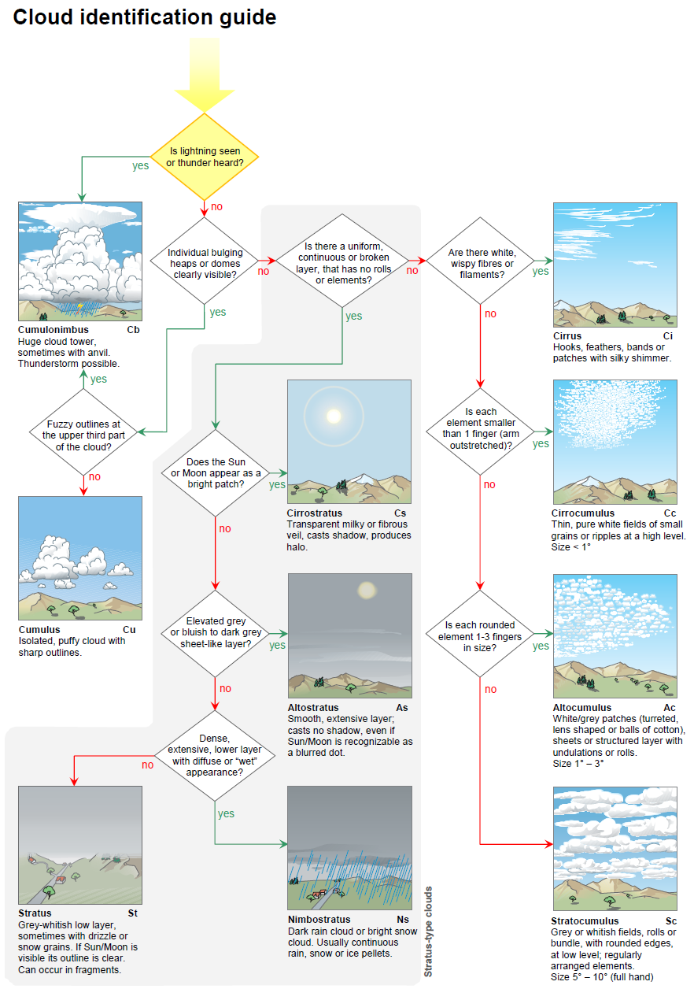

#### 種の識別（第2.7.2.2節）
種（species）は、主に雲の定義と記述、および参照画像との比較に基づいて識別されるべきである。その特徴によって種が識別できない場合は、何も報告すべきではない。また、同じ類（genus）の雲が複数存在する場合、それらが必ずしもすべて同じ種に属するとは限らない。

#### 変種の識別（第2.7.2.3節）
変種（varieties）は、主に雲の定義と記述、および参照画像との比較に基づいて識別されるべきである。変種は、明確に認識された場合にのみ示すこと。同じ雲が複数の変種の特徴を持つ場合、観測されたすべての変種を報告すべきである。

#### 部分的な特徴および付随雲の識別（第2.7.2.4節）
部分的な特徴（supplementary features）および付随雲（accessory clouds）は、主に雲の定義と記述、および参照画像との比較に基づいて識別されるべきである。同じ雲に対して、複数の部分的な特徴または付随雲が同時に存在することがある。

#### 母雲の決定（第2.7.2.5節）
観測中の雲がどの母雲から生じたかの決定には、雲の進化に関する知識が必要である。長期間にわたる空の慎重な観測が必要である。観測者は、関連する雲の定義と記述を使用し、参照画像との比較を行うべきである。観測された雲の起源（「転化雲（mutatus）」）や、その形成過程（「派生雲（genitus）」）に少しでも疑いがある場合は、「転化雲（mutatus）」または「派生雲（genitus）」の指示を使用すべきではない。

#### 雲に関連する気象現象の識別（第2.7.2.6節）
雲以外の気象現象（meteors）で雲に関連するものは、主に定義と記述、および参照画像との比較に基づいて識別されるべきである。これらは、雲内で発生している物理的プロセスに関する重要な情報を提供することが多いため、常に関連する雲と一緒に記録されるべきである。それらの存在は、特定の雲の類を識別する際に決定的となることすらある。

### 全雲量と雲量（第2.7.3節）
全雲量（Total cloud cover）は、目に見えるすべての雲によって覆われた空の割合である。雲量（Cloud amount）は、特定のタイプまたは組み合わせの雲によって覆われた空の割合を指す。それは、類、種、変種、層、または特定の雲の組み合わせを指すことができる。

常に全雲量を見積もり、また存在するさまざまな類の雲量も見積もること。同じ類に属する雲の異なる種や変種、および異なる層の雲量も記録されるべきである。

見積もりは、空全体が見渡せる開けた場所から行われるべきである。例えば、山や、煙霧、霧、または煙などによって空が部分的に隠されている場合、全雲量と各雲量は、見えている部分から見積もるべきである。また、空が降水によって部分的にベールで覆われている場合、この部分は降水雲に覆われていると見なすべきである。

一部の雲が部分的にしか見えないか、一時的に隠れている場合、雲量を見積もることが困難なことがある。これは、雲が重なり合った層や斑状になっている場合に当てはまる。このような状況では、以前は隠れていた雲が見えるようになることがあるため、時間の経過とともに空を観測することで雲量を見積もることができる場合がある。雲が層をなしているか、その他の形で重なっている場合、観測された各雲量の合計が全雲量を超えることがある。

地平線近くの雲の隙間は、観測者には見えないことがある。雲量や各雲量を見積もる際は、観測者の位置から見える隙間のみを考慮すべきである。

暗い夜間には、全雲量のみを決定することができる。これは、雲によって星が暗くなったり完全に隠れたりしている空の割合に基づくべきである。

### 高さと高度（第2.7.4節）
観測者は、観測場所のレベルからの雲底の高さ、または平均海面からの高度を測定または見積もるべきである。可能であれば、雲の鉛直方向の広がりも決定されるべきである。報告された高さまたは高度の根拠（見積もり、雲高計による測定など）は常に明記されるべきである。

### 移動方向と速度（第2.7.5節）
慣例により、雲の移動方向は、その雲が「どこから」移動してくるかの方向である。例えば、雲が南西から北東に移動する場合、記録される移動方向は「南西」である。雲の速度は、その水平移動の速度である。

空の観測では、雲またはその巨視的要素の移動方向と、可能であれば移動速度を報告すべきである。多くの場合、これは雲のレベルにおける風の方向と速度の良い近似値でもある。特に地形性の雲の場合、雲全体としての移動が、その巨視的要素の移動と大きく異なる可能性がある。そのような違いが観測された場合は、報告されるべきである。

### 光学的厚さ（第2.7.6節）
雲の光学的厚さとは、その雲が光を透過させない度合いのことである。光学的厚さは、物理的性質および雲の次元（大きさ）に依存する。観測者は光学的厚さを記録し、雲または雲層が最大の厚さを持つ方向を示すべきである。表13に、光学的厚さの数値スケールを示す。

表13. 雲の光学的厚さのスケール

| スケール | 記述       | コメント                                                                                                                                                                                           |
| :------: | :--------- | :------------------------------------------------------------------------------------------------------------------------------------------------------------------------------------------------- |
|    1     | 非常に弱い | 雲を通して空の青さが識別できる                                                                                                                                                                     |
|    2     | 弱い       | 雲は空の青さを隠すが、太陽が影を落とすのを妨げない。このような雲は通常白色であるが、明るい灰色の場合もある                                                                                         |
|    3     | 中程度     | 雲は全体的に十分な輝度を持つが、所々に目立つ陰影がある。広範囲のシートや層として存在する場合、雲は明るい灰色である                                                                                 |
|    4     | 強い       | 雲は強く陰影がつけられている。広範囲のシートや層として存在する場合、雲は暗い灰色に見える。層が不連続であるか散在する要素で形成されている場合、太陽に直接さらされている部分は白く、かなり輝いている |
|    5     | 非常に強い | 太陽にさらされて輝くように白い部分を除き、雲は暗い。雲は脅威的な外観を持つ                                                                                                                         |

### 山岳観測所からの雲の観測（第2.7.7節）
山岳観測所が雲底よりも低いレベルにある場合、雲の観測手順は低地の観測所と同じである。山岳地帯はしばしば明確な鉛直方向の基準点を提供するため、雲の高さや高度に関する情報はかなり正確になることが多い。雲が観測所のレベルより下で観測された場合は、別々に示されるべきである。平坦または波状（undulated）の表面や、層の頂部の上方にそびえ立つ積雲状の雲の存在などの特徴を含め、これらの雲の上面について記述がなされるべきである。雲量を見積もる際、山が雲の斑、シート、または層から突き出ている場所も、雲で覆われていると見なすべきである。

### 超高層大気中の雲の観測（第2.7.8節）
真珠母雲および夜光雲は、主に超高層大気中の雲の定義および記述に基づいて識別されるべきである。

これらの超高層大気中の雲が観測された場合は、観測の日付、時刻、および場所の正確な記録を保持しなければならない。空における雲の位置を記録し、可能な限り写真を撮影すべきである。

夜光雲の場合、出現の方位角（左右の広がり）、および雲の上縁（下縁がある場合はそれも）の地平線上の仰角を記録すべきである。雲の明るさを5段階のスケールで決定し、可能であればその構造と分類も決定すべきである（明るさのスケールと夜光雲の分類の具体的な詳細については表11を参照）。観測期間中の明るさと分類の変化も記録すべきである。

一般的な観測条件も書き留めておくべきである。例えば、煙霧、もや、および対流圏の雲の存在などである。夜光雲と同時に発生しているオーロラの存在も書き留めておくべきである。

観測時に観測者が夜光雲の方位角や仰角を決定できない場合は、地形的特徴に対する雲の広がり、および雲の近くに見える明るい星に対する仰角を慎重に書き留めておくべきである。そのような基準となる目印を提供することで、雲の広がりと仰角を後で決定することができる。

## 符号CL、CMおよびCHによる雲の符号化と対応する記号（第2.8節）
### 雲の符号化への導入（第2.8.1節）
本図鑑で提示されている符号CL、CM、およびCHは、仕様表から選択された数字（コードフィギュア）によって、気象報告における雲を記述するための便利な方法を提供する。仕様と手順は、符号の仕様と符号化手順において詳細に議論されている。

各数字（コードフィギュア）について、以下の情報が与えられている：

(a) 技術的仕様

(b) 技術的仕様を拡張する説明であり、該当する雲の外観と進化、および時には他の雲との関係や違いに関するもの

正しい数字（コードフィギュア）を選択するための手順は、符号CL、CM、およびCHにおける雲の符号化指示の中で説明されている。

#### 条件（第2.8.1.1節）
正しい数字（コードフィギュア）を選択するには以下が必要であり、留意されなければならない：

1. 空全体の観測：

- これは、特定の符号の仕様が、個々の雲の特定の類（genera）、種（species）、または変種（varieties）だけでなく、空全体の様相にも適用されるという事実から生じる
- さらに、存在する雲の形態を識別することは困難であるにもかかわらず、空全体の様相はすぐに認識できるという状況がある
2. ほぼ継続的な空の監視：

- これは、特定の符号の仕様が、個々の雲または全雲量の進化と発達に直接関連しているという事実に基づく。また、観測時の空の外観が非常に複雑で、存在する過渡的な雲の形態を、それが進化した特徴的な形態と関連付けることなしには、正しい数字（コードフィギュア）を選択することが不可能な状況においても、ほぼ継続的な空の監視が必要である
- CLの符号は、層積雲（Stratocumulus）、層雲（Stratus）、積雲（Cumulus）、および積乱雲（Cumulonimbus）の類の雲を示す
- CMの符号は、高積雲（Altocumulus）、高層雲（Altostratus）、および乱層雲（Nimbostratus）の類の雲を示す
- CHの符号は、巻雲（Cirrus）、巻積雲（Cirrocumulus）、および巻層雲（Cirrostratus）の類の雲を示す

### 符号の仕様および符号化手順（第2.8.2節）
- CL - 層積雲（Stratocumulus）、層雲（Stratus）、積雲（Cumulus）、および積乱雲（Cumulonimbus）の類の雲
- CM - 高積雲（Altocumulus）、高層雲（Altostratus）、および乱層雲（Nimbostratus）の類の雲
- CH - 巻雲（Cirrus）、巻積雲（Cirrocumulus）、および巻層雲（Cirrostratus）の類の雲

#### CL - 層積雲（Stratocumulus）、層雲（Stratus）、積雲（Cumulus）、および積乱雲（Cumulonimbus）の類の雲（第2.8.2.1節）
##### CL = 0（第2.8.2.1.0節）
(a) 技術的仕様

CLの雲はない。
##### CL = 1（第2.8.2.1.1節）
(a) 技術的仕様

扁平積雲（Cumulus humilis）または晴天の断片積雲（Cumulus fractus）、あるいはその両方。

扁平雲（Humilis）：鉛直方向の広がりが小さく、平らに見える。

断片雲（Fractus）：ぼろぼろである（ちぎれている）。

（「晴天（Dry weather）」は降水のない条件を意味する。）

(b) 説明

符号CL = 1に対応する雲には以下のものが含まれる：

(i) 形成の初期段階または消散の最終段階にある積雲（Cumulus）。

(ii) 完全に形成されているが、かなり強く、十分に乱れた風によってほつれた積雲。これらの断片積雲（Cumulus fractus）はよく分離しており、一般的に白く見える。これらの雲と悪天（wet weather）の断片積雲との違いは、仕様CL = 7の説明で示されている。

(iii) 明確な水平の雲底を持つ完全に形成された積雲。これらの雲は、扁平またはしぼんだ形態を持つか、カリフラワー状の外観を持たないやや丸みを帯びた頂部を示す。

  <figure style="text-align: center; margin: 0; flex: 1;">
    
    <figcaption>断片積雲（Cumulus fractus）</figcaption>
  </figure>
  <figure style="text-align: center; margin: 0; flex: 1;">
    
    <figcaption>扁平積雲（Cumulus humilis）</figcaption>
  </figure>

##### CL = 2（第2.8.2.1.2節）
(a) 技術的仕様

並積雲（Cumulus mediocris）または雄大積雲（Cumulus congestus）。断片雲（fractus）または扁平雲（humilis）の種の積雲、あるいは層積雲（Stratocumulus）を伴うことも伴わないこともあるが、すべてが同じレベルに雲底を持つ。

(b) 説明

並積雲（Cumulus mediocris）または雄大積雲（Cumulus congestus）は、中程度または強い鉛直方向の広がりを持つ積雲であり、一般的にドーム状または塔状の隆起を持つ：

(i) やや強い風または強い風の日には、これらの積雲は不規則な雲底を持ち、所々ちぎれていることがある。

(ii) 中緯度では、雷雨の傾向がある暑い日に、また低緯度（貿易風帯）でも頻繁に、積雲は一般的に雄大雲（congestus）の種になる。これらは明確な水平の雲底とカリフラワーに似た膨らんだ上部を持つ。これらの雲は時には塔の形、時には隆起の複雑な塊の形をとる。

(iii) 雄大積雲（Cumulus congestus）は、時にはしゅう雨の形で降水をもたらすことがある。

(iv) 時には、塔状層積雲（Stratocumulus castellanus）の小塔が非常に強く発達し、並積雲または雄大積雲の段階に達することがある。この場合の符号化はCL = 5ではなくCL = 2である。同様の進化が塔状高積雲（Altocumulus castellanus）で起こることもある。この場合も符号化はCM = 8ではなくCL = 2である。

  <figure style="text-align: center; margin: 0; flex: 1;">
    
    <figcaption>並積雲（Cumulus mediocris）</figcaption>
  </figure>
  <figure style="text-align: center; margin: 0; flex: 1;">
    
    <figcaption>雄大積雲（Cumulus congestus）</figcaption>
  </figure>

##### CL = 3（第2.8.2.1.3節）
(a) 技術的仕様

無毛積乱雲（Cumulonimbus calvus）。積雲（Cumulus）、層積雲（Stratocumulus）、または層雲（Stratus）を伴うことも伴わないこともある。

(b) 説明

(i) 無毛雲（calvus）の主な特徴は、積乱雲の頂部がはっきりとした輪郭を欠き、存在する積乱雲のどれもまだ多毛積乱雲（Cumulonimbus capillatus）の段階に達していないことである。

(ii) 無毛積乱雲は雄大積雲から進化し、通常は急速に多毛積乱雲へと発達する。無毛積乱雲は一般的に、非常に短期的な中間発達段階を構成する。

(iii) これらは、雄大積雲の上部の特徴である明確な輪郭とカリフラワー状の外観が少なくとも部分的に消失していることによって、雄大積雲と区別される。

(iv) これらは、上部の一部が明確な繊維状または筋状の外観を持たないこと、あるいはかなとこ状、プルーム（羽毛）状、または髪の毛の塊状の発達がないことによって、多毛積乱雲と区別される。

(v) 無毛積乱雲の滑らかな部分は、他の対流性の強い上昇気流によって生じた新しいドームによって隠されることがある。雲塊は一時的に雄大積雲の外観を呈することがあるが、依然として無毛積乱雲として識別され、CL = 3として符号化される。

(vi) 時には、雄大積雲として識別された雲が、雷光、雷鳴、または雹（ひょう）を伴うことがある。この雲は無毛積乱雲として識別され、CL = 3として符号化される。

  <figure style="margin: 0;">
    
    <figcaption>無毛積乱雲および雄大積雲（Cumulonimbus calvus and Cumulus congestus）</figcaption>
  </figure>

##### CL = 4（第2.8.2.1.4節）
(a) 技術的仕様

積雲由来の層積雲（Stratocumulus cumulogenitus）。積雲が存在することもある。

(b) 説明

(i) 積雲由来の層積雲は、最も多くの場合、鉛直方向の発達（広がり）が安定層に達したときに積雲が横に広がることによって生じる。

(ii) この層が非常に安定している場合、対流は止まり、雲塊全体が横に広がる。

(iii) 場合によっては、安定層が対流を完全に止めるほど強くないか、深くないことがある。その場合、積雲は一時的に横に広がった後、少なくともいくつかの場所で安定層の上で再び成長を始める。したがって、積雲由来の層積雲は、積雲の雲底と雲頂の間の任意のレベルで発生する可能性がある。

(iv) 積雲から積雲由来の層積雲への変化は連続的なプロセスであり、一般的に、積雲が安定層に向かって徐々に広がり、そこで横に広がることで特徴付けられる。

(v) 積雲由来の層積雲は、強い風のシアの結果として、積雲の上部が横に広がることによって形成されることがある。

(vi) 積雲由来の層積雲は、対流が止まり、積雲のドーム状の頂部が平らになり、層積雲の斑状の外観を呈する午後遅くや夕方に発生することが多い。

(vii) 積乱雲由来の層積雲（Stratocumulus cumulonimbogenitus）および積雲由来の層積雲は、積乱雲が観測されている間はCL = 3またはCL = 9として符号化される。

(viii) 積乱雲が消滅した場合、積乱雲由来の層積雲が存在すれば、CL = 4の符号化が必要である。

(ix) 既存の層積雲が積雲によって貫通（進入、または進入して通過）される場合、後者は層積雲に向かって上方に広がることはなく、薄くなった領域、あるいは晴れた領域が積雲の塔を囲むことがある。符号化はCL = 8である。

  <figure style="margin: 0;">
    
    <figcaption>積雲由来の層積雲（Stratocumulus cumulogenitus）</figcaption>
  </figure>

##### CL = 5（第2.8.2.1.5節）
(a) 技術的仕様

積雲由来ではない層積雲（Stratocumulus non-cumulogenitus）（積雲が広がってできたものではない）。

(b) 説明

(i) 層積雲は、1つまたは複数のレベルで発生することがあり、通常、灰色または白っぽいシートまたは層で構成され、ほとんど常に暗い部分を持つ。

(ii) これらは、かなり大きな要素で構成されており、分離しているか、合体しているか、または斑状に分かれている。

(iii) まれに、長く低い孤立した水平のロール雲（volutus）または下部が非常にぼろぼろの小さな積雲状の房状雲（floccus）の形をとる。

(iv) 風のシアと乱れは、層積雲の所々にぼろぼろの（ちぎれた）外観を与えることがある。

(v) 時には、非常に弱い雨、雪、または雪あられの形で降水をもたらすことがある。

(vi) 塔状層積雲（Stratocumulus castellanus）の小塔が強く発達すると、並積雲または雄大積雲の段階に達することがある。この場合の符号化はCL = 5ではなくCL = 2である。

(vii) 斑状に分かれた積雲由来ではない層積雲（CL = 5）は、積雲または積乱雲が広がって形成された層積雲と似ていることがあるが、混同してはならない。この後者の場合、符号化はCL = 4である。

(viii) 時には、層積雲の層が脅威的な外観を呈し、その雲底が所々不明瞭（拡散）になり、乱層雲（Nimbostratus）への変化の過程を示すことがある。この変化が層の実質的に連続した部分で完了し、要素がないことによってそれが裏付けられる場合、この部分は乱層雲として識別され、CM = 2として報告される。

  <figure style="text-align: center; margin: 0; flex: 1;">
    
    <figcaption>不透明層状層積雲（Stratocumulus stratiformis opacus）の下の塔状層積雲（Stratocumulus castellanus）</figcaption>
  </figure>
  <figure style="text-align: center; margin: 0; flex: 1;">
    
    <figcaption>不透明層状層積雲および断片積雲（Stratocumulus stratiformis opacus and Cumulus fractus）</figcaption>
  </figure>

##### CL = 6（第2.8.2.1.6節）
(a) 技術的仕様

霧状層雲（Stratus nebulosus）または晴天の断片層雲（Stratus fractus）、あるいはその両方。

(b) 説明

(i) 霧状層雲は、一般的に、かなり均一な雲底を持つ連続した単一のシートまたは層で構成され、通常は灰色であるが、時には暗かったり脅威的であったりする。

(ii) 断片層雲は、層雲の層の形成中または消散中の一時的な段階である。

(iii) この断片層雲と悪天の断片層雲の違いは、CL = 7の説明で指摘されている。

(iv) 断片層雲が霧状層雲の層の下で発生する場合、それらは層が厚くなりつつあるときに層の雲底と合体する断片であるか、層が割れつつあるときに雲底から切り離された断片のいずれかである可能性がある。

  <figure style="text-align: center; margin: 0; flex: 1;">
    
    <figcaption>晴天の断片層雲（Stratus fractus of dry weather）</figcaption>
  </figure>
  <figure style="text-align: center; margin: 0; flex: 1;">
    
    <figcaption>霧状層雲（Stratus nebulosus）</figcaption>
  </figure>

##### CL = 7（第2.8.2.1.7節）
(a) 技術的仕様

悪天の断片層雲（Stratus fractus）または断片積雲（Cumulus fractus）、あるいはその両方（ちぎれ雲（pannus））。通常は高層雲（Altostratus）または乱層雲（Nimbostratus）の下にある。

悪天とは、一般的に降水中およびその少し前後に存在する条件を意味する。

(b) 説明

(i) 悪天の断片層雲または悪天の断片積雲、あるいはその両方（ちぎれ雲）は、低くなってきた高層雲または乱層雲の雲底の下で形成されることが多い。原則として、それらは次第に数を増し、多かれ少なかれ連続した層に合体する。ちぎれ雲は、その上にある雲層の雲底によって形成される明るい灰色の背景に対して暗く、または灰色に見える。この背景は、ちぎれ雲の層の隙間から通常見える。また、積乱雲や降水をもたらす積雲の雲底の下に存在することもよくある。

(ii) 空全体を覆うちぎれ雲は、そのぼろぼろの雲底によって霧状層雲および層積雲と区別できる。

(iii) 仕様CL = 7の断片層雲は、常に他の類の雲と併存して発生する。それらは一般的に数が多く、上方の雲層の雲底の明るい灰色の背景に対して暗くまたは灰色に見える。それらはほぼ常に不安定な特定の性質を持ち、一般的に速く移動し、急速に形を変える。通常、降水を伴う。

(iv) 仕様CL = 6の断片層雲は単独で発生することがあり、その場合、太陽の方向を見ると灰色に見え、太陽の反対方向を見ると白く見える。霧状層雲の層など、他の雲を背景にして見ると、仕様CL = 7の断片層雲に似ているが、降水は伴わない。

(v) 仕様CL = 7の断片積雲は、常に他の類の雲と併存して発生する。これらは一般的に数が多く、上方の雲の雲底によって形成される明るい灰色の背景に対して暗くまたは灰色に際立つ。同じ仕様の断片層雲と同様に、悪天の断片積雲の雲はほぼ常に不安定な特定の性質を持つ。これらは頻繁に降水を伴う。

(vi) 仕様CL = 1の断片積雲は、主に単独で発生し、よく分離している。特徴として白く、太陽から離れた方向から見るとほとんど輝くように見え、太陽に向かって見ると陰影を示す。これらの雲は、そのレベルの風がかなり強く、乱れているときに頻繁に観測される。

  <figure style="text-align: center; margin: 0; flex: 1;">
    
    <figcaption>乱層雲転化ちぎれ不透明高層雲（Altostratus opacus pannus nimbostratomutatus）</figcaption>
  </figure>
  <figure style="text-align: center; margin: 0; flex: 1;">
    
    <figcaption>ちぎれ乱層雲（Nimbostratus pannus）</figcaption>
  </figure>

##### CL = 8（第2.8.2.1.8節）
(a) 技術的仕様

積雲由来の層積雲以外の積雲（Cumulus）および層積雲（Stratocumulus）で、異なるレベルに雲底を持つもの。

(b) 説明

(i) 符号CL = 8は、積雲が積雲由来ではない層積雲の斑、シート、または層の下に形成される場合に適用される。

(ii) 積雲は層積雲を貫通（進入、または進入して通過）することがある。

(iii) しかし、積雲が広がって積雲由来の層積雲を形成することはない。

(iv) 符号CL = 8は、積雲が層積雲の上方に観測される場合にも適用される。例としては、塔状高積雲（Altocumulus castellanus）の塔が発達し、並積雲または雄大積雲へと移行する場合などがある。

  <figure style="text-align: center; margin: 0; flex: 1;">
    
    <figcaption>不透明層状層積雲および断片積雲（Stratocumulus stratiformis opacus and Cumulus fractus）</figcaption>
  </figure>
  <figure style="text-align: center; margin: 0; flex: 1;">
    
    <figcaption>積雲を伴う放射状波状不透明層状層積雲（Stratocumulus stratiformis opacus undulatus radiatus with Cumulus）</figcaption>
  </figure>

##### CL = 9（第2.8.2.1.9節）
(a) 技術的仕様

多毛積乱雲（Cumulonimbus capillatus）（しばしばかなとこ雲を伴う）。無毛積乱雲（Cumulonimbus calvus）、積雲（Cumulus）、層積雲（Stratocumulus）、層雲（Stratus）、またはちぎれ雲（pannus）を伴うことも伴わないこともある。

(b) 説明

(i) 多毛積乱雲は無毛積乱雲から進化する。それらは上部の外観によって無毛積乱雲（CL = 3）から区別される：

多毛積乱雲の上部は、明確な繊維状または筋状の構造を示し、かなとこ雲、プルーム（羽毛）雲、または巨大な髪の毛の塊に似た形をとることが多い。
無毛積乱雲は、繊維状または筋状の部分を持たない。
(ii) CL = 9が対象とする多数の可能性のあるケースのうち、以下の2つが頻繁に観測される：

明確な水平の雲底（時には部分的または完全にちぎれ雲によって隠されている）を持つ積乱雲は、中緯度の暑くて雷雨の傾向がある日、および低緯度の湿潤地帯で頻繁に発生する。
かなり強い風によって雲底がほつれており、時折ちぎれ雲を伴う積乱雲。
(iii) 多毛積乱雲の巻雲状の部分は、雲が観測点の上を通過する際に見えなくなることがある。それでもなお、その履歴に基づいて多毛積乱雲として分類され、CL = 9と符号化されるべきである。

(iv) 多毛積乱雲の巻雲状の部分が他の雲に隠れてしまった場合も同様である。

(v) 雷光、雷鳴、または雹（ひょう）の発生が、積乱雲の存在を示す唯一の指標となることがある。この場合、雲が無毛雲か多毛雲のどちらの種に属するかを決定することは不可能であり、慣例により符号化はCL = 9となる。

(vi) 時には、0 °C（32 °F）のレベルが低い場合、上部の繊維状構造が多毛積乱雲全体に広がり、その後巻雲状の雲塊（CH = 3）に退化するが、少なくとも1つの積乱雲が視界内にあるか、存在することがわかっている限り、CL = 9の符号化は維持される。

(vii) 多毛積乱雲は時として雲塊を生み出し、それが積乱雲から切り離されて独立したアイデンティティを持つようになることがある。多くの場合、それらは巻雲、高積雲、高層雲、または層積雲の外観を呈する。

  <figure style="margin: 0;">
    
    <figcaption>降水多毛積乱雲（Cumulonimbus capillatus praecipitatio）</figcaption>
  </figure>

##### CL = /（第2.8.2.1.10節）
(a) 技術的仕様

暗闇、霧、風塵、砂嵐、またはその他の類似した現象のために、CLの雲が観測できない。

#### CM - 高積雲（Altocumulus）、高層雲（Altostratus）、および乱層雲（Nimbostratus）の類の雲（第2.8.2.2節）

##### CM = 0（第2.8.2.2.0節）
(a) 技術的仕様

CMの雲はない。

##### CM = 1（第2.8.2.2.1節）
(a) 技術的仕様

半透明高層雲（Altostratus translucidus）。

(b) 説明

(i) この高層雲の大部分は、灰色または青みがかった色をしており、太陽や月の位置を明らかにするのに十分なほど半透明である。 この高層雲は通常、次第に厚くなる巻層雲（Cirrostratus）のベールが連続的に進化することによって形成される。 時には、特に熱帯地方では、積乱雲（Cumulonimbus）の中部または上部が広がることで生成されることがある。

(ii) 高層雲はハロ（暈）現象を示さない。

  <figure style="margin: 0;">
    
    <figcaption>乱層雲転化半透明高層雲（Altostratus translucidus nimbostratomutatus）</figcaption>
  </figure>

##### CM = 2（第2.8.2.2.2節）
(a) 技術的仕様

不透明高層雲（Altostratus opacus）または乱層雲（Nimbostratus）。

(b) 説明

(i) 符号CM = 2に対応する高層雲は、半透明高層雲（Altostratus translucidus）よりも暗い灰色または暗い青灰色であり、太陽や月を完全に隠すのに十分な密度をその広がりの大部分にわたって持っている。 これは複数の層で発生することがある。 

(ii) 不透明高層雲は、半透明高層雲の層が厚くなること、高積雲（Altocumulus）のシートまたは層の要素が合体すること、積乱雲の中部または上部が横に広がる（spreading out）こと、乱層雲が薄くなること、または濃密巻雲（Cirrus spissatus）が水平に広がることから生じる可能性がある。

(iii) 同じくCM = 2である乱層雲は、不透明高層雲よりも密度が高く暗い外観を持つ。その雲底は比較的低いレベルにあり、一般的に不明瞭（拡散した）で「濡れた」外観を持つ。 

(iv) 乱層雲は、厚い不透明高層雲の層の進化、厚い不透明高積雲（Altocumulus opacus）のシートまたは層の要素の合体、または、まれに不透明層積雲（Stratocumulus opacus）から生じる。 また、積乱雲から進化することもある。

(v) 不透明高層雲または乱層雲の層に伴うちぎれ雲（pannus）が連続した層に合体し、高層雲または乱層雲が見えなくなった場合、符号化CM = 2はCM = /に置き換えられるべきである。ちぎれ雲はCL = 7として符号化される。

  <figure style="text-align: center; margin: 0; flex: 1;">
    
    <figcaption>降水乱層雲および悪天の断片層雲（Nimbostratus praecipitatio and Stratus fractus of wet weather）</figcaption>
  </figure>
  <figure style="text-align: center; margin: 0; flex: 1;">
    
    <figcaption>降水不透明高層雲（Altostratus opacus praecipitatio）</figcaption>
  </figure>

##### CM = 3（第2.8.2.2.3節）
(a) 技術的仕様

単一のレベルにある半透明高積雲（Altocumulus translucidus）。

(b) 説明

(i) 符号CM = 3は、同じレベルにある斑状またはシート状の高積雲、または層状の高積雲に適用される。これらの雲のさまざまな要素は、非常に大きいわけでも、非常に暗いわけでもない。 雲の要素が少しでも変化する場合、それはほとんど気付かない程度であり、空を次第に覆っていく（侵略していく）ことはない。

(ii) 空には、同じレベルにあり、光学的厚さが異なる複数の高積雲の斑またはシートが含まれていることがある。 変種（variety）である半透明雲（translucidus）の定義により、個々の斑またはシートの大部分が太陽や月の位置を明らかにするのに十分なほど半透明である場合、それらを半透明高積雲として識別することが許容される。 しかし、符号が半透明高積雲を指す場合、それは同じレベルにある高積雲の総量を関連付けている。符号CM = 3は、そのレベルで半透明の高積雲が支配的である場合にのみ使用できる。 符号の仕様が不透明高積雲（Altocumulus opacus）を指す場合にも、同様の規則が適用される。 

(iii) （空を侵略していない）半透明高積雲が2つ以上のレベルに存在する場合、CM = 7を参照のこと。

  <figure style="text-align: center; margin: 0; flex: 1;">
    
    <figcaption>波状すきま半透明層状高積雲（Altocumulus stratiformis translucidus perlucidus undulatus）</figcaption>
  </figure>
  <figure style="text-align: center; margin: 0; flex: 1;">
    
    <figcaption>半透明層状高積雲（Altocumulus stratiformus translucidus）</figcaption>
  </figure>

##### CM = 4（第2.8.2.2.4節）
(a) 技術的仕様

継続的に変化し、1つまたは複数のレベルで発生する半透明高積雲（Altocumulus translucidus）の斑（しばしばレンズ状）。

(b) 説明

(i) 仕様CM = 4の高積雲の斑の不規則に配列された要素は、絶えず形を変えている。それらはある場所で消散し、別の場所で形成されているように見えることが多い。 雲の斑は水平方向の広がりが限られており、その要素は絶えず変化している。その結果、これらは通常、変種である半透明雲に属し、不透明雲（opacus）に属することはまれである。 斑全体としては大きなレンズの形をしていることがあり、1つまたは複数のレベルで発生することがある。雲は次第に空を覆っていくことはない。

(ii) 符号CM = 4は、多数の比較的小さな、絶えず変化する要素で構成される上記の斑だけでなく、単一の滑らかなレンズ状の要素またはそのような要素の積み重ねからなる比較的安定した雲にも適用される。

(iii) これらの雲は、積雲または積乱雲の上部付近またはかなり離れた場所で、付随雲（頭巾雲（pileus）またはベール雲（velum））の形で発生することがある。

(iv) レンズ雲は丘陵地帯や山岳地帯で頻繁に観測される。

  <figure style="margin: 0;">
    
    <figcaption>英国イングランド、ペナイン山脈の風下にあるレンズ状高積雲（Altocumulus lenticularis to the lee of the Pennines, England, UK）</figcaption>
  </figure>

##### CM = 5（第2.8.2.2.5節）
(a) 技術的仕様

帯状の半透明高積雲（Altocumulus translucidus）、または次第に空を覆っていく（侵略していく）1つ以上の半透明高積雲または不透明高積雲（Altocumulus opacus）の層。これらの高積雲は全体として厚くなるのが一般的である。

(b) 説明

(i) 主な特徴は、次第に空を覆っていく（侵略していく）高積雲である。 雲は地平線の一部から天頂に向かって徐々に進み、それによって雲量が増加する。 雲系の境界はしばしば天頂を通過し、最終的に雲が最初に現れた方向とは反対側の地平線に達することがある。 空を見ると、観測者は雲が最初に現れた方向の地平線まで雲系が広がっているのを見るだろう。また、雲が最も厚いのも通常はこの方向である。 雲系の主要部分は、全体的または部分的に半透明、あるいは全体的または部分的に不透明な、1つまたは複数の層で構成される。 雲系の前進部分（多くの場合消散の過程にある）は、小さくほつれた高積雲の要素、またはロール状や帯状の雲で構成されることがあり、通常は単一のレベルで観測され、半透明の雲で構成される。 この前進部分は、空の広い範囲を覆うことがある。

(ii) 符号CM = 5は、雲の先端が最初に現れた方向とは反対側の地平線に達した時点、または先端の前進が止まった時点で使用されなくなる。

(iii) 次第に空を覆っていく（侵略していく）高積雲は、同時にその一部または全体が、高層雲（Altostratus）または乱層雲（Nimbostratus）へと変化していることがある。 高積雲の一部が高層雲または乱層雲に変化した場合、すなわち高積雲の一部において要素（薄片、ロール、丸みを帯びた塊など）が存在する証拠が消失した場合、符号化はCM = 5ではなくCM = 7になる。 要素が存在する証拠が全体にわたって消失すると直ちに、状況に応じて符号化はCM = 1またはCM = 2となる。

  <figure style="margin: 0;">
    
    <figcaption>波状すきま半透明層状高積雲（Altocumulus stratiformis translucidus perlucidus undulatus）</figcaption>
  </figure>

##### CM = 6（第2.8.2.2.6節）
(a) 技術的仕様

積雲由来の高積雲（Altocumulus cumulogenitus）（または積乱雲由来の高積雲（Altocumulus cumulonimbogenitus））。

(b) 説明

(i) 積雲由来の高積雲は、一般に安定層に達した積雲（Cumulus）の頂部が横に広がる（spreading out）ことによって生じる。 時折、鉛直方向に発達している雄大積雲（Cumulus congestus）が、その成長を完全には止められない安定層に遭遇することがある。この場合、積雲は一時的に横に広がった後、少なくとも局所的には安定層の上で再び成長を始める。 したがって、積雲由来の高積雲は、雄大積雲の側面に現れることがある。

(ii) 積雲由来の高積雲は、その形成様式により斑状に発生する。 最初、大きくて暗い要素を持つこれらの斑はかなり厚くて不透明であり、その下面にはさざ波状の起伏が見られることがある。 その後、斑は薄くなり、最終的に別々の要素に分かれる。 同じ空に、様々な進化段階の高積雲の斑が見られることが多い。

(iii) 積雲由来の高積雲の斑を横から見ると、特にその境界付近で積雲状の外観を示すことがある。 そのような斑を塔状高積雲（Altocumulus castellanus）と混同しないよう注意を払う必要がある。

(iv) 積雲由来の高積雲は、積乱雲（Cumulonimbus）のかなとこ雲（incus）や、積乱雲由来の濃密巻雲（Cirrus spissatus cumulonimbogenitus）と混同されるべきではない。これらは両方とも下面に乳房雲（mamma）を示すことがあり、高積雲に似ている場合がある。 しかし、高積雲は、かなとこ雲や濃密巻雲が持つ繊維状の構造、絹のような光沢、および白さを持つことは決してない。

(v) 積乱雲に伴う高積雲（積乱雲由来の高積雲）もCM = 6として符号化される。これは、積乱雲がまだ積雲の発達段階にある間に形成されることが多い。

  <figure style="text-align: center; margin: 0; flex: 1;">
    
    <figcaption>積雲由来の高積雲および雄大積雲（Altocumulus cumulogenitus and Cumulus congestus）</figcaption>
  </figure>
  <figure style="text-align: center; margin: 0; flex: 1;">
    
    <figcaption>頭巾かなとこ多毛積乱雲（Cumulonimbus capillatus incus pileus）</figcaption>
  </figure>

##### CM = 7（第2.8.2.2.7節）
(a) 技術的仕様

二重高積雲（Altocumulus duplicatus）、あるいは次第に空を覆っていく（侵略していく）ことのない単一の層の不透明高積雲（Altocumulus opacus）、あるいは高層雲（Altostratus）または乱層雲（Nimbostratus）を伴う高積雲。

(b) 説明

仕様CM = 7には、以下の空が含まれる：

(i) 異なるレベルにある高積雲の斑、シート、または層（二重雲（duplicatus））。これらの斑、シート、または層は、通常は所々不透明な半透明高積雲、または不透明高積雲である場合がある。 この高積雲の要素は絶えず変化しているわけではなく、雲が次第に空を覆っていく（侵略していく）こともない。

(ii) 単一のレベルにある不透明高積雲の斑、シート、または層。 要素は絶えず変化しているわけではなく、雲が次第に空を覆っていく（侵略していく）こともない。 空には、同じレベルにあり、光学的厚さが異なる複数の高積雲の斑またはシートが含まれていることがある。 変種である不透明雲（opacus）の定義により、個々の斑またはシートの大部分が太陽や月の位置を隠すのに十分なほど不透明である場合、それらを不透明高積雲として識別することが許容される。 しかし、符号が不透明高積雲を指す場合、それは同じレベルにある高積雲の総量を関連付けている。CM = 7のケースは、そのレベルで不透明な高積雲が支配的である場合にのみ使用できる。

(iii) 高積雲は、高層雲または乱層雲と一緒に、以下の配置で観測されることがある：

部分的に高積雲の特徴を示し、部分的に高層雲または乱層雲の特徴を示す単一または複数の層。 この空は、高積雲が局所的に変化して高層雲や乱層雲の外観を獲得したり、高層雲や乱層雲が高積雲に分かれたりする変化の結果として生じることが多い。
1つまたは複数のレベルにある高積雲の斑の上にある、半透明高層雲または不透明高層雲。
より高い高積雲と一緒に存在する、多くの場合ほとんど識別できないかなり低いベール。

  <figure style="text-align: center; margin: 0; flex: 1;">
    
    <figcaption>二重塔状高積雲（Altocumulus castellanus duplicatus）</figcaption>
  </figure>
  <figure style="text-align: center; margin: 0; flex: 1;">
    
    <figcaption>波状不透明層状高積雲（Altocumulus stratiformis opacus undulatus）</figcaption>
  </figure>

##### CM = 8（第2.8.2.2.8節）
(a) 技術的仕様

塔状高積雲（Altocumulus castellanus）または房状高積雲（Altocumulus floccus）。

(b) 説明

(i) これら2つの種の高積雲は積雲状の外観を持つ。この特徴は、房状高積雲よりも塔状高積雲においてより顕著である。

(ii) 塔状高積雲は、線状に配列されているように見える小塔で構成される。これらの小塔は一般に共通の水平な雲底を持ち、それが雲に城壁の胸壁状の外観を与える。

(iii) 房状高積雲は、丸みを帯びてわずかに膨らんだ上部を持つ、白または灰色の散在した房状で発生する。これらはしばしば繊維状の跡（尾流雲（virga））を伴う。 これらの雲は、非常に小さく、多かれ少なかれぼろぼろの（ちぎれた）積雲に似ている。

(iv) 存在する塔状高積雲または房状高積雲の一部が、並積雲（Cumulus mediocris）、雄大積雲（Cumulus congestus）、または積乱雲（Cumulonimbus）へと発達した場合、それらはCLの雲を符号化するための規則に従うことになる。

  <figure style="text-align: center; margin: 0; flex: 1;">
    
    <figcaption>尾流房状高積雲（Altocumulus floccus virga）</figcaption>
  </figure>
  <figure style="text-align: center; margin: 0; flex: 1;">
    
    <figcaption>放射状塔状高積雲（Altocumulus castellanus radiatus）</figcaption>
  </figure>

##### CM = 9（第2.8.2.2.9節）
(a) 技術的仕様

混沌とした空の高積雲（Altocumulus）、一般に複数のレベルにある。

(b) 説明

(i) この空の主な特徴は、混沌として重苦しく、よどんだ外観である。 中層の雲は、かなり低く不透明な高積雲から、高く半透明な繊維状の高層雲のベールに至るまで、あらゆる過渡的な形態を持つ、不明確な種または変種の多かれ少なかれ割れた雲のシートが重なり合って構成されている。

(ii) この空はまた、一般的に下層と上層に属する雲の多様性を示す。

  <figure style="margin: 0;">
    
    <figcaption>混沌とした空の高積雲（Altocumulus of a chaotic sky）</figcaption>
  </figure>

##### CM = /（第2.8.2.2.10節）
(a) 技術的仕様

暗闇、霧、風塵、砂嵐、またはその他の類似した現象のため、あるいは下層の連続した雲の層のために、CMの雲が観測できない。

#### CH-clouds 巻雲、巻積雲、巻層雲(Section 2.8.2.3)
##### CH = 0(Section 2.8.2.3.0)
(a) TECHNICAL SPECIFICATION

CH雲なし。

##### CH = 1(Section 2.8.2.3.1)
(a) TECHNICAL SPECIFICATION

巻雲の毛状雲、および時には巻雲の鈎状雲。これらは次第に空に広がることはない。

(b) EXPLANATION

(i) CH = 1に該当する巻雲は、ほとんど直線の、あるいは多かれ少なかれ湾曲した筋状（巻雲の毛状雲）として現れることが最も多い。よりまれに、丸みを帯びていない鈎や房を頂部に持つコンマのような形状（巻雲の鈎状雲）をしている。

(ii) 巻雲の毛状雲および鈎状雲は、通常、他の種の巻雲と同じ空に現れる。コード番号 CH = 1 は、巻雲の毛状雲、鈎状雲、またはこれらの雲の組み合わせによる雲量が、他の巻雲の種の合計雲量より大きい場合にのみ使用できる。

(iii) CH = 1としてコード化される巻雲は、次第に空に広がることはない。

  <figure style="text-align: center; margin: 0; flex: 1;">
    
    <figcaption>巻雲の鈎状雲、房状雲、塔状雲、毛状雲および濃密雲</figcaption>
  </figure>
  <figure style="text-align: center; margin: 0; flex: 1;">
    
    <figcaption>巻雲の毛状雲、増加中</figcaption>
  </figure>

##### CH = 2(Section 2.8.2.3.2)
(a) TECHNICAL SPECIFICATION

巻雲の濃密雲。斑状あるいはもつれた束状で、通常は増加せず、時には積乱雲の上部の残骸のように見えることがある。または巻雲の塔状雲、あるいは巻雲の房状雲。

(b) EXPLANATION

(i) CH = 2に該当する巻雲は、積乱雲由来ではない濃密雲、巻雲の塔状雲、巻雲の房状雲の種、またはこれらすべての組み合わせである。

(ii) 巻雲の濃密雲は、太陽の方向を見たときに灰色がかって見えるほど十分な光学的厚さを持つ斑状の雲で構成される。これらは時として縁がもつれた筋状（もつれ雲の変種）になっており、積乱雲の上部の残骸であるという誤った印象を与えることがある。

(iii) 巻雲の塔状雲は、共通の雲底から立ち上がる小さな繊維状の塔あるいは丸みを帯びた隆起を示す。巻雲の房状雲は、多くの場合、尾流を伴う多かれ少なかれ孤立した房の形をしている。

(iv) 上記の雲は、巻雲の毛状雲または巻雲の鈎状雲を伴うことがある。ただし、積乱雲由来ではない巻雲の濃密雲、巻雲の塔状雲もしくは房状雲、またはこれらの雲の任意の組み合わせの雲量が、巻雲の毛状雲および鈎状雲の合計雲量よりも大きい。

  <figure style="text-align: center; margin: 0; flex: 1;">
    
    <figcaption>巻雲の塔状雲</figcaption>
  </figure>
  <figure style="text-align: center; margin: 0; flex: 1;">
    
    <figcaption>巻雲の房状雲</figcaption>
  </figure>

  <figure style="margin: 0;">
    
    <figcaption>巻雲の濃密雲の乳房雲および巻雲の房状雲</figcaption>
  </figure>

##### CH = 3(Section 2.8.2.3.3)
(a) TECHNICAL SPECIFICATION

積乱雲由来の巻雲の濃密雲。

(b) EXPLANATION

(i) コード番号 CH = 3 は、空に存在する少なくとも1つの巻雲が、積乱雲から発生したという直接的または間接的な証拠を提供する場合にのみ使用される。この積乱雲由来の巻雲の濃密雲は、起源が疑わしい巻雲の濃密雲、巻雲の塔状雲、巻雲の房状雲、巻雲の毛状雲、または巻雲の鈎状雲を伴うことがある。

(ii) 観測者は、空を継続的に監視することで、積乱雲の上部から巻雲の濃密雲が発達するのを目撃できるかもしれない。しかし、多くの場合、観測者は巻雲の濃密雲の起源に関する直接的な情報を持っていない。それにもかかわらず、空に存在する巻雲の濃密雲が積乱雲から発生したことを、合理的な確実性をもって示す十分な間接的証拠が存在する場合がある。

(iii) 積乱雲由来の巻雲の濃密雲は、その縁の毛のような、あるいはほつれたような外観、全体的なかなとこ状の形状、または太陽をベールで覆ったり、その輪郭をぼやけさせたり、あるいは完全に隠してしまうほどしばしば十分な光学的厚さによって、その起源を明らかにする。

  <figure style="margin: 0;">
    
    <figcaption>積乱雲由来の巻雲の濃密雲および積乱雲の多毛雲かなとこ雲</figcaption>
  </figure>

##### CH = 4(Section 2.8.2.3.4)
(a) TECHNICAL SPECIFICATION

巻雲の鈎状雲、巻雲の毛状雲、またはその両方で、次第に空に広がるもの。これらは全体として一般に厚みを増す。

(b) EXPLANATION

(i) CH = 4 に該当する巻雲の主な特徴は、次第に空に広がることである。雲の集まりは地平線の一部に広がり、その前縁は反対側の地平線に向かって移動している。

(ii) この雲は、小さな鈎や房から垂れ下がる筋の形（巻雲の鈎状雲）として現れることが最も多い。それより頻度は低いが、直線的または不規則に湾曲した筋の形（巻雲の毛状雲）で現れることもある。

(iii) この雲は通常、最初に現れた地平線の方向に向かって融合しているように見えるが、巻層雲は存在しない。

  <figure style="text-align: center; margin: 0; flex: 1;">
    
    <figcaption>巻雲の鈎状雲</figcaption>
  </figure>
  <figure style="text-align: center; margin: 0; flex: 1;">
    
    <figcaption>巻雲の濃密雲の放射状雲、巻雲の鈎状雲の放射状雲、巻雲の房状雲および巻積雲の房状雲</figcaption>
  </figure>

##### CH = 5(Section 2.8.2.3.5)
(a) TECHNICAL SPECIFICATION

巻雲（しばしば帯状）および巻層雲、または巻層雲単独で、次第に空に広がるもの。これらは全体として一般に厚みを増すが、連続したベールは地平線から45度以上の高度には達しない。

(b) EXPLANATION

(i) 巻層雲が次第に空に広がるが、その連続した部分は依然として地平線から45度未満である。

(ii) 巻層雲のベールの前方に、しばしば長い筋状（巻雲の毛状雲）またはコンマのような形状（巻雲の鈎状雲）の巻雲が現れることがある。これらは空の一部を横切る帯状に配列され、地平線の1点または対向する2点に向かって収束しているように見えることが多い（放射状雲の変種）。

(iii) 巻雲は魚の骨格に似た形（肋骨雲の変種）を持つこともある。

  <figure style="margin: 0;">
    
    <figcaption>広がりつつある巻層雲の霧状雲および巻雲の鈎状雲</figcaption>
  </figure>

##### CH = 6(Section 2.8.2.3.6)
(a) TECHNICAL SPECIFICATION

巻雲（しばしば帯状）および巻層雲、または巻層雲単独で、次第に空に広がるもの。これらは全体として一般に厚みを増す。連続したベールは地平線から45度以上の高度に広がるが、空を完全に覆うことはない。

(b) EXPLANATION

(i) 巻層雲が次第に空に広がるが、その連続した部分は地平線から45度以上の高度にあるが空を完全に覆ってはいない。

(ii) 巻層雲のベールの前方に、しばしば長い筋状（巻雲の毛状雲）またはコンマのような形状（巻雲の鈎状雲）の巻雲が現れることがある。これらは空の一部を横切る帯状に配列され、地平線の1点または対向する2点に向かって収束しているように見えることが多い（放射状雲の変種）。

(iii) 巻雲は魚の骨格に似た形（肋骨雲の変種）を持つこともある。

  <figure style="margin: 0;">
    
    <figcaption>広がりつつある巻層雲の毛状雲の二重雲の波状雲</figcaption>
  </figure>

##### CH = 7(Section 2.8.2.3.7)
(a) TECHNICAL SPECIFICATION

空全体を覆う巻層雲。

(b) EXPLANATION

(i) 空全体を覆う巻層雲は、通常、明確な詳細を示さない、明るく均一な霧状のベール（巻層雲の霧状雲）、あるいは多かれ少なかれはっきりとした筋を持つ白く繊維状のベール（巻層雲の毛状雲）として現れる。

(ii) 巻層雲のベールは時として非常に薄いためほとんど見えず、特に薄い巻層雲で頻繁に発生する暈（かさ）現象が、その存在を示す唯一の証拠となる。巻層雲は比較的濃密な場合もある。

(iii) 異なる高度の巻雲や巻積雲が巻層雲を伴うことがある。

(iv) 巻層雲のベールが所々で下層の雲に隠されていたり、地平線が暗かったり、煙霧や煙などによって部分的または完全に隠されている場合、観測者は（例えば継続的な観測によって）巻層雲が本当に空全体を覆っていると確信できない限り、CH = 7 を報告してはならない。もし少しでも疑いがある場合は、CH = 8 としてコード化すべきである。ただし、そのベールが次第に空に広がってきたことが分かっている場合は例外であり、その場合はコード番号 CH = 6 を使用すべきである。

(v) ベールに隙間や晴れ間があり、そこから空の青色を識別できる場合は、コード番号 CH = 8 とすべきである。

(vi) 連続的な移行の過程により、高層雲の半透明雲の薄い層が巻層雲の完全なベールに続き、これら2つが共に空全体を覆っている場合、コード番号 CH = 7 を、コード番号 CM = 1（高積雲が存在しない場合）または CM = 7（高積雲が存在する場合）と同時に使用すべきである。

  <figure style="margin: 0;">
    
    <figcaption>巻層雲の霧状雲における暈現象</figcaption>
  </figure>

##### CH = 8(Section 2.8.2.3.8)
(a) TECHNICAL SPECIFICATION

次第に空に広がることはなく、また空全体を覆うこともない巻層雲。

(b) EXPLANATION

(i) 次第に空に広がることのない（あるいは、もはや広がっていない）、空全体を完全に覆うことのない巻層雲のベール。ベールの縁ははっきりしている場合もあれば、ほつれている場合もある。

(ii) コード番号 CH = 8 は、量が増加しているかどうかにかかわらず、斑状の巻層雲にも適用される。

(iii) 巻雲および巻積雲（優勢ではない）が存在することもある。

  <figure style="margin: 0;">
    
    <figcaption>22度ハロ（暈）を伴う巻層雲の毛状雲の波状雲</figcaption>
  </figure>

##### CH = 9(Section 2.8.2.3.9)
(a) TECHNICAL SPECIFICATION

巻積雲単独、またはCH雲の中で巻積雲が優勢な場合。

(b) EXPLANATION

(i) コード番号 CH = 9 は、巻積雲が存在する唯一のCH雲である場合、またはその雲量が共存する巻雲および巻層雲の合計雲量よりも大きい場合にのみ使用できる。

(ii) 巻積雲が空にある唯一のCH雲である場合、その雲要素は、非常に特徴的な小さなさざ波を伴う、多かれ少なかれ広範囲の斑状に群がっていることがよくある。

(iii) 巻積雲が巻雲または巻層雲と共に現れる場合、これらの雲はしばしば複合的な斑状に結びついており、通常は継続的な内部変化の過程にある。

  <figure style="margin: 0;">
    
    <figcaption>巻積雲の層状雲の波状雲</figcaption>
  </figure>

##### CH = /(Section 2.8.2.3.10)
(a) TECHNICAL SPECIFICATION

暗闇、霧、風塵、砂嵐、またはその他の同様の現象、あるいは下層雲の連続した層のために、CH雲を観測できない。

### コードCL、CM、CHにおける雲のコーディング手順(Section 2.8.3)
空の様子を正しくコード化するために従うべき厳格な規則と優先順位がある。最も高い優先順位は一番上にある。最初のポイント（1）が適用できない場合は、次のポイント（2）に進む。観測している雲に到達するまで下に続ける。複数の雲を識別した場合は、優先順位の高い雲を報告する。

注記：

コーディング手順を適用する際、「存在する（present）」という言葉は、この雲のタイプが他の雲（たとえ優勢な雲であっても）と同時に発生した場合でも、記載された優先順位が観測者に観測された空の正しいコード番号を選択させることを意味する。

#### コーディング手順 CL(Section 2.8.3.1)
1. 存在する1つの積乱雲の少なくとも一部が多毛雲の種である場合、コーディングは CL = 9 である。
2. 積乱雲がまだはっきりと繊維状または筋状になっていない場合、コーディングは CL = 3 である。
3. 積雲が広がって形成された層積雲が存在する場合、コーディングは CL = 4 である。
4. 雲底の高度が異なる積雲と層積雲が同時に存在する場合、コーディングは CL = 8 である。
5. 積雲の並雲または雄大雲が存在し、すべて同じ高度の雲底を持つ場合、コーディングは CL = 2 である。
6. 上記のいずれも適用できない場合は、以下のうちから優勢な雲を選択する：
   - 悪天候時の層雲の断片雲または積雲の断片雲が優勢な場合は、コード番号 CL = 7 を使用する。
   - 晴天時の層雲の霧状雲/断片雲が優勢な場合は、コード番号 CL = 6 を使用する。
   - 積雲由来ではない層積雲が優勢な場合は、コード番号 CL = 5 を使用する。
   - 晴天時の積雲の扁平雲/断片雲が優勢な場合は、コード番号 CL = 1 を使用する。

#### コーディング手順 CM(Section 2.8.3.2)
1. 混沌とした空の高積雲が存在する場合、コーディングは CM = 9 である。
2. 高積雲の塔状雲または房状雲が存在する場合、コーディングは CM = 8 である。
3. 高積雲が高層雲または乱層雲と共存している場合、コーディングは CM = 7 である。
4. 積雲由来または積乱雲由来の高積雲が存在する場合、コーディングは CM = 6 である。
5. 高積雲が次第に空に広がっている場合、コーディングは CM = 5 である。
6. 高積雲の斑状の雲が絶えず変化している場合、コーディングは CM = 4 である。
7. 高積雲（半透明雲および/または不透明雲の変種）が2つ以上の高度にある場合、コーディングは CM = 7 である。
8. 単一の高度にある高積雲が主に半透明雲である場合、コーディングは CM = 3 である。
9. 単一の高度にある高積雲が主に不透明雲である場合、コーディングは CM = 7 である。
10. 高層雲の大部分が半透明である場合、コーディングは CM = 1 である。
11. 高層雲の大部分が太陽や月を完全に隠すほど濃密であるか、乱層雲が存在する場合、コーディングは CM = 2 である。

#### コーディング手順 CH(Section 2.8.3.3)
1. 巻積雲が単独であるか、または他の巻雲系の雲を伴うが空で優勢な場合、コーディングは CH = 9 である。
2. 巻層雲が空全体を覆っている場合、コーディングは CH = 7 である。
3. 巻層雲が空に広がっておらず、かつ完全に覆っていない場合、コーディングは CH = 8 である。
4. 巻層雲が次第に空に広がり、地平線から45度以上の高度に広がるが空全体を覆っていない場合、コーディングは CH = 6 である。
5. 巻層雲が次第に空に広がり、地平線から45度未満の高度に広がる場合、コーディングは CH = 5 である。
6. 巻雲の鈎状雲および/または毛状雲が次第に空に広がっている場合、コーディングは CH = 4 である。
7. 巻雲の濃密雲のいずれかが積乱雲を起源とする場合、コーディングは CH = 3 である。
8. 積乱雲由来ではない巻雲の濃密雲、巻雲の塔状雲および/または房状雲の雲量が優勢な場合、コーディングは CH = 2 である。
9. 巻雲の毛状雲および/または鈎状雲は CH = 1 としてコード化される。
### CL、CM、CH向けの雲分類補助ツール(Section 2.8.4)

#### 雲分類支援ツール CL 低層雲分類支援ツール(Section 2.8.4.1)

  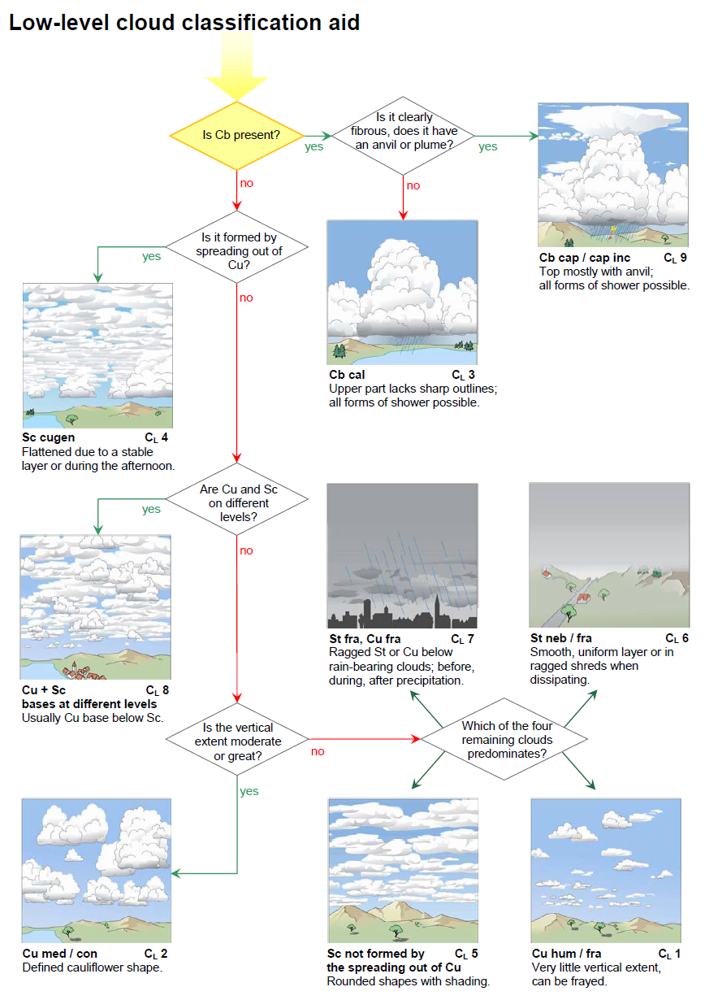

#### 雲分類支援 CM 中層雲分類支援(Section 2.8.4.2)

  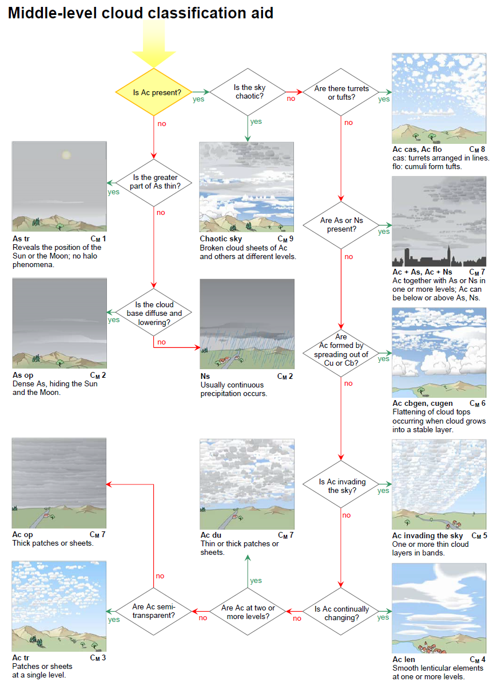

#### 雲分類支援 CH 上層雲分類支援(Section 2.8.4.3)

  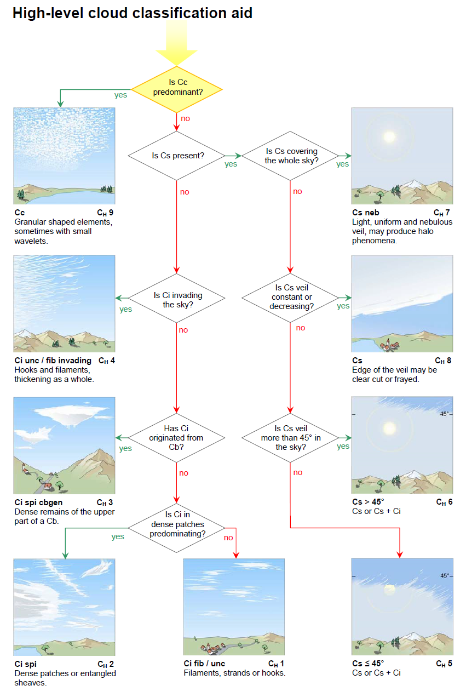

### CL、CM、CHコードに対応する雲の記号(Section 2.8.5)
CL、CMおよびCHコードの各数字に対応する雲は、表14に示す記号を用いて表すことができる。

**表14. CL、CMおよびCHコードに対応する雲の記号**

  <table style="width: 90%; text-align: center; border-collapse: collapse; font-family: sans-serif;">
    <thead>
      <tr>
        <th style="border: 1px solid #777; padding: 12px; background-color: #c6d9f1; width: 25%; font-weight: normal;">コード</th>
        <th style="border: 1px solid #777; padding: 12px; background-color: #c6d9f1; width: 25%; font-weight: normal;">CL</th>
        <th style="border: 1px solid #777; padding: 12px; background-color: #c6d9f1; width: 25%; font-weight: normal;">CM</th>
        <th style="border: 1px solid #777; padding: 12px; background-color: #c6d9f1; width: 25%; font-weight: normal;">CH</th>
      </tr>
    </thead>
    <tbody>
      <tr>
        <td style="border: 1px solid #777; padding: 12px; background-color: #c6d9f1;">0</td>
        <td style="border: 1px solid #777; padding: 12px;"></td>
        <td style="border: 1px solid #777; padding: 12px;"></td>
        <td style="border: 1px solid #777; padding: 12px;"></td>
      </tr>
      <tr>
        <td style="border: 1px solid #777; padding: 12px; background-color: #c6d9f1;">1</td>
        <td style="border: 1px solid #777; padding: 12px;">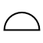</td>
        <td style="border: 1px solid #777; padding: 12px;">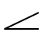</td>
        <td style="border: 1px solid #777; padding: 12px;">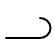</td>
      </tr>
      <tr>
        <td style="border: 1px solid #777; padding: 12px; background-color: #c6d9f1;">2</td>
        <td style="border: 1px solid #777; padding: 12px;">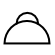</td>
        <td style="border: 1px solid #777; padding: 12px;">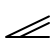</td>
        <td style="border: 1px solid #777; padding: 12px;">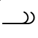</td>
      </tr>
      <tr>
        <td style="border: 1px solid #777; padding: 12px; background-color: #c6d9f1;">3</td>
        <td style="border: 1px solid #777; padding: 12px;">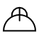</td>
        <td style="border: 1px solid #777; padding: 12px;">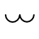</td>
        <td style="border: 1px solid #777; padding: 12px;">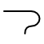</td>
      </tr>
      <tr>
        <td style="border: 1px solid #777; padding: 12px; background-color: #c6d9f1;">4</td>
        <td style="border: 1px solid #777; padding: 12px;">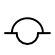</td>
        <td style="border: 1px solid #777; padding: 12px;">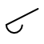</td>
        <td style="border: 1px solid #777; padding: 12px;">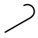</td>
      </tr>
      <tr>
        <td style="border: 1px solid #777; padding: 12px; background-color: #c6d9f1;">5</td>
        <td style="border: 1px solid #777; padding: 12px;"></td>
        <td style="border: 1px solid #777; padding: 12px;">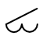</td>
        <td style="border: 1px solid #777; padding: 12px;">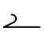</td>
      </tr>
      <tr>
        <td style="border: 1px solid #777; padding: 12px; background-color: #c6d9f1;">6</td>
        <td style="border: 1px solid #777; padding: 12px;">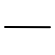</td>
        <td style="border: 1px solid #777; padding: 12px;">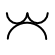</td>
        <td style="border: 1px solid #777; padding: 12px;">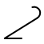</td>
      </tr>
      <tr>
        <td style="border: 1px solid #777; padding: 12px; background-color: #c6d9f1;">7</td>
        <td style="border: 1px solid #777; padding: 12px;">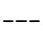</td>
        <td style="border: 1px solid #777; padding: 12px;">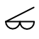</td>
        <td style="border: 1px solid #777; padding: 12px;">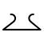</td>
      </tr>
      <tr>
        <td style="border: 1px solid #777; padding: 12px; background-color: #c6d9f1;">8</td>
        <td style="border: 1px solid #777; padding: 12px;">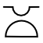</td>
        <td style="border: 1px solid #777; padding: 12px;">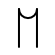</td>
        <td style="border: 1px solid #777; padding: 12px;">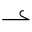</td>
      </tr>
      <tr>
        <td style="border: 1px solid #777; padding: 12px; background-color: #c6d9f1;">9</td>
        <td style="border: 1px solid #777; padding: 12px;">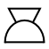</td>
        <td style="border: 1px solid #777; padding: 12px;">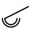</td>
        <td style="border: 1px solid #777; padding: 12px;">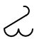</td>
      </tr>
    </tbody>
  </table>

## 航空機からの雲の観測(Section 2.5)
### 航空機からの雲の観測における課題(Section 2.5.1)
上空の観測者による雲の観測は、地表の観測者からの情報とは異なる情報を提供することができる。上空の観測者は、雲の鉛直分布、雲量と高度、雲の構造と上部または上面の外観、さらにはその構成粒子について、より完全な知識を得ることができる。

雲の外観は航空機に対する相対的な位置に依存するため、観測が行われる条件を明記する必要がある。本節における外観の記述は、雲底の500～1,000m（1,650～3,300フィート）下、または雲の上面（雲頂）の上から観測した場合、あるいは雲の内部から観測した場合の、最も頻繁に見られる雲の外観に対応している。

#### 視野(Section 2.5.1.1)
上空の観測者の視野は高度とともに広がり、空気がより透明になるため、通常は高高度になるほどより遠くまで見渡すことができる。したがって、上空にいる観測者は、より広範囲の雲の集まり（雲群）を見ることができる場合が多い。

  <figure style="margin: 0;">
    
    <figcaption><strong>弱い寒冷前線への接近</strong> 高度約11,300m（37,000フィート）を飛行する航空機の下には、かなり広範囲に広がる下層の対流雲（層積雲）のシートがある。画像の上部および右側には、弱い寒冷前線に伴う層状雲の「壁」があり、航空機はそれに向かって飛行している。</figcaption>
  </figure>

#### 雲の見かけ(Section 2.5.1.2)
- 遠近法の影響
  
遠近法の影響により、雲と同じかそれに近い高度を飛行している観測者には、雲が実際には離れていても、かなり連続した層として見えることがある。

- 雲要素の見かけの幅

地上の観測者は、雲要素の見かけの幅に部分的に基づいて雲の類（巻積雲、高積雲、層積雲）を区別できるが、この基準は上空の観測者にとってはほとんど役に立たない。場合によっては、雲の高度が、類を決定するための唯一の有用な基準となることがある。

- 雲の輪郭

上空の観測者が雲に近づくにつれて、雲の輪郭は不明瞭になり、よりほつれたように見える。

- 雲底

雲底の外観は距離によって変化し、観測者が近づくにつれてより拡散し、よりほつれたようになる。近距離では起伏を区別することが難しくなる。例えば、不透明な高積雲の層の雲底は、高層雲の雲底と非常によく似て見えることがある。

- 雲の上面

雲の上面の観測は、大気の不安定度に関する間接的な情報を提供するため、非常に有用である。

異なる類の雲であっても、上から見ると似て見えることがある。このため、上空の観測者が上面から雲を識別することが困難になる場合がある。

通常、雲の上面は雲底よりも輪郭がはっきりしている。滑らかであったり粗かったり、境界が明瞭であったり拡散していたりすることがある。また、より明るく、輝度の変化も大きい。

雲層の上面は平坦である場合もあれば、さまざまな幅の明確な波打ち（起伏）を持つ場合もある。波打ちは10～1,000m（33～3,300フィート）のスケールを持つことがあり、海の波を思わせる。また、浅く丸みを帯びた突起、隆起、またはドーム状の形を持つこともあり、これらが一列に並んで羊毛のような外観を呈することもある。層の内部から現れたり、下から突き抜けたりする、よく発達したドームや塔が見えることもある。これらの数が多い場合、それらが現れる表面を検出することが困難になることがある。雲のベール（ベール雲）が、浅いドームやよく発達した塔の側面を覆うことがある。時折、このようなベールが広範囲にわたり十分に厚いため、下にある雲が部分的または完全に隠されることがある。

#### 雲とその周辺における乱気流(Section 2.5.1.4)
雲の内部または周辺では、鉛直気流（上昇気流および下降気流）が発生することがある。航空機がある気流から別の気流へと通過する際に感じる連続した揺れは、飛行士が「乱気流」と呼ぶものを構成する。この乱気流の激しさは、鉛直気流の速度と規模、さらには航空機の特性に依存する。

#### 雲の中での視程(Section 2.5.1.5)
雲の内部では、たとえ非常に薄い雲であっても、視程は常に周囲の晴天の大気中よりも低下する。一部の雲は、視程をほぼゼロにまで低下させるほど濃密である。

  <figure style="margin: 0;">
    
    <figcaption><strong>層雲の霧状雲</strong></figcaption>
  </figure>

#### 雲に関連する大気光象(Section 2.5.1.6)
特定の大気光象（暈（かさ）、光冠など）は、上空の観測者が雲の内部かつその上面近くにいる場合に見えることがある。斑状、シート状、または層状の雲の上にいる観測者は、雲が水滴で構成されている場合は光輪（グローリー）や霧虹（フォグボウ）を、雲が氷晶で構成されている場合は暈現象を観測することがある。

  <figure style="margin: 0;">
    
    <figcaption><strong>地平線下のハロ（暈）</strong> ドイツのミュンヘンからフランスのパリへの飛行における高い視点により、幻日とともに下幻日および映日を観測できた。

太陽を囲む半径22度の円弧は内暈（22度ハロ）である。内暈は最も頻繁に観測される暈現象の一つである。内暈の左右両側で太陽と同じ高度には、幻日と呼ばれる明るい色づいた斑点がある。それぞれの幻日から水平に伸びているのは幻日環の一部である。幻日環は地平線と平行に立ち、太陽を通る白い環である。

太陽の真下に垂直に位置する明るい反射ハロが映日である。映日は地平線の下にあるため、航空機や山などの高い視点からしか見られない。映日の左右、かつ幻日の真下には、対応する下幻日がある。これらから離れて伸びているのが、非常に微かな下幻日環の一部である。</figcaption>
  </figure>

### 航空機から観測した雲の記述(Section 2.5.2)

#### 巻雲(Section 2.5.2.1)
巻雲は通常、極地方では高度3kmから8km（10,000フィートから25,000フィート）、温帯地方では5kmから13km（16,500フィートから45,000フィート）、熱帯地方では6kmから18km（20,000フィートから60,000フィート）に発生する。温帯帯では、寒帯気団の巻雲は熱帯気団の巻雲よりも低い高度を占める。

Below the cloud.（雲の下から）下から見ると、巻雲は通常明確な構造を持たない。しかし、時には白い繊細なフィラメント、あるいは白または大部分が白い斑状や狭い帯状を持つことがある。巻雲は、規則的に配列された丸みを帯びたまたは粒状の雲要素がないことで巻積雲と区別され、分離した要素で構成されていることで巻層雲と区別される。

Within the cloud.（雲の中）巻雲はほぼ完全に氷晶で構成されている。観測者はしばしば太陽光の中でこれらの氷晶のきらめきを目にする。暈（かさ）現象が存在する場合、一般に内暈（22度ハロ）に限られる。

Above the cloud.（雲の上から）上から完全な太陽光の下で見ると、巻雲は非常に明るい。薄い巻雲は煙霧の層の上面に似ていることがある一方、濃密な巻雲は乳白色の外観を持つ。他の雲や地面が巻雲を通して見えることがよくある。厚い巻雲の上からは、映日（アンダーサン）が見えることがある。

  <figure style="margin: 0;">
    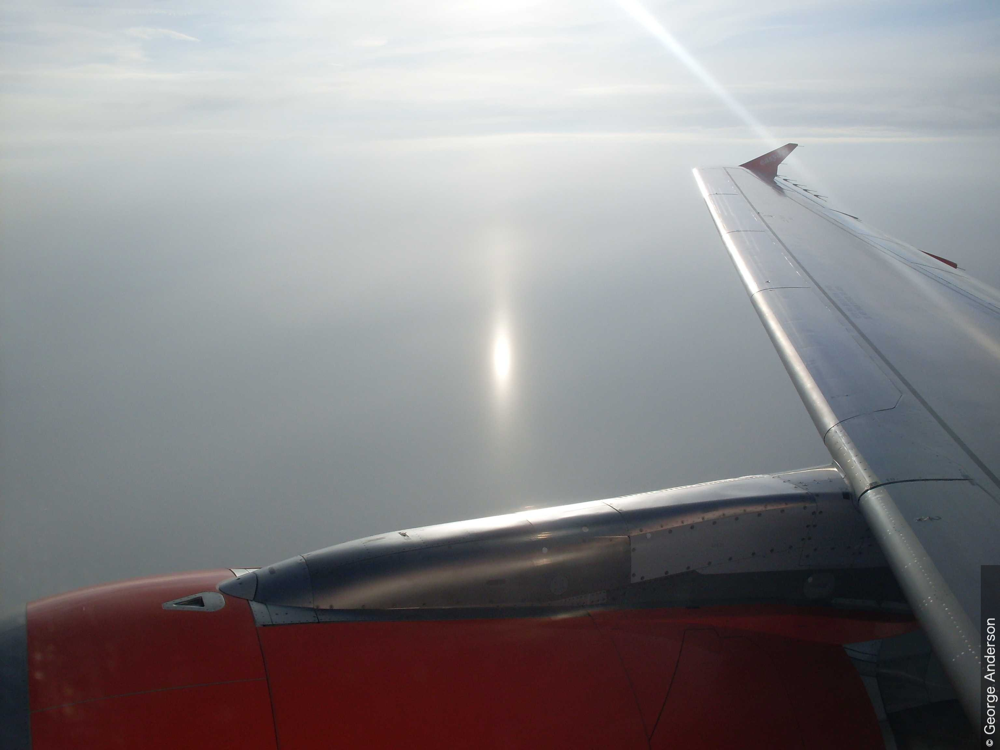
    <figcaption><strong>映日</strong></figcaption>
  </figure>

#### 巻積雲(Section 2.5.2.2)
巻積雲は、極地方では3km（10,000フィート）以上、温帯地方では5km（16,500フィート）以上、熱帯地方では6km（20,000フィート）以上で最も頻繁に発生する。

Below the cloud.（雲の下から）下から見ると、巻積雲は非常に小さな丸みを帯びた要素で構成される薄い斑状、シート状、または層状に見える。要素は結合しているか分離しており、それらの水平な雲底はすべて同じ高度にある。それらは陰影を伴って、あるいは陰影なしで白く見える。

Within the cloud.（雲の中）巻積雲はほぼ完全に氷晶で構成されている。過冷却水滴が形成されることもあるが、これらは通常急速に氷晶に置き換わる。観測者は薄い霧の中を飛行しているような印象を受ける。より強い乱気流になり得る巻積雲の塔状雲を除いて、弱い乱気流に遭遇する可能性がある。観測される可能性のある唯一の暈現象は内暈（22度ハロ）である。

Above the cloud.（雲の上から）上から見ると、巻積雲の要素は綿毛に似た柔らかい輪郭を持つ。それらは形状と大きさにおいて積雲の扁平雲に似て見えることがある。巻積雲の塔状雲の場合、要素は共通の雲底を持ち、より鉛直方向に発達している。映日（アンダーサン）は観測されない。

  <figure style="margin: 0;">
    
    <figcaption><strong>彩雲:イリデッセンス</strong></figcaption>
  </figure>

#### 巻層雲(Section 2.5.2.3)
巻層雲は、極地方では3km（10,000フィート）以上、温帯地方では5km（16,500フィート）以上、熱帯地方では6km（20,000フィート）以上で最も頻繁に発生する。

Below the cloud.（雲の下から）下から見ると、巻層雲は、空の全体または一部を覆う、透明でかなり均質な白っぽいベールとして現れる。通常、暈現象を生じさせ、雲底を特定するのは困難である。

Within the cloud.（雲の中）巻層雲はしばしば複数の層になって発生する。それを構成する氷の粒子は、太陽光の中でしばしばきらめく。多くの種類の暈現象が観測されることがある。雲の下部、特に雲底付近では、わずかな乱気流に遭遇することがある。

Above the cloud.（雲の上から）上から見ると、巻層雲は、空を連続して覆う範囲が広いことを除けば、巻雲とほとんど同じに見える。上面は境界が明瞭で平坦であるか、巻積雲に似た隆起を伴って拡散していることがある。地面は通常、薄い巻層雲のベールを通して見えるが、厚い雲のベールを通してはめったに見えない。映日（アンダーサン）が観測されることがあるが、他の暈現象はまれである。

#### 高積雲(Section 2.5.2.4)
高積雲は最も頻繁に、極地方では高度2kmから4km（6,500フィートから13,000フィート）、温帯地方では2kmから7km（6,500フィートから23,000フィート）、熱帯地方では2kmから8km（6,500フィートから25,000フィート）に発生する。

高積雲はいくつかの形で観測されるが、そのうち最も重要なものを以下に説明する。

##### 分離した要素を伴うシート状または層状として発生する高積雲層状雲(Section 2.5.2.4.1)
分離した要素を伴うシート状または層状として発生する高積雲の層状雲。
このタイプの高積雲は、一般に厚さが500m（1,650フィート）未満である。

Below the cloud.（雲の下から）下から見ると、この雲は隙間のあるシート状または層状に見える。全体が半透明であるか、または部分的に半透明で部分的に不透明である。色は白で、時には灰色を伴う。

Within the cloud.（雲の中）この雲は小さな水滴で構成され、時には氷晶を伴う。航空機に軽い着氷が発生することがある。乱気流は弱いか中程度である。

Above the cloud.（雲の上から）上から見ると、この雲は滑らかで波打っているか、羊毛のように見えることがある。下層の雲や地面が見える明確な隙間がある。より低い高度で形成されたよく発達した積雲系の雲が、雲層を突き抜けることがある。時折、主層の約100から300m（330から1,000フィート）上に薄いシート状または斑状の雲が見られる（高積雲の二重雲）。光輪（グローリー）が、時には霧虹（フォグボウ）を伴って雲要素上に観測されることがある。映日（アンダーサン）が、通常は雲要素間の煙霧がかかった氷晶に満ちた部分に現れることがある。

  <figure style="margin: 0;">
    
    <figcaption><strong>上空からの高積雲の層状雲の波状雲のすきま雲</strong> 写真には、イタリアアルプス上空の高度約11,000mの航空機から見た、高積雲の層状雲の波状雲のすきま雲の層が写っている。画像の右下には、山の上にいくつかの積雲が見える。</figcaption>
  </figure>

##### 結合した要素を伴うシート状または層状として発生する「隙間のない」高積雲層状雲(Section 2.5.2.4.2)
結合した要素を伴うシート状または層状として発生する「隙間のない」高積雲の層状雲。
このタイプの高積雲は、通常、厚さが500m（1,650フィート）未満である。時折、2つ以上の薄いシート状または斑状で発生し、その場合はかなり深い厚みを示唆する暗い外観を持つ。最も低い層の雲底から最も高い層の雲頂までの全体の厚さは、通常2,000m（6,500フィート）未満である。

Below the cloud.（雲の下から）下から見ると、この雲はシート状または層状として現れ、全体が灰色、または時には白と灰色で、様々な不透明度を持つ。近くから観測すると、要素は大きく暗く見え、層積雲とまったく同じように見える。

Within the cloud.（雲の中）この雲は小さな水滴で構成され、時には氷晶を伴う。特に夜間、航空機のライトが点灯しているとき、視程の変化はかなりはっきりしている。かなりの着氷があるかもしれない。乱気流は通常は弱いが、中程度になることもある。

Above the cloud.（雲の上から）上から見ると、この雲は通常、要素の薄い境界を示す裂け目を除いて連続しているように見える。上面は滑らかで波打っているか、羊毛のような外観を持つことがある。光輪（グローリー）、霧虹、および映日（アンダーサン）が、時には同時に観測されることがある。

##### 高積雲 レンズ雲(Section 2.5.2.4.3)
高積雲のレンズ雲。
このタイプの高積雲は、高積雲のレンズ形の斑状として現れる。その鉛直方向の広がりは通常200m（660フィート）以下であるが、地形性の高積雲のレンズ雲ははるかに厚くなることがある。

Below the cloud.（雲の下から）下から見ると、この雲は拡散して見える。しばしば部分的に半透明であり、時折太陽の近くで彩雲が見られる。完全に白いか、または白と灰色である。

Within the cloud.（雲の中）乱気流は通常は弱いが、中程度になることもある。

Above the cloud.（雲の上から）上から見ると、薄い高積雲のレンズ雲は地面が見えるほど透明になることがあるが、それでもかなり暗く見える。厚い高積雲のレンズ雲は白く見え、その上に明るい光輪（グローリー）が観測されることがある。

  <figure style="margin: 0;">
    
    <figcaption><strong>高積雲のレンズ雲の二重雲（皿の積み重ね）</strong> 画像には、典型的なレンズ形と明確で滑らかな輪郭を持つ、斑状の高積雲のレンズ雲が写っている。1、2、3に見られるように、いくつかの斑状雲が重なり合っており（二重雲の変種）、積み重ねられた皿（フランス語でpile d'assiettes）のような外観を与えている。ほとんどのレンズ雲の斑状雲の縁や薄い部分には、彩雲の緑色や特にピンク色が見える。

小さな積雲系の房は、存在するもう一つの明確に識別可能な種である高積雲の房状雲を示している。</figcaption>
  </figure>

##### 高積雲 塔状雲(Section 2.5.2.4.4)
高積雲の塔状雲。
この高積雲は、共通の雲底から立ち上がる積雲系の雲頂を持つ。

Below the cloud.（雲の下から）下から見ると、この雲は高積雲の層に似た、水平でかなり広範囲の雲底を持つ。雲のすぐ下では煙霧によって視程が低下し、雲から尾流雲が落下することがある。雲底付近で乱気流が強まる。

Within the cloud.（雲の中）この雲の上部のより高い塔の内部では、乱気流は一般に強く、放電（セントエルモの火）が観測されることがある。視程は変化しやすく、着氷が発生することがある。

Above the cloud.（雲の上から）上から見ると、この雲は、煙霧の層または滑らかで波打つ雲層に雲底が埋もれた、よく発達した積雲系の雲に非常によく似ている。積雲系の塔の鉛直方向の広がりは様々である。一部は積雲の雄大雲、あるいは積乱雲へと発達し、高高度での雷雨をもたらすことがある。

##### 高積雲 房状雲(Section 2.5.2.4.5)
高積雲の房状雲。
このタイプの高積雲は房状に発生する。

Below the cloud.（雲の下から）下から見ると、この雲の斑状部分は拡散している。白っぽかったり暗かったりし、雲底はすべてがまったく同じ高度にあるわけではない。雲から落下する尾流雲が観測されることがある。高積雲の房状雲の下では乱気流は弱いか中程度である。

Within the cloud.（雲の中）軽い着氷が発生することがあり、乱気流は弱い状態からかなり強い状態まで及ぶことがある。

Above the cloud.（雲の上から）上から見ると、雲要素は乳白色の領域に囲まれた、またはそこから現れる小さな積雲系の雲のように見える。この雲は通常、厚さが500から1,000m（1,650から3,300フィート）である。積雲系の房は時として2から3km（6,500から10,000フィート）の鉛直方向の広がりに達し、上から見ると雲全体が高積雲の塔状雲に似た形になることがある。

#### 高層雲(Section 2.5.2.5)
高層雲は通常、極地方では高度2kmから4km（6,500フィートから13,000フィート）、温帯地方では2kmから7km（6,500フィートから23,000フィート）、熱帯地方では2kmから8km（6,500フィートから25,000フィート）に発生する。しかし、高層雲の上部は示された上限を超えることがある。高層雲の厚さは1kmから5km以上（3,300フィートから16,500フィート以上）に及ぶことがある。

Below the cloud.（雲の下から）下から見ると、高層雲の雲底はほぼ平坦であり、拡散してぼやけて見える。これは、雨や雪が降るためであり、通常は地面に達しない（尾流雲）ためである。雲層の一部は、太陽が弱く透けて見えるほど薄い。

Within the cloud.（雲の中）横切る部分や氷点（0 ℃）に対する航空機の相対的な位置に応じて、遭遇する粒子は水滴（過冷却または非過冷却）、雨滴、氷晶、雪の結晶、または雪片である。雲が氷晶のみで構成されている場合、通常、粒子の濃度は比較的低い。

上空の観測者は、内部構造が大きく異なる2つのタイプの高層雲を区別できる：

1. 均質な層であり、しばしば上面がかなりの高度に達する。この層内の視程は通常良好であり、かなりの雲の厚みを通して地表を見ることができる。暈（かさ）現象が観測されることがあり、しばしば明るい。
2. 水雲の多数の斑状、シート状、または層状であり、これらは尾流雲または降水雲（降水）によって繋がっている可能性がある。降水雲は層状構造を覆い隠す可能性があるため、高層雲は大きな晴れ間のある厚い単一の層として見えることがある。したがって、雲内の視程はかなり変動し、場所によっては100m未満になることもある。夜間は、航空機のライトが点灯しているときに隙間を容易に確認できる。高積雲の斑状雲が通常、この高層雲の頂部に存在する。

両方のタイプの高層雲において、乱気流は弱く下部に限られるが、内部対流がある場合は強くなることがある。着氷は一般に軽い。

Above the cloud.（雲の上から）上から見ると、第1のタイプの高層雲の上面は巻層雲に似ており、第2のタイプは高積雲に似ている。高層雲の上面で観測される光学現象は、巻層雲や高積雲で観測されるものと同じである。

高層雲が発達する空気が不安定であるか、または不安定になると、内部対流によって積雲系の要素が生成され、雲の塊のはるか上に上昇し、積乱雲にまで発達することもある。下層の空気の不安定性が強い対流気流を発生させるのに十分な場合、積雲の雄大雲や積乱雲が高層雲を突き抜けることがある。

  <figure style="margin: 0;">
    
    <figcaption><strong>航空機から見た様々な高度の雲</strong> 航空機から見ると、大気中の雲の鉛直分布を理解することができる。この画像の上部には広範囲に広がる巻層雲の毛状雲（上層雲）のシートがあり、左下には層積雲の層状雲（下層の対流雲）の層がある。層積雲の層の上面には隆起や突起が見られる。層積雲の上の高度には高層雲の薄いシート状（半透明雲の変種）があり、これはおそらく積乱雲の一部が広がって形成されたもの（積乱雲由来）である。画像の右側および中央には積雲の雄大雲の塔（5および6）があり、これらはおそらく画像中央の高積雲の塔状雲から発達したものである。最後に、大きく背の高い積乱雲の多毛雲のかなとこ雲（かなとこ雲）が画像の中央を横切って伸びている。</figcaption>
  </figure>

#### 乱層雲(Section 2.5.2.6)
乱層雲の主体は、ほぼ常に極地方では高度2kmから4km（6,500フィートから13,000フィート）、温帯地方では2kmから7km（6,500フィートから23,000フィート）、熱帯地方では2kmから8km（6,500フィートから25,000フィート）に発生する。しかし、雲底はしばしばこれらの限界より下にあり、上面はそれより上にある。乱層雲は一般に高層雲よりも厚く、典型的に2kmから8km（6,500フィートから25,000フィート）の鉛直方向の厚さを持つ。

Below the cloud.（雲の下から）下から見ると、乱層雲は灰色で、多くの場合暗い。雨や雪がその底から降り、通常は地面に達する。したがって、その雲底は拡散しているか不明瞭に見えるか、あるいは強い降水（降水雲）を通してまったく見えないこともある。乱層雲の下では、ちぎれ雲にしばしば遭遇する。乱気流は、すぐ上の乱層雲よりも、ちぎれ雲の内部の方が強い。

Within the cloud.（雲の中）乱層雲の構成粒子は高層雲の構成粒子に似ているが、一般により大きく、より数が多い。このことと、乱層雲が典型的に大きな鉛直方向の広がりを持つことにより、雲の下部ではやや暗くなる。乱層雲は本質的に層状の雲であるが、かなりの鉛直方向の広がりを持つ積雲系の対流雲がその内部に形成されることがある。乱層雲の中では視程が悪く、しばしば50m未満であり、着氷が発生することがある。乱気流は一般に中程度であるが、内部対流がある場合はかなり強くなることがある。

Above the cloud.（雲の上から）上から見ると、乱層雲の上面はしばしば巻層雲や高層雲に似ている。拡散していてかなり滑らかであり、平坦であったり、波打っていたり、羊毛のように見えたりすることもある。不安定な気団の中では、積雲の雄大雲や積乱雲が乱層雲の中に埋もれ、その上面より高く上昇することがある。光輪（グローリー）、霧虹、映日（アンダーサン）などの光学現象が見えることがある。

#### 層積雲(Section 2.5.2.7)
層積雲は通常2km（6,500フィート）以下に発生する。その厚さは500mから1,000m（1,650フィートから3,300フィート）の範囲である。高積雲と同様に、層積雲はいくつかの形をとることがあり、主に以下の2つの形がある。

##### 分離した要素を伴うシート状または層状として発生する層積雲の層状雲(Section 2.5.2.7.1)
分離した要素を伴うシート状または層状として発生する層積雲の層状雲。
Below the cloud.（雲の下から）下から見ると、この雲はシート状または層状として現れ、白っぽいか、灰色、またはその両方であるかなり広範囲の要素で構成される。層積雲は、水分量が多く、鉛直方向の広がりが大きいため、高積雲よりも暗い。

Within the cloud.（雲の中）この雲は水滴で構成され、低温時には時折氷晶が混ざる。観測者は濃霧の中を飛行しているような印象を受け、視程の変化は大きいことも小さいこともある。乱気流は一般に中程度であるが、対応するタイプの高積雲よりも強いことが多い。

Above the cloud.（雲の上から）上から見ると、分離した要素を持つ高積雲と同様に、この雲はやや羊毛のように見える。突出部、隆起、またはドームが存在することがあり、これらは層の一部として発生するか、下から突き抜けた積雲の雄大雲や積乱雲の上部として発生する。層の中に開けた空間や裂け目がしばしば見える。光輪（グローリー）、霧虹、映日（アンダーサン）が、時には同時に観測されることがある。

##### 結合した要素を伴うシート状または層状として発生する「隙間のない」層積雲の層状雲(Section 2.5.2.7.2)
結合した要素を伴うシート状または層状として発生する「隙間のない」層積雲の層状雲。
Below the cloud.（雲の下から）下から見ると、この雲の底は通常明瞭で波打っている。その真の起伏は、輝度の違いによってのみ明らかにされる。

Within the cloud.（雲の中）この雲は水滴で構成され、低温時には時折氷晶が混ざる。雨滴、雪あられ、雪の結晶、雪片が存在することもある。観測者は濃霧の中を飛行しているような印象を受ける。中程度の着氷があるかもしれず、乱気流は一般に中程度である。

Above the cloud.（雲の上から）上から見ると、上面は平坦に見えることがある。しかし、ほとんどの場合、波打っているか、または長い平行な帯を持っている。突出部、隆起、またはドームが見えることがある。しばしば、このタイプの層積雲のすぐ上の空気は煙霧がかかっている。光輪（グローリー）、霧虹、映日（アンダーサン）が、時には同時に観測されることがある。

雲のシート状または層は、しばしば地形の形状に密接に従う。明るい隆起や暗い窪みは、川、湖、海岸、丘陵などの地形的特徴の良い指標となることがある。また、雲の切れ間から地形が見えることもある。

  <figure style="margin: 0;">
    
    <figcaption><strong>弱い寒冷前線への接近</strong></figcaption>
  </figure>

#### 層雲(Section 2.5.2.8)
層雲は通常、地表から2km（6,500フィート）の間に発生する。その厚さは数十メートルから数百メートル（数十フィートから数百フィート）の範囲である。

Below the cloud.（雲の下から）下から見ると、層雲の層または斑状雲は一般に灰色であり、時に輝度の変化を示す。その雲底は明確に定義されていることもあれば、拡散していたり、ほつれていたりすることもある。層雲を通して太陽が見える場合、その輪郭はぼやけない（すりガラスを通して見るような効果はない）。

Within the cloud.（雲の中）層雲は小さな水滴と、時には氷晶で構成される。霧雨のしずく、氷晶、雪あられが存在することもある。雲の密度は頂部に向かって徐々に増し、そこでは非常に微細な水滴が高濃度で存在するため、視程がほぼゼロにまで低下することがある。密度と視程の変化は水平方向にも観測される。軽度から中程度の着氷が発生することがあり、乱気流は軽度から中程度である。

Above the cloud.（雲の上から）上から見ると、上面は一般に波打ち（通常は波長が短い）を示し、突出部を示すことがある。強風時には波打ちはより顕著になり、地面の不規則性を反映した隆起や窪みが観測されることがある（層積雲と比較せよ）。多くの場合、上面のすぐ上の空気は煙霧がかかっている。光輪（グローリー）、霧虹、映日（アンダーサン）が、時には同時に観測されることがある。

  <figure style="margin: 0; width: 45%; text-align: center;">
    
    <figcaption><strong>上空からの移流霧:海霧</strong></figcaption>
  </figure>
  <figure style="margin: 0; width: 45%; text-align: center;">
    
    <figcaption><strong>滑昇層雲</strong></figcaption>
  </figure>

#### 積雲(Section 2.5.2.9)
積雲は様々な大きさと発達段階で発生し、鉛直方向の広がりが数十メートルから数百メートル（数十フィートから数百フィート）の範囲である積雲の扁平雲から、数百メートルから約2km（数百フィートから約7,000フィート）の範囲である積雲の並雲、そして時には5km（16,500フィート）を超える積雲の雄大雲に至る。

##### 積雲 扁平雲(Section 2.5.2.9.1)
Below the cloud.（雲の下から）下から見ると、この雲は通常、水平な雲底を持つ。乱気流は一般に中程度である。

Within the cloud.（雲の中）積雲の扁平雲は水滴（時には過冷却）で構成される。その中を飛行する観測者は、視程の変化が大きい濃霧の中にいるような印象を受ける。約2～5m/s（7～17フィート/秒）の上昇気流に遭遇することがある。乱気流は、特に雲の形成および成長過程においては激しいことがあり、雲が成熟すると弱まる。

Above the cloud.（雲の上から）上から見ると、この雲はしばしば煙霧の層に浮かんでいるように見え、そこから丸みを帯びた雲頂が現れる。雲頂の大部分はほぼ同じ高度に達する。個々の雲は広く間隔が空いているか、あるいは互いに近く、層積雲の斑状雲に似るほど十分に平坦である場合もある。積雲の扁平雲の上には通常、乱気流はない。

  <figure style="margin: 0;">
    
    <figcaption><strong>積雲の扁平雲</strong></figcaption>
  </figure>

##### 積雲 並雲(Section 2.5.2.9.2)
Below the cloud.（雲の下から）通常水平である積雲の並雲の雲底は、積雲の扁平雲の雲底よりも少し暗く、乱気流はしばしば強い。

Within the cloud.（雲の中）この雲は水滴（時には過冷却）で構成される。視程は変化しやすく、非常に悪いかゼロになることさえ多い。軽度から中程度の着氷があるかもしれない。上昇気流は5m/s（17フィート/秒）を超えることがある。乱気流はかなり激しい。

Above the cloud.（雲の上から）上から見ると、これらの積雲はわずかまたは中程度の突出部あるいはドームを示し、その大きさは雲ごとに異なることがある。積雲の並雲の上に白い雲のベール（頭巾雲またはベール雲）が観測されることがある。積雲の並雲は時折、風の方向に向いた列状に並ぶことがある。これらの「クラウドストリート（雲列）」は、かなりの距離から見ると層積雲のように見えることがある。

積雲の並雲には、様々な鉛直方向の発達を伴う積雲系の雲（雷雨前の対流性の空）が含まれることに留意せよ。これらは通常、縁がほつれており、雲頂が引き裂かれている。これらは積雲の雄大雲の段階を短時間経過した後、急速に積乱雲の段階に達する。

  <figure style="margin: 0;">
    
    <figcaption><strong>積雲の並雲の放射状雲</strong></figcaption>
  </figure>

##### 積雲 雄大雲(Section 2.5.2.9.3)
Below the cloud.（雲の下から）積雲の雄大雲は輝度のコントラストが強い。下から見ると、比較的暗い雲底を持ち、それはほぼ水平でかなり頻繁にほつれている。降水中を除いて、雲底の下の視程は良好である。乱気流は通常強い。

Within the cloud.（雲の中）積雲の雄大雲は主に水滴で構成されるが、温度が0 ℃を大きく下回る場所では氷晶が形成されることがある。時折、雨滴が観測されることがある。視程は一般に非常に悪いが、大きく変動する。かなりの着氷があるかもしれない。上昇気流は時に10m/s（33フィート/秒）を超え、乱気流はしばしば激しい。放電が発生することがある。

Above the cloud.（雲の上から）上から見ると、日光に照らされた積雲の雄大雲は他のタイプの積雲よりも眩しい。上部は、明確で強い陰影のある突出部やドームを伴い、大きなカリフラワー、巨大な煙突、または塔の形をしている。それらの雲頂は非常に異なる高度に達することがあり、時には煙霧の層やかなり連続した雲層から現れる。

いくつかの雲を繋ぐこともあるベール（頭巾雲またはベール雲）が頻繁に観測されることがある。

#### 積乱雲(Section 2.5.2.10)
積乱雲の雲底は通常2km（6,500フィート）以下に見られる。雲頂はしばしば10km（35,000フィート）以上の高さに達する。積乱雲の鉛直方向の広がりは3kmから、まれに15km（10,000～50,000フィート）以上に及ぶ。

Below the cloud.（雲の下から）下から見ると、積乱雲は一般に暗く見える。雲底はしばしばほつれており、その下にはぼろぼろの断片の形をしたちぎれ雲が頻繁に観測される。それらは時折、積乱雲の前方および下部の外縁の下に一種の暗いロール状（アーチ雲）を構成する。降水（雨、雪、または雹の強いしゅう雨）のため、視程が悪い場合がある。乱気流はしばしば激しい。

Within the cloud.（雲の中）積乱雲は水滴と、特にその上部において氷晶で構成される。また、大きな雨滴も含み、しばしば雪の結晶、雪片、雪あられ、凍雨、または雹も含む。水滴や雨滴は大幅に過冷却されていることがあり、特に過冷却された水滴が氷晶と混ざり合っている場合、航空機への急速な着氷を引き起こす可能性がある。

雲の下部および中部では暗く、視程は非常に低く、しばしばゼロになる。上部では、照明は強いかもしれないが視程は悪い。鉛直気流（上昇気流および下降気流）はしばしば15m/s（50フィート/秒）を超え、下降気流は主に強い降水域にある。乱気流は激しい。

放電（セントエルモの火）が発生することがある。それらは温度が0 ℃から–2 ℃の間である場所で最も頻繁に起こるように思われる。

Above the cloud.（雲の上から）発達段階に応じて、積乱雲は、強い輝度のコントラストを持つ積雲の雄大雲に似ているか、あるいはしばしば巨大な羽毛やかなとこ雲の形をした濃密な巻雲に似ており、波打ったり隆起したりした部分を持つ。日光に照らされると、非常に大きな輝度のコントラストを伴って眩しく輝く。積乱雲の主体は時として層状雲の層から現れる。様々な寸法の雲のベール（頭巾雲またはベール雲）が雲を取り囲むことがある。通常、暈は観測されない。下の雲の隙間を通して、しゅう雨の中に虹の一部が見えることがある。

  <figure style="margin: 0; width: 45%; text-align: center;">
    
    <figcaption><strong>積乱雲の多毛雲かなとこ雲</strong></figcaption>
  </figure>
  <figure style="margin: 0; width: 45%; text-align: center;">
    
    <figcaption><strong>積乱雲の多毛雲かなとこ雲の乳房雲</strong></figcaption>
  </figure>

### 航空機から見る霧ともや(Section 2.5.3)
霧と煙霧は特定の種類の雲に頻繁に似ているため、ここで考慮される。

#### 霧(Section 2.5.3.1)
霧は大気中に浮遊する非常に小さな水滴（および時には微小な氷の粒子）で構成されており、地表での水平視程を1,000m未満に低下させる。霧の鉛直方向の広がりは数メートルから数百メートルに及ぶ。

Within the fog.（霧の中）霧の中を飛行すると、上空の観測者の視程は低くなる。着氷が発生する場合、それは一般に非常に軽い。比較的浅い霧の場合、乱気流はないか軽度であるが、より深い霧では、乱気流は軽度から中程度になることがある。

Above the fog.（霧の上から）上から見ると、霧は滑らかな層雲の層のように見える。平坦であったり、わずかに波打っていたり、様々な大きさの丸みを帯びたドームを示したりすることがある。

#### 煙霧（もや）(Section 2.5.3.2)
上空の煙霧は、光を散乱させる極めて小さな粒子で構成されている。散乱は粒子の濃度とともに増加する。上空の煙霧の層は、約5km（16,500フィート）まで航空機が遭遇する可能性がある。

Below the haze.（煙霧の下から）下から見ると、上空の煙霧は濃い青色または黒っぽい色合いのベールとして現れる。下からこのような煙霧の層に入る上空の観測者は、視程の漸進的な低下を経験する。

Within haze aloft.（上空の煙霧の中）航空機が煙霧のみの中にいるのか、それとも煙霧の中に埋もれた雲の中にいるのかを判断することが困難な場合が多い。煙霧の層から上へ飛行して抜け出すと、通常、水平視程の急速な改善が観測される。

Above the haze.（煙霧の上から）上から見ると、上空の煙霧は風景を隠す傾向がある。散乱光は太陽の方向で特に強い。この方向では、風景が水面のような非常に明るい領域を含んでいない限り、地形を区別することは不可能である。太陽から離れた方向では、地面に向かう視程はより良くなる。

上空の煙霧の上限は地平線を形成する。煙霧のすぐ上を飛行し斜め下を見ると、煙霧の中に埋もれている可能性のある雲を区別することはほぼ不可能である（ただし、これらの雲の頂部が煙霧の層の上に現れている場合を除く）。多くの層状雲と同様に、煙霧の上限は安定した空気層（しばしば気温逆転層）の底と一致する。