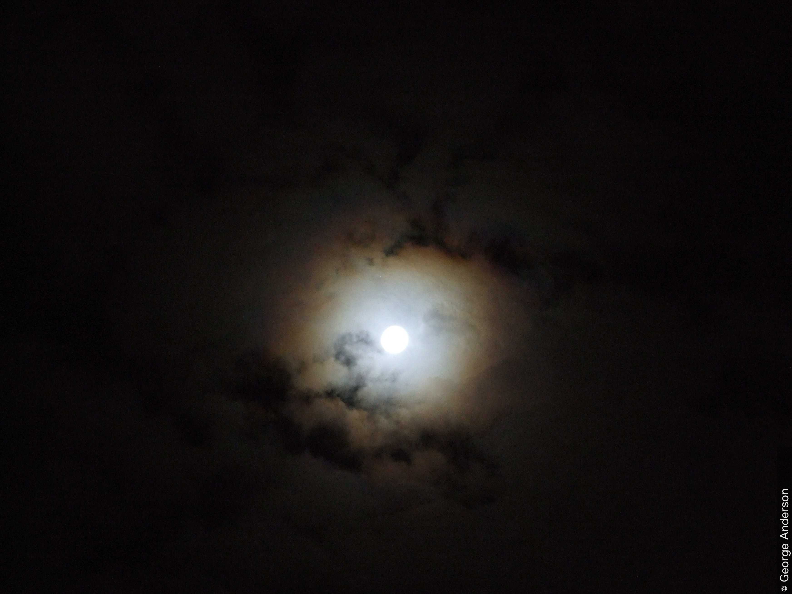

# 層積雲 (Sc) (Kaemtz 1840)(セクション 2.3.7)

## 目次

- [層積雲 (Sc) (Kaemtz 1840)(セクション 2.3.7)](#層積雲-sc-kaemtz-1840セクション-237)
  - [目次](#目次)
  - [層積雲の定義](#層積雲の定義)
  - [種(セクション 2.3.7.2)](#種セクション-2372)
    - [層積雲 層状雲 (Sc str) - CCH 1953(セクション 2.3.7.2.1)](#層積雲-層状雲-sc-str---cch-1953セクション-23721)
    - [層積雲 レンズ雲 (Sc len) - Ley 1894, CEN 1930(セクション 2.3.7.2.2)](#層積雲-レンズ雲-sc-len---ley-1894-cen-1930セクション-23722)
    - [層積雲 塔状雲 (Sc cas) - CCH 1953(セクション 2.3.7.2.3)](#層積雲-塔状雲-sc-cas---cch-1953セクション-23723)
    - [層積雲 ロール雲 (Sc vol) - CIMO 2016(セクション 2.3.7.2.4)](#層積雲-ロール雲-sc-vol---cimo-2016セクション-23724)
    - [層積雲 房状雲 (Sc flo) - CIMO 2016(セクション 2.3.7.2.5)](#層積雲-房状雲-sc-flo---cimo-2016セクション-23725)
  - [変種(セクション 2.3.7.3)](#変種セクション-2373)
    - [層積雲 半透明雲 (Sc tr) - CEN 1930(セクション 2.3.7.3.1)](#層積雲-半透明雲-sc-tr---cen-1930セクション-23731)
    - [層積雲 すきま雲 (Sc pe) - CCH 1953(セクション 2.3.7.3.2)](#層積雲-すきま雲-sc-pe---cch-1953セクション-23732)
    - [層積雲 不透明雲 (Sc op) - CEN 1930(セクション 2.3.7.3.3)](#層積雲-不透明雲-sc-op---cen-1930セクション-23733)
    - [層積雲 二重雲 (Sc du) - CCH 1953(セクション 2.3.7.3.4)](#層積雲-二重雲-sc-du---cch-1953セクション-23734)
    - [層積雲 波状雲 (Sc un) - Clayton 1896, CEN 1930(セクション 2.3.7.3.5)](#層積雲-波状雲-sc-un---clayton-1896-cen-1930セクション-23735)
    - [層積雲 放射状雲 (Sc ra) - CEN 1926(セクション 2.3.7.3.6)](#層積雲-放射状雲-sc-ra---cen-1926セクション-23736)
    - [層積雲 蜂の巣状雲 (Sc la) - CCH 1953(セクション 2.3.7.3.7)](#層積雲-蜂の巣状雲-sc-la---cch-1953セクション-23737)
  - [部分的な特徴および付随雲(セクション 2.3.7.4)](#部分的な特徴および付随雲セクション-2374)
    - [層積雲 アスペリタス](#層積雲-アスペリタス)
    - [層積雲 KH波雲](#層積雲-kh波雲)
    - [層積雲 乳房雲](#層積雲-乳房雲)
    - [層積雲 尾流雲](#層積雲-尾流雲)
    - [層積雲 降水雲](#層積雲-降水雲)
  - [層積雲の形成源となる雲(セクション 2.3.7.5)](#層積雲の形成源となる雲セクション-2375)
  - [層積雲と他の類の類似した雲との主な違い(セクション 2.3.7.6)](#層積雲と他の類の類似した雲との主な違いセクション-2376)
    - [霧状巻層雲(Cs neb)と比較した層積雲(Sc)(セクション 2.3.7.6.1)](#霧状巻層雲cs-nebと比較した層積雲scセクション-23761)
    - [高積雲(Ac)と比較した層積雲(Sc)(セクション 2.3.7.6.2)](#高積雲acと比較した層積雲scセクション-23762)
    - [高層雲(As)と比較した層積雲(Sc)(セクション 2.3.7.6.3)](#高層雲asと比較した層積雲scセクション-23763)
    - [乱層雲(Ns)と比較した不透明層状層積雲(Sc str op)(セクション 2.3.7.6.4)](#乱層雲nsと比較した不透明層状層積雲sc-str-opセクション-23764)
    - [層雲(St)と比較した層積雲(Sc)(セクション 2.3.7.6.5)](#層雲stと比較した層積雲scセクション-23765)
    - [積雲(Cu)と比較した層積雲(Sc)(セクション 2.3.7.6.6)](#積雲cuと比較した層積雲scセクション-23766)
    - [断片積雲(Cu fra) / 並積雲(Cu med)と比較した房状層積雲(Sc flo)(セクション 2.3.7.6.7)](#断片積雲cu-fra--並積雲cu-medと比較した房状層積雲sc-floセクション-23767)
  - [物理的構成(セクション 2.3.7.7)](#物理的構成セクション-2377)
  - [解説(セクション 2.3.7.8)](#解説セクション-2378)
  - [画像ギャラリーから](#画像ギャラリーから)

## 層積雲の定義
灰色または白色、あるいはその両方の色合いを持つ、斑状、シート状、または層状の雲で、ほぼ常に暗い部分があり、モザイク状、丸みを帯びた塊状、ロール状などで構成される。これらは（尾流雲を除いて）非繊維状であり、融合している場合とそうでない場合がある。規則的に配列された小さな要素の大部分は、見かけの幅が5°以上である。

## 種(セクション 2.3.7.2)

### 層積雲 層状雲 (Sc str) - CCH 1953(セクション 2.3.7.2.1)
広がったシート状または層状に配列されたロール状または大きな丸みを帯びた塊。要素は多かれ少なかれ平らになっている。この種は最も一般的である。

  
  
<strong>不透明層状層積雲および断片積雲</strong> 
広く広がる層状に配列された大きく丸みを帯びて融合した塊やロールが、この雲を層積雲として特定している。この雲は日の出時には非常に厚かったが、午前中に持ち上がり、薄くなっていった。午後早いうちには、層積雲の薄い斑状の部分だけが残った。

この持ち上がりと薄化は、南東の大きな高気圧が南へ後退するにつれて、下層が安定した状態から条件付不安定な状態へと移行したためである。

この持ち上がりと安定度の変化に伴い、積雲が形成され始めた。層積雲の下には、断片積雲のボロボロの破片がいくつか見られる。 

### 層積雲 レンズ雲 (Sc len) - Ley 1894, CEN 1930(セクション 2.3.7.2.2)
レンズまたはアーモンドの形をした層積雲のパッチ（斑状の雲）で、しばしば非常に細長く、通常は輪郭がはっきりしている。このパッチは、（水平線から30°以上の角度で観察した場合に見かけの幅が5°を超える）小さな要素が密集して構成されているか、または多かれ少なかれ滑らかで通常は暗い1つのユニットで構成されている。彩雲が見られることもある。

この種の層積雲はかなりまれである。

  
  
<strong>レンズ層積雲 – 波状雲</strong> 
この写真は、風の流れの風下から見た層積雲（種：レンズ雲）の珍しい景色を示している。側面から見ると、レンズ雲はしばしばレンズやアーモンドの形をした一連の波を形成し、通常は明確な輪郭を持ち、一般的には地形性の起源を持つ。この画像では、撮影者は標高600mを超えるイギリス・北アイルランドのモーン山脈の山頂から5km以内にいた。強い境界層の風が気流を山脈の風上側に押し上げ、この景色は風下側の補償的な下降流を示している。撮影者のすぐ目の前では、雲が消散して明確な隙間を残している。遠くには、一連の波の次の波が見える。巻雲と高積雲も少し隙間から見えている。

### 層積雲 塔状雲 (Sc cas) - CCH 1953(セクション 2.3.7.2.3)
共通の水平な底面でつながった雲の要素から垂直に立ち上がる積雲状の塔。これらの塔は：

- 線状に並んでいるように見える
- 雲に城郭（城の胸壁）のような外観を与える
- 幅よりも高さの方が高い場合がある
- 側面から雲を見たときに特に顕著である
塔状層積雲はかなりの大きさに成長し、以下のように発達することがある：

- 強烈に隆起している場合、または垂直方向に大きく広がっている場合は、層積雲由来の雄大積雲
- 上部の一部が滑らか、繊維状、または筋状である場合、または雲が雷、雷鳴、または雹（ひょう）のシャワーを降らせる場合は、層積雲由来の積乱雲

  
  
<strong>不透明層状層積雲の下にある塔状層積雲</strong> 
香港（中国）のこの壮大な画像は、レンズ雲、塔状雲、層状雲という3つの種の層積雲が存在する空を捉えている。

最も低い雲底（600m）は、不安定性がこことここでレンズ雲における積雲状の塔の成長を引き起こしているため、レンズ雲と塔状雲によって共有されている。塔状雲の基本的な特徴、すなわち「共通の水平な底面から立ち上がり、線状に配列された積雲状の塊」がはっきりと見える。

長く融合したロールで構成される、暗灰色で厚い不透明層状層積雲の層が画像の上部（雲底1,400m）にある。この層は、水平線上の明るい灰色と太陽光からわかるように、北東の端で薄くなり消散しつつあった。

下層の層積雲と同じ雲底に、断片積雲のパッチといくつかの扁平積雲のセルが見られる。積雲と層積雲が異なる雲底に存在し、層積雲が積雲の広がりから形成されたものではないため、コーディングは CL = 8 である。

### 層積雲 ロール雲 (Sc vol) - CIMO 2016(セクション 2.3.7.2.4)
長く、水平で、分離した、管状の雲の塊で、しばしば水平軸を中心にゆっくりと転がっているように見える。通常は単独で発生するが、連続した雲の列として観察されることもある。

この種の層積雲はまれである。

  
  
<strong>ロール層積雲</strong> 
この写真は、長く、低く、管状の水平な雲を示しており、この画像に示されている部分の約2倍の長さがあった。専門的には、これは層積雲の類に属する。ロール状であり、他のどの雲からも分離しているため、ロール雲という種の例である。この雲は現地時間18時25分に十分に発達した状態で最初に発見され、45分後にも外観にほとんど変化がなくまだ見えていたが、形成も消散も見られなかった。このロール雲の起源は不明であるが、周辺で海霧が報告されていた。

### 層積雲 房状雲 (Sc flo) - CIMO 2016(セクション 2.3.7.2.5)
積雲状の外観を持つ小さな房。房の下部は一般的にボロボロであり、非常に低い温度では繊維状の尾（氷晶の尾流雲）を伴う。房状層積雲は、その高度における不安定性の兆候である。房状層積雲は、しばしば塔状層積雲の底面の消散の結果として形成される。

  
  
<strong>房状層積雲</strong> 
この写真は、早朝（現地時間06時40分）の弱い対流を示している。1と2では、積雲状の外観を持つ小さな房が見られ、その下部は多かれ少なかれボロボロになっている。これは房状雲という種の雲の典型である。要素は典型的な房状高積雲の要素に似ているが、明らかに大きく、低い位置にある。2,000mの雲底は、この雲を下層雲レベルの上限近くに位置づけるため、房状層積雲に指定される。地表の風が非常に弱かったため、この雲を、一般的に強い境界層の風によって駆動される断片積雲や、これほどボロボロの雲底を持たない並積雲と混同してはならない。画像撮影時には地表の気温逆転が存在していたため、対流はより高いレベルの不安定性によって強制されたものであり、一般的に陸上の積雲の発達を開始させる日中の地表加熱によるものではない。画像の上部にある房状雲の要素を通して巻雲が見え、樹木限界のすぐ上に巻雲または巻層雲が見える。

## 変種(セクション 2.3.7.3)

### 層積雲 半透明雲 (Sc tr) - CEN 1930(セクション 2.3.7.3.1)
どこをとってもあまり密度が高くない、層積雲のパッチ、シート、または層。雲の大部分は、太陽や月の位置がわかるほど十分に半透明である。雲の要素が結合する部分では、青空をかすかに見分けることができる場合もある。

  
  
<strong>半透明波状層状層積雲</strong> 
灰色と白色の雲のロールのこの広範な層は、層状層積雲の典型である。雲はそれほど厚くなく、層を通して青空の領域が見え、融合した要素はほぼ平行な線状に配列されている。これらの特徴により、半透明雲と波状雲という変種が特定される。近くの総観気象観測所は、代表的な探空観測から、雲底が4,000フィート、推定雲頂が5,500フィートであると報告した。

### 層積雲 すきま雲 (Sc pe) - CCH 1953(セクション 2.3.7.3.2)
雲の要素間の隙間から、太陽、月、青空、またはより高い雲を見ることができる層積雲のパッチ、シート、または層。

  
  
<strong>半透明すきま層状層積雲</strong> 
この写真は、いくつかの暗い部分を持ち、層状雲という種に関連するかなり平らな底面を示す、白色から灰色の層積雲の層を示している。この層は、太陽の位置がわかるほど十分に薄いか半透明である。これが半透明雲という変種である。さらに、雲の要素の間に隙間があり、2と3ではそこから青空が見える。これがすきま雲という変種である。

### 層積雲 不透明雲 (Sc op) - CEN 1930(セクション 2.3.7.3.3)
連続した、またはほぼ連続したシート状または層状の大きな暗いロールまたは丸みを帯びた塊で構成される密度の高い層積雲であり、その大部分は太陽や月を隠すほど十分に不透明である。不透明層積雲の底面は平坦な場合があり、融合した要素への見かけ上の細分化は、その上面の不規則性に起因する。しかし、より多くの場合、下面は平坦ではなく、要素が真の浮き彫りとして際立っている。

  
  
<strong>不透明すきま層状層積雲</strong> 
この大部分が暗灰色の雲の層は、層積雲の類の典型である。比較的高い雲底を持ち、要素が多かれ少なかれ平らになった広がったシートまたは層として配列されており、種が層状雲であることを特定している。層の大部分が太陽を隠すほど十分に不透明であるため、不透明雲という変種である。しかし、画像の左下に向かって3と4に青空が見える2つの非常に小さな隙間がある。したがって、その領域にすきま雲という変種を特定することができる。遠くの地平線近くに、小さな積雲が見える。

### 層積雲 二重雲 (Sc du) - CCH 1953(セクション 2.3.7.3.4)
互いに接近し、時には部分的に融合した、2つ以上の広く水平に重なり合ったパッチ、シート、または層で構成される層積雲。この変種は、層状雲およびレンズ雲という種で発生する。

  
  
<strong>不透明層状層積雲の下にある塔状層積雲</strong> 
香港（中国）のこの壮大な画像は、レンズ雲、塔状雲、層状雲という3つの種の層積雲が存在する空を捉えている。

最も低い雲底（600m）は、不安定性がこことここでレンズ雲における積雲状の塔の成長を引き起こしているため、レンズ雲と塔状雲によって共有されている。塔状雲の基本的な特徴、すなわち「共通の水平な底面から立ち上がり、線状に配列された積雲状の塊」がはっきりと見える。

長く融合したロールで構成される、暗灰色で厚い不透明層状層積雲の層が画像の上部（雲底1,400m）にある。この層は、水平線上の明るい灰色と太陽光からわかるように、北東の端で薄くなり消散しつつあった。

下層の層積雲と同じ雲底に、断片積雲のパッチといくつかの扁平積雲のセルが見られる。積雲と層積雲が異なる雲底に存在し、層積雲が積雲の広がりから形成されたものではないため、コーディングは CL = 8 である。

### 層積雲 波状雲 (Sc un) - Clayton 1896, CEN 1930(セクション 2.3.7.3.5)
ほぼ平行な線のシステムで配列された、かなり大きく、しばしば灰色の要素で構成される層。メインのシステムと交差する横線の形で、二重の波状システムが見られることがある。その場合、要素は「縦横の隊列」に配列されているように見える。

波状層積雲は層状雲という種で発生する。

  
  
<strong>不透明すきま波状放射状層状層積雲および断片積雲KH波雲</strong> 
この層積雲の広範な層（種：層状雲）にある長いロール（変種：波状雲）は、地平線近くの一点に向かって収束しているように見える（変種：放射状雲）。ロールの間の非常に小さな隙間から真上に青空が見える（変種：すきま雲）。これらの小さな隙間は太陽の位置も明らかにするが、ロールはそれを隠すのに十分に厚い（変種：不透明雲）。 

小さく、散在する、より灰色の雲は断片積雲である。それらはボロボロの縁を持ち、ほとんどのものはわずかに丸みを帯びた頂部を持っている。これらの雲の1つは、その上部後縁に部分的な特徴であるKH波雲（カールまたは砕ける波）を示している。

### 層積雲 放射状雲 (Sc ra) - CEN 1926(セクション 2.3.7.3.6)
遠近法の効果により、地平線の1点または反対側の2点に向かって収束するように見える、広く、ほぼ平行な帯を示す層積雲。この変種は、列状に配列された積雲（「クラウドストリート」）に似て見えるが、違いは、積雲が列状に配列された個別のセルであるということである。

放射状層積雲は層状雲という種で発生する。

  
  
<strong>放射状層積雲および断片積雲と扁平積雲</strong> 
この画像には2つの下層雲の類がある：断片雲および扁平雲という種の積雲と、層積雲である。両方の類は同じレベルに雲底を持ち、広く、ほぼ平行な帯状に並んでいる（変種：放射状雲）。小さく非常に高い飛行機雲も存在する。

層積雲が優勢であるため、コーディングは CL = 5 である。

### 層積雲 蜂の巣状雲 (Sc la) - CCH 1953(セクション 2.3.7.3.7)
シート状、層状、または斑状の層積雲で、多かれ少なかれ規則的に分布した丸い穴があり、その多くは縁がフリンジ状になっている。雲の要素と澄んだ空間は、しばしば網目状またはハニカム状に配列される。その詳細は急速に変化する。

## 部分的な特徴および付随雲(セクション 2.3.7.4)
層積雲はアスペリタスやKH波雲を示すことがあり、非常に低い温度では穴開き雲を示すことがある。

層積雲はまた乳房雲を示すことがある。その場合、その下面は、雲から切り離されそうにさえ見える乳房または逆さの塚の形をした強調された浮き彫りを示す。  

乳房層積雲は、乳房状の（しわのある）外観を持つ不透明高層雲と混同される可能性がある。

特に地表の気温が非常に低い場合には、層積雲の下に尾流雲が発生することもある。

降水雲という特徴が発生することはまれである。発生した場合でも、降水（雨、雪、または雪霰）の強度は弱いものにとどまる。
### 層積雲 アスペリタス

  
  
<strong>層積雲 アスペリタス</strong> 
この画像の層状層積雲（ジャージー島のジャージー空港の近くの総観気象観測所での報告高度は3,000フィート）は、層積雲に典型的に見られる様々な色合いの灰色を示している。雲の塊は太陽を隠すほど十分に不透明であり、これにより不透明雲という変種に属することが特定される。最も興味深いのは、砕ける波を連想させる、ドラマチックに見える非常に強調された波打ちであり、これが部分的な特徴であるアスペリタスとしてそれを特定している。アスペリタスは波状雲よりも無秩序であり、水平方向の組織化が少なく、一般に、下から見た荒れた海面に似た雲底の波によって特徴付けられる。照度のレベルと雲の厚さのばらつきが、ドラマチックな視覚効果をもたらすことがある。この写真のドラマチックな特徴は、雲がゆっくりと漂う中で、構造にほとんど変化がなく、表面状態に検出可能な変化がないまま、20分以上見えていた。

### 層積雲 KH波雲

  
  
<strong>層積雲 KH波雲</strong> 
KH波雲は、雲の上面における比較的短命な波の形成であり、カールまたは砕ける波（ケルビン・ヘルムホルツ波）の形をとる。それはウインドシアによって引き起こされる雲の部分的な特徴である。この例は層積雲のKH波雲である。

### 層積雲 乳房雲

  
  
<strong>積雲由来の不透明乳房層状層積雲</strong> 
この画像は、層状雲という種を示す、比較的均一な雲底を持つ灰色の層積雲の層を示している。太陽の位置を隠すほど十分に厚く不透明であり、これが不透明雲という変種を特定している。興味深いことに、雲底の一部は、乳房や逆さの塚の形をした強調された浮き彫りを示しており、これが部分的な特徴である乳房雲である。これらは、特定の種類の不透明高層雲に現れる可能性のあるしわのある外観と混同されるべきではない。画像の撮影時刻より前に、積雲がこの層積雲の層へと急速に広がっていくのが見られたため、これに積雲由来というタグを追加することができる。近くの探空観測は顕著な逆転層を示しており、その下で雲が広がった。

### 層積雲 尾流雲

  
  
<strong>尾流雲を伴う塔状層積雲</strong> 
この写真の手前には、層積雲のパッチから垂直に立ち上がり、共通の比較的水平な底面でつながっている小さな積雲状の塔が見える。これが塔状雲という種を定義している。塔は幅よりも高さの方が高いことがあるが、この例ではそれほど高くなく、発達の初期段階にある可能性が高い。塔状雲は側面から見たときに特に顕著であり、塔は線状に配列されているように見える。この画像で特に興味深いのは、2と3で雲から降っている尾流雲の存在であり、これは層積雲の珍しい特徴である。遠くに雄大積雲が見える。

### 層積雲 降水雲

  
  
<strong>積乱雲由来の層積雲</strong> 
この写真は、少なくとも部分的には積乱雲の広がりによって形成された浅い層積雲の層を示している。親雲である積乱雲の上部は層積雲によって隠されている。母雲が積乱雲であるため、積乱雲由来という記述子を追加することができる。層積雲よりも深さのある積乱雲の存在は、雲底の下に見える小さな雹（ひょう）として降る降水によって明らかになっている。これが部分的な特徴である降水雲である。降水軸の右側で層積雲の下に見える積雲状の雲は、明確な平らな雲底を持ち、それは周囲の層積雲の雲底よりも低い。上部が平らなかなとこ（かなとこ雲）を持つ部分的に隠れた多毛積乱雲が遠くに見え、積乱雲とは関係のない層積雲のパッチも見られる。

## 層積雲の形成源となる雲(セクション 2.3.7.5)
層積雲は以下から変化して形成されることがある：

- 小さな要素が十分な大きさに成長したときの高積雲から（高積雲変化の層積雲）
- 時には高層雲の雲底付近で、蒸発する降水によって湿潤になった層内の乱流または対流の結果として（高層雲由来の層積雲）
- より頻繁には乱層雲の雲底付近で、蒸発する降水によって湿潤になった層内の乱流または対流の結果として（乱層雲由来の層積雲）
- 降水現象の終わりを示す、乱層雲の薄化から（乱層雲変化の層積雲）
- 層雲の層の持ち上がりから（層雲変化の層積雲）
- 高度の変化を伴うかどうかにかかわらず、層雲の対流または乱流による変形から（層雲変化の層積雲）
- 積雲の頂部が安定層に達した際の広がりによって（積雲由来の層積雲）。通常、積雲の中部から上部は安定層に近づくにつれて徐々に広がる。積雲の鉛直方向の発達は：
  - 安定層で停止し、積雲の頂部から広がる層積雲のパッチをもたらす。しばしば積雲は雲底から上に向かって完全に消散する
  - 安定層で一時的に停止し、その後、所々または全体で成長を再開し、積雲の側面に層積雲をもたらす
- 強いウインドシアのために塔が傾いて広がるか、または切り離されて広がる場合の積雲から（積雲由来の層積雲）
- 午後遅くから夕方にかけて対流が止まり、積雲のドーム状の頂部が平らになる場合の積雲から（積雲由来の層積雲）
- 積乱雲の広がりによって（積乱雲由来の層積雲）。層積雲は積乱雲の側面またはその近くで観察されることがあり、積乱雲がまだ積雲の段階にある間にしばしば形成される。それにもかかわらず、この層積雲は積雲由来ではなく、積乱雲由来として分類される
- 既存の積乱雲の下部の一部の広がりによって（積乱雲由来の層積雲）

積雲または積乱雲の塔は、それらとは無関係に形成された既存の層積雲の層を通過することもある。これが発生した場合：

積雲または積乱雲は、層積雲の層に向かって上方に広がらない
積雲状の塔の周囲の層積雲には、薄くなった、あるいは晴れたゾーンが頻繁に現れる

  
  
<strong>積雲を伴う不透明波状放射状層状層積雲</strong> 
この画像は、層状雲という種に関連する比較的均一な雲底を持つ、層積雲の典型的な灰色の層を示している。層状層積雲に関連する雲の変種のいくつかが確認できる。雲は連続した層になっており、太陽の位置を隠すのに十分に厚く不透明であり、これは不透明雲という変種を示している。さらに、雲はほぼ平行な線状に配列された目立つ波打つロールで構成されているため、波状雲という変種でもある。その上、遠近法の効果により、これらの線または帯は地平線上の一点に向かって収束するように見え、放射状雲という変種を生み出している。遠くには、断片積雲のボロボロの縁、より組織化された扁平積雲、および雲底の低い少量の層積雲も見える。

## 層積雲と他の類の類似した雲との主な違い(セクション 2.3.7.6)
### 霧状巻層雲(Cs neb)と比較した層積雲(Sc)(セクション 2.3.7.6.1)
層積雲は、極寒の天候下では、ハロ（暈）現象が観察される可能性のある豊富な氷晶の尾流雲を生成することがある。この層積雲は、以下の点により霧状巻層雲と区別される：

- 要素、丸みを帯びた塊、ロールなどの証拠をいくらか示していること
- 巻層雲よりも不透明度が高いこと

### 高積雲(Ac)と比較した層積雲(Sc)(セクション 2.3.7.6.2)
層積雲は、以下の点により高積雲と区別される：

- 水平線から30°以上の角度で観察した場合、規則的に配列された要素の大部分の見かけの幅が5°より大きいこと
- 弱い雨または雪の形での降水の可能性があること

### 高層雲(As)と比較した層積雲(Sc)(セクション 2.3.7.6.3)
層積雲の広範な層は、以下の点により高層雲と区別される：

- 雲底の均一性が低いこと
- 要素、丸みを帯びた塊、ロールなどの存在
- 極端な低温時を除いて、非繊維状に見えること（高層雲はしばしば繊維状の外観を持つ）
- 雨、雪、または雪霰の形での非常に弱くまれな降水（高層雲は、弱い、あるいは時折中程度の、雨、雪、または凍雨を降らせることがある）

### 乱層雲(Ns)と比較した不透明層状層積雲(Sc str op)(セクション 2.3.7.6.4)
不透明層状層積雲（厚く広範な層）は、以下の点により乱層雲と区別される：

- 雲底の均一性が低いこと
- 要素、丸みを帯びた塊、ロールなどの存在
- 強度が弱く発生頻度の低い、雨、雪、または雪霰の形での降水（乱層雲は通常、雨を降らせ、雪や凍雨を降らせる可能性があり、それらは強い強度になることがある）
- アスペリタスまたは乳房雲の可能性があること
- ちぎれ雲が存在しないこと（乱層雲の通常の特徴）

### 層雲(St)と比較した層積雲(Sc)(セクション 2.3.7.6.5)
層積雲は、以下の点により層雲と区別される：

- 要素、丸みを帯びた塊、ロールなどの存在
- 断片層雲の特徴であるボロボロの構造が通常存在しないこと（房状層積雲は下部がボロボロで上部に積雲状の房がある）
- 雨、雪、または雪霰の弱い降水（層雲は霧雨、雪、または霧雪を降らせる）
- 乳房雲の可能性があること
- 尾流雲の可能性があること（層雲の低い雲底は降水が確実に地面に到達することを意味する）
- 光冠（コロナ）の可能性があること

### 積雲(Cu)と比較した層積雲(Sc)(セクション 2.3.7.6.6)
層積雲は、以下の点により積雲と区別される：

- 要素が通常はグループまたはパッチで発生し、一般的に平らな頂部を持つこと
- 時折、融合した底面から立ち上がるドームまたは塔の形をした頂部を持つこと
- 全体が陰になっている可能性があること（積雲は太陽に照らされた輝くような白い部分があることで知られている）
- アーチ雲、漏斗雲、頭巾雲、ベール雲、およびちぎれ雲が存在しないこと
- 断続的または連続的な性質で均一に降る降水（積雲はしゅう雨（シャワー）の形で降る降水で知られている）
- 通常は虹が存在しないこと

### 断片積雲(Cu fra) / 並積雲(Cu med)と比較した房状層積雲(Sc flo)(セクション 2.3.7.6.7)
房状層積雲は、かなり強い風によってすり切れた断片積雲や、疾風から強風の日の不規則な底面を持つ並積雲に強く似ていることがある。 

房状層積雲は、以下の点によりこれらの種の積雲と区別される：

- 通常は非常にボロボロの下部を持つこと。部分的に平らな底面の証拠がある場合、それは急速に消散する
- 積雲に対して予想される雲底と比較して、異常に高い雲底を持つこと（積雲はより低い雲底で観察されることもある）
- 識別に疑問がある場合、その雲は適切な積雲の種として識別される

## 物理的構成(セクション 2.3.7.7)
層積雲は水滴で構成され、時には雨滴を伴い、さらにまれには雪霰、雪の結晶、雪片を伴う。存在する氷晶は通常、雲に繊維状の外観を与えるにはまばらすぎる。極寒の天候時には、層積雲はハロ（暈）現象を伴う可能性のある豊富な氷晶の尾流雲を生成することがある。層積雲があまり厚くない場合、光冠（コロナ）や彩雲が観察されることもある。

## 解説(セクション 2.3.7.8)
層積雲の外観は高積雲の外観に似ている。層積雲は一般的に高度が低いため、その要素は高積雲の要素よりも大きく見え、時にはより滑らかに見える。

層積雲の要素はしばしば線状またはグループ状に配列され、一重または二重の波状システムを示す。要素は多かれ少なかれ分離している場合がある。しかし、雲の層はより多くの場合連続しており、時には隙間がある。連続した雲の層の下面はしばしば平坦ではなく、しわ、乳房雲などの形での浮き彫りを示す。

## 画像ギャラリーから

  
  
<strong>不透明層状層積雲</strong> 
層積雲は灰色または白色、あるいはその両方の混合の雲で、ほぼ常に暗い部分を持つパッチ、シート、または層の形をしている。モザイク状、丸みを帯びた塊、ロールなどで構成されており、（尾流雲を除いて）非繊維状であり、融合している場合とそうでない場合がある。規則的に配列された小さな要素の大部分は、見かけの幅が5°以上である。この写真では、層状雲という種の、ロールを伴う典型的な灰色の層積雲の層が見られる。当時、それは薄くなり持ち上がり始めていたが、太陽の位置を隠すのに十分なほど全体的に厚かったため、不透明雲という変種に属する。遠くの都市の手前には煙霧が滞留している。

  
  
<strong>光冠（オーレオール）</strong> 
この写真は、満月の周りに形成された発達の悪い光冠（コロナ）を示しており、内側の部分（オーレオール）のみが見える。オーレオールは、月の周りの明るい青白色の円盤で、赤褐色の外縁を持つ。4と5にある雲のシートの隙間のため、ややボロボロの形に見える。

オーレオールは、薄く半透明の雲（半透明層状層積雲）を透過する月光の回折によって引き起こされたものであり、この雲は多種多様な水滴サイズで構成されていた。雲の粒子が均一なサイズである場合にのみ、1つまたは複数の色付きの外輪が見える。

  
  
<strong>不透明層状層積雲 アスペリタス</strong> 
この不透明層状層積雲の雲底にある波のような特徴は、部分的な特徴であるアスペリタスである。

  
  
<strong>ロール層積雲2</strong> 
このパノラマ画像は、接近するロール雲を示している。それは層積雲の類に属する広範な低い管状の雲の塊（1、2、3）の形をしている。完全に分離しているため、背景の雲よりも明るい灰色のかなり均一な色をしており、これがロール雲という種の際立った特徴である（他の雲に付随しているアーチ雲とは異なる）。

  
  
<strong>塔状層積雲および房状層積雲</strong> 
この画像は、高い雲底を持つ層積雲の塔状雲という種と房状雲という種の例を示している。塔状雲は一般的に線状に配列され、共通の水平な底面から立ち上がる。上部には城郭のような外観があり、側面から見ると非常に目立つ。また、この写真にはボロボロの外観を持つ房（3と4）も見られ、これが房状雲を構成している。この写真では、塔状雲と房状雲の両方が高積雲との境界線上にあるが、要素の大きさから、下層雲レベルに属すると見なすことができる。また、遠くに層状高積雲のパッチが見え、画像の上部には鈎状巻雲が見える。後者は地平線上の一点に向かって収束しているように見えるため、放射状雲という変種である。

  
  
<strong>積雲由来の層積雲</strong> 
この写真は、トウモロコシ畑の上空での積雲の発達を示している。気温の逆転層の下で垂直方向の成長が突然停止し、それによって雲が広がり、雲が層積雲の層へと変形した。母雲が積雲であるため、積雲由来という記述子を追加することができる。2と3の雲底付近には、断片積雲の小さな破片も見られる。

  
  
<strong>積雲由来の層積雲2</strong> 
この画像は、積雲の広がりによって形成された層積雲の側面図を示しており、それが積雲由来であることを特定している。積雲内の上昇気流が約1,600m（5,000フィート）の強い気温逆転層に達した際に雲が広がった。また、雲底が約500m（1,500フィート）のさらに少量の積雲も見られ、背景にはより広範な層積雲の層が見える。

  
  
<strong>弱い寒冷前線への接近</strong> 
約11,300m（37,000フィート）を飛行する航空機の下には、下層の対流雲（層積雲）のかなり広範なシートがある。画像の上部と右側には、弱い寒冷前線に関連する層状雲の「壁」があり、航空機はそれに向かって飛行している。

  
  
<strong>地形性層積雲</strong> 
ボラ（ブラ）は、ディナルアルプス（ヴェレビト山脈（クロアチア）、ディナラ山脈（ボスニア・ヘルツェゴビナおよびクロアチア）、ビオコボ山脈（クロアチア））の風下側の、アドリア海東岸に沿って時折発生する、強くて突風を伴う北東の斜面下降風である。この写真は、ボラ風の発生時にクロアチアのヴェレビト山脈の上空で時折発生する典型的な地形性の雲を示している。

  
  
<strong>人工積雲由来の層積雲</strong> 
ここではチェコ共和国のムニェルニーク発電所の上に、人工雄大積雲が形成されている。「人工」という名前は、雲が人間の活動の直接的な結果として形成されたことを示している。この場合、発電所の煙突から上昇する熱気泡が周囲の冷たい空気の中で凝結した結果である。

積雲の頂部はかなりの高さまで伸びているが、一部の雲は約2,000mの高さの気温逆転層の下に広がり、層積雲の層を形成している。層積雲は積雲の広がりによって形成されたため、母雲の名前である積雲由来が適用される。さらに、この雲も人間の活動に起因するため、ここでも人工という名前が適用される。したがって、この雲は人工積雲由来の層積雲である。背景には、いくつかの自然の並積雲と雄大積雲がある。

  
  
<strong>ロール層積雲3</strong> 
この写真はロール雲を示している。それは長く低く管状の雲であり、この画像ではその一部しか見ることができない。縁はわずかにボロボロになっている。専門的には、それは層積雲の類である。ロール状であり他のどの雲からも分離しているため、ロール雲という種の典型である。

  
  
<strong>波状不透明層状層積雲</strong> 
空は、層状層積雲によく見られる、明るい部分を伴う灰色の雲の層で完全に覆われている。この層は太陽が見えないほど厚く、そのため不透明雲という変種である。雲底は波打ちを示しており、追加の変種である波状雲を示している。波打ちは十分に強調されているため、部分的な特徴であるアスペリタスとして分類される可能性もある。

  
  
<strong>積雲由来の層積雲3</strong> 
この写真では、孤立した積雲のセルが逆転層に達し、その頂部が風下に広がって積雲由来の層積雲の層となっている。積雲のセルは並雲と雄大雲という種の中間と見なすことができるが、前者の傾向がある。層積雲の層は比較的薄く短命であり、それぞれの積雲が逆転層に達して広がった後、わずか30分しか続かなかった。右端にある積雲のセルは雲底から上に向かって崩壊している。地平線の低い位置に断片積雲と並積雲がある。この地域は強まる高気圧の影響下にあった。

  
  
<strong>かなとこ降水多毛積乱雲を伴うロール層積雲</strong> 
この写真の際立った特徴は、層積雲の暗灰色の帯状の塊である。雲全体としては周囲の雲に付随しておらず、そのためロール雲という種に指定される。ロール雲は、特定の雲の前部下部に付随している部分的な特徴であるアーチ雲と混同してはならない。ロール雲は一般的に、低く水平で分離した管状の雲の塊であり、しばしば水平軸を中心にゆっくりと転がっているように見える。この例では、ロール雲には帯状の外観があるが、これは珍しい。これは雷雨活動の最中に形成されており、おそらく特定の下降気流と湿潤な条件の組み合わせに起因している。背景の雲は積乱雲であり、遠くに降水雲という部分的な特徴が見える。

  
  
<strong>人工積雲由来の層積雲2</strong> 
この写真は、チェコ共和国のプルネジョフ、トゥシミツェ、およびポチェラディ発電所からの上昇する熱気泡が、1、2、および3において人工雄大積雲をどのように生成したかを示している。これらの雲は、約2,500mの高さの逆転層の下に広がって層積雲を形成した。層積雲は積雲の広がりによって形成されたため、積雲由来という母雲の用語が適用される。さらに、雲が人間の活動の結果として形成されたため、人工という名前も適用される。したがって、この雲は人工積雲由来の層積雲である。地平線では煙霧による視程のわずかな低下があり、煙突の風下では、煙突からの追加の粒子状物質に起因する煙がある。

  
  
<strong>波状不透明層状層積雲および下層の断片積雲</strong> 
この写真は、層積雲の類の典型である、雲のかなり大きくしばしば灰色の要素の層を示している。それはまた、層状雲という種に関連する比較的平らな底面を持っている。雲は太陽を完全に隠すのに十分に不透明であるため、不透明雲という変種でもある。最も特徴的なのは、広範な平行線に配列された一連の波打ちであり、これが追加の変種である波状雲を特定している。波打ちは雲の高さの風向に対して横方向になっている。背景には、小さな丸みを帯びた頂部を持つ好天の断片積雲が少量ある。

  
  
<strong>房状層積雲および塔状層積雲</strong> 
積雲状の外観を持つ比較的小さくボロボロの房は房状層積雲である。これらは以下のいずれかである可能性はない：

(a) 好天の断片積雲。そのすり切れた外観は強い乱流の風によるものではなかったため（これは要素の輪郭のゆっくりとした変化とゆっくりとした動きによって確認された）。

(b) 扁平積雲。完全に形成されたり、明確な水平な底面を持ったり、頂部が平らになっているように見えたりする要素はないため。

(c) 不規則な底面を持ち部分的にボロボロの並積雲。十分な垂直方向の広がりがなく、風は疾風でも強風でもなかったため。

(d) 塔状層積雲。積雲状の塔が共通の底面から立ち上がっていないため。

(e) 房状高積雲。要素が大きすぎ、その高さは下層レベルにあると推定されたため。

房状層積雲は、地平線の低い位置に列をなしている塔状層積雲と一緒に見られることが多い。房状雲はしばしば塔状雲の底面の消散の結果として形成される。  

房状層積雲と塔状層積雲は一般的に、大気境界層（PBL）より上の不安定な大気中で形成される。この朝は、夜間の著しい冷却により、非常に浅いPBLがもたらされた。1,400m（4,500フィート）の雲底は、この雲をPBLのかなり上に位置づけている。

  
  
<strong>不透明層状層積雲 アスペリタス2</strong> 
この画像は、層状雲という種である、いくつかの暗い部分を持つ灰色の広がった層積雲の層を示している。雲は太陽を完全に隠すほど厚く、そのため不透明雲という変種である。この画像で最も興味深い特徴は、雲の下面にある明確な波のような構造（例えば、2と3）である。ここの波打ちは、波状雲という変種に見られるものよりも強調され組織化されていないため、部分的な特徴であるアスペリタスに指定される。アスペリタスの場合、この画像のように波が滑らかであったり、より小さな特徴のまだら模様になっていたりして、時には鋭い点へと下降することがある。まるで海面を下から見ているかのようである。雲の厚さと照度のばらつきは、いくつかのドラマチックな視覚効果をもたらすことがある。近くの観測では、写真撮影の前後で雲底が1,200から1,500m（4,000から5,000フィート）に下がり、北東と北西でしゅう雨と雷雨が記録されていることを示している。

  
  
<strong>不透明層状層積雲 アスペリタス3</strong> 
この画像は、層状雲という種の、いくつかのより暗い部分を持つ灰色の広がった層積雲の層を示している。太陽が完全に隠されるほど十分に不透明であり、そのため不透明雲という変種である。特に興味深いのは、2と3に見られる、雲の下面の明確な波のような構造である。波打ちは波状雲という変種よりも強調され組織化されていないため、部分的な特徴であるアスペリタスに指定される。波は滑らかであったりより小さな特徴のまだら模様になっていたりして、時には鋭い点へと下降する。まるで海面を下から見ているかのようである。雲の厚さと照度のばらつきは、いくつかのドラマチックな視覚効果をもたらすことがある。この画像の撮影時、測定された1,820mの雲底は下層雲レベルの上限にあり、高積雲と間違われる可能性がある。

  
  
<strong>波状レンズ層積雲</strong> 
この画像は、イギリス・スコットランドのガロウェイ・ヒルズの風下にある薄い層積雲の層の中の波打ち（横波 – 雲の変種である波状雲）を示している。層積雲は、波打ちが所定の位置に留まっている（定常波）ため、レンズ雲という種であるが、それらは絶え間ない変化の状態にあり、風上の縁で形成され、風下の縁で消散している。

地平線に向かって、裏後光（反薄明光線）とそれに伴う影がかすかに見える。

  
  
<strong>ケルビン・ヘルムホルツ波雲</strong> 
KH波雲は、カールまたは砕ける波（ケルビン・ヘルムホルツ波）の形をとる、雲の頂部における比較的短命な波の形成である。それはウインドシアによって引き起こされる雲の部分的な特徴である。この例は層積雲のKH波雲である。

