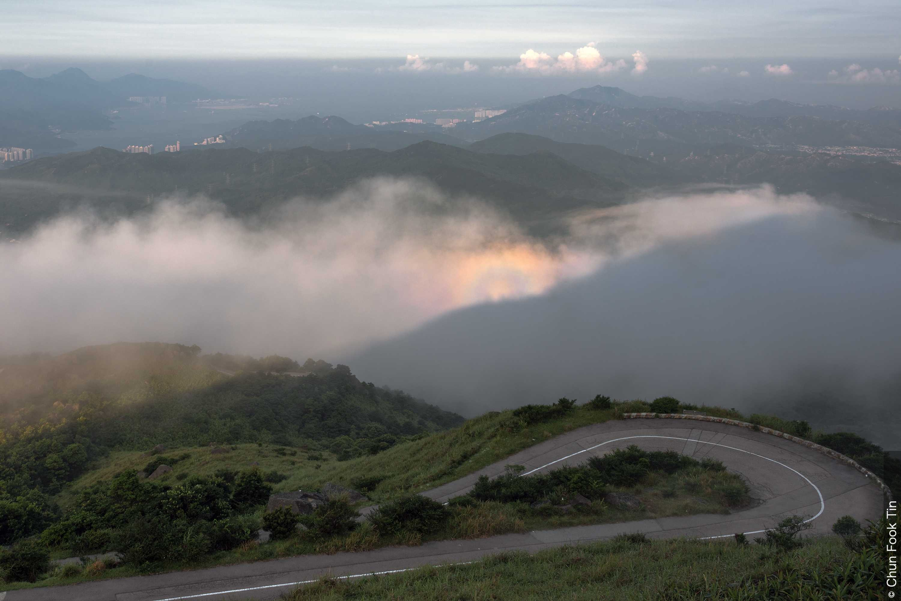
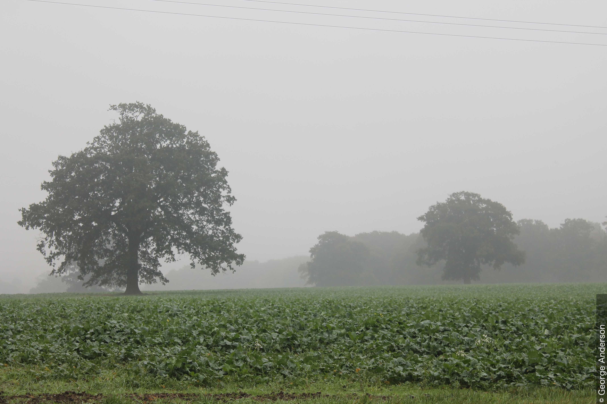

# 層雲 (St) (Howard 1803; Hildebrandsson 1887; Abercromby 1887)(Section 2.3.8)

## 目次
- [層雲の定義(Section 2.3.8.1)](#層雲の定義section-2381)
- [種(Section 2.3.8.2)](#種section-2382)
  - [層雲 霧状雲 (St neb) - Clayden 1905, CCH 1953(Section 2.3.8.2.1)](#層雲-霧状雲-st-neb---clayden-1905-cch-1953section-23821)
  - [層雲 断片雲 (St fra) - CEN 1930, CCH 1953(Section 2.3.8.2.2)](#層雲-断片雲-st-fra---cen-1930-cch-1953section-23822)
- [変種(Section 2.3.8.3)](#変種section-2383)
  - [層雲 不透明雲 (St op) – Besson 1921, CCH 1953(Section 2.3.8.3.1)](#層雲-不透明雲-st-op--besson-1921-cch-1953section-23831)
  - [層雲 半透明雲 (St tr) – CEN 1926, CCH 1953(Section 2.3.8.3.2)](#層雲-半透明雲-st-tr--cen-1926-cch-1953section-23832)
  - [層雲 波状雲 (St un) – Clayton 1896, CCH 1953(Section 2.3.8.3.3)](#層雲-波状雲-st-un--clayton-1896-cch-1953section-23833)
- [部分的な特徴と付随雲(Section 2.3.8.4)](#部分的な特徴と付随雲section-2384)
  - [降水雲 (praecipitatio)](#降水雲-praecipitatio)
- [層雲が形成される可能性のある雲(Section 2.3.8.5)](#層雲が形成される可能性のある雲section-2385)
- [層雲と他の類の類似した雲との主な違い(Section 2.3.8.6)](#層雲と他の類の類似した雲との主な違いsection-2386)
  - [St（層雲）とCi（巻雲）の比較(Section 2.3.8.6.1)](#st層雲とci巻雲の比較section-23861)
  - [St tr（層雲 半透明雲）とCs（巻層雲）の比較(Section 2.3.8.6.2)](#st-tr層雲-半透明雲とcs巻層雲の比較section-23862)
  - [St（層雲）とAs（高層雲）の比較(Section 2.3.8.6.3)](#st層雲とas高層雲の比較section-23863)
  - [St neb op（層雲 霧状雲 不透明雲）とNs（乱層雲）の比較(Section 2.3.8.6.4)](#st-neb-op層雲-霧状雲-不透明雲とns乱層雲の比較section-23864)
  - [St tr（層雲 半透明雲）とNs（乱層雲）の比較(Section 2.3.8.6.5)](#st-tr層雲-半透明雲とns乱層雲の比較section-23865)
  - [St（層雲）とSc（層積雲）の比較(Section 2.3.8.6.6)](#st層雲とsc層積雲の比較section-23866)
  - [St fra（層雲 断片雲）とCu fra（積雲 断片雲）の比較(Section 2.3.8.6.7)](#st-fra層雲-断片雲とcu-fra積雲-断片雲の比較section-23867)
- [物理的構成(Section 2.3.8.7)](#物理的構成section-2387)
- [説明的注釈と特別な雲(Section 2.3.8.8)](#説明的注釈と特別な雲section-2388)
- [From Image Gallery](#from-image-gallery)

## 層雲の定義(Section 2.3.8.1)
一般にかなり一様な底面を持つ灰色の雲層で、霧雨、雪、または雪あられを降らせることがある。雲を通して太陽が見える場合、その輪郭ははっきりと識別できる。層雲は、非常に低い温度の場合を除き、ハロ（暈）現象を生じない。

時として層雲は、ぼろぼろの断片の形で現れることがある。

    
    

    <strong>層雲 霧状雲 不透明雲 (Stratus nebulosus opacus)</strong> 
    一般に、層雲はかなり一様な底面を持つ灰色の雲層であり、霧雨、雪、または雪あられを降らせることがある。層雲を通して太陽（または月）が見える場合、その輪郭ははっきりと識別できる。この画像では、雲は一様に灰色で識別可能な形がなく、これが種である霧状雲（nebulosus）として特定される。また、太陽が見えないほど十分に濃密で不透明であり、変種を不透明雲（opacus）として定義している。
    

## 種(Section 2.3.8.2)

### 層雲 霧状雲 (St neb) - Clayden 1905, CCH 1953(Section 2.3.8.2.1)
霧状で灰色の、かなり一様な層雲の層。これは最も一般的な種である。

    
    

    <strong>層雲 霧状雲 (Stratus nebulosus)</strong> 
    層雲は一般に、かなり一様な底面を持つ灰色の雲層である。この画像では、種である霧状雲（nebulosus）の一様で特徴のない性質が見られる。離陸する航空機が層雲の層に消え始める様子から、低い雲底（27〜30 m（90〜100 ft））の拡散した性質がわかる。尾翼の先端は視界から消えているが、着陸装置はまだ見えている。航空機全体は2秒以内に雲の中に消えた。降水がなかったため、これは悪天候ではない典型的な層雲である。濃い靄（もや）によって水平視程が低下しているため、小屋、吹き流し、木々がはっきりと見えない。
    

### 層雲 断片雲 (St fra) - CEN 1930, CCH 1953(Section 2.3.8.2.2)
不規則でぼろぼろの断片の形で発生する層雲で、その輪郭は絶えず、しばしば急速に変化する。

    
    

    <strong>晴天の層雲 断片雲 (Stratus fractus of dry weather)</strong> 
    層雲は一般にかなり一様な底面を持つ灰色の雲層であるが、時としてぼろぼろの断片の形で現れることがある。この写真では、層雲は暗灰色で、不規則でぼろぼろの（引き裂かれた）雲の断片の外観を呈しており（1、2、3で見られる）、その輪郭は素早く絶え間なく変化していた。これらの特徴が種である断片雲（fractus）を定義している。さらに、この雲は降水によって生じたものではないため、晴天の層雲の断片雲である。これは、より白く高密度な積雲 断片雲（Cumulus fractus）と混同してはならない。また、層雲 断片雲は熱対流ではなく主に乱気流によって形成されるため、鉛直方向の発達がより小さいことを示している。画像には、高積雲 層状雲（Altocumulus stratiformis）の層や巻積雲（Cirrocumulus）の断片も見られる。
    

## 変種(Section 2.3.8.3)
### 層雲 不透明雲 (St op) – Besson 1921, CCH 1953(Section 2.3.8.3.1)
層雲の雲片、雲布、または雲層で、その大部分が非常に不透明であるため、太陽または月を完全に覆い隠すもの。これは最も一般的な変種である。

    
    

    <strong>層雲 霧状雲 不透明雲 (Stratus nebulosus opacus)</strong> 
    一般に、層雲はかなり一様な底面を持つ灰色の雲層であり、霧雨、雪、または雪あられを降らせることがある。層雲を通して太陽（または月）が見える場合、その輪郭ははっきりと識別できる。この画像では、雲は一様に灰色で識別可能な形がなく、これが種である霧状雲（nebulosus）として特定される。また、太陽が見えないほど十分に濃密で不透明であり、変種を不透明雲（opacus）として定義している。
    

### 層雲 半透明雲 (St tr) – CEN 1926, CCH 1953(Section 2.3.8.3.2)
層雲の雲片、雲布、または雲層で、その大部分が太陽または月の輪郭を明らかにするほど十分に半透明なもの。

    
    

    <strong>層雲 半透明雲 (Stratus translucidus)</strong> 
    層雲は一般にかなり一様な底面を持つ灰色の雲層であり、霧雨、雪、または雪あられを降らせることがある。この画像では、霧が上昇してかなり大きな層雲の雲片になっており、雲の特徴的な灰色が見られる。この層雲は全体的に十分に薄く、明確な輪郭で太陽の位置を明らかにしており、これが雲の変種を半透明雲（translucidus）として特定している。
    

### 層雲 波状雲 (St un) – Clayton 1896, CCH 1953(Section 2.3.8.3.3)
波打ち（起伏）を示す層雲の雲片、雲布、または雲層。この変種はあまり頻繁には発生しない。

    
    

    <strong>層雲 波状雲 (Stratus undulatus)</strong> 
    写真が撮影される数分前、連続した層雲の層（正午までは霧であったもの）が崩れ、層雲の雲片へと上昇した。画像の雲片は波状の構造をしており、これが変種である波状雲（undulatus）を特定している。この波打ち（起伏）は層積雲 波状雲（Stratocumulus undulatus）に似ているが、その発達を詳細に観察した結果、発生頻度の低い変種である層雲 波状雲であることが確認された。さらなる証拠として、雲底は比較的低く、西側の高台は霧に包まれたままである。写真の上部には、いくつかの高積雲（Altocumulus）が見える。
    

## 部分的な特徴と付随雲(Section 2.3.8.4)
層雲の唯一の部分的な特徴は降水雲（praecipitatio：霧雨、雪、または雪あられの形での降水）である。
### 降水雲 (praecipitatio)

    
    

    <strong>降水を伴う層雲 霧状雲 (Stratus nebulosus with precipitation)</strong> 
    層雲は一般にかなり一様な底面を持つ灰色の雲層であり、霧雨、雪、または雪あられを降らせることがある。この画像では灰色の雲にほとんど形がなく、種である霧状雲（nebulosus）として特定される。この雲は太陽を遮るほど十分に濃密であるため、変種である不透明雲（opacus）としても定義できる。また、白い斑点（雪片）で見られるように、部分的な特徴である降水雲（praecipitatio）を生じるほど十分に濃密でもある。
    

## 層雲が形成される可能性のある雲(Section 2.3.8.5)
層雲は、層積雲（Stratocumulus）が厚くなって低下し、かなり一様な底面を形成したときの変化（層雲 層積雲転化雲：St stratocumulomutatus）から形成されることがある。あるいは、底面は同じ高さにとどまるが、その凹凸や細分性を失うことで形成されることもある。

降水を伴う層積雲は、厚くなって低下し、その凹凸や細分性を失うことがある。これは層雲への変化ではない。降水を伴う層積雲が長期間にわたって凹凸や細分性を欠いている場合は、その雲が乱層雲（Nimbostratus）に変化したと見なす必要がある。

層雲はしばしば、地表の温暖化や風速の増加により、霧の層がゆっくりと上昇することによって形成される。

悪天候（通常、降水中およびその前後短時間に存在する条件）の層雲 断片雲は、しばしば高層雲、乱層雲、または積乱雲によって生成される（層雲 断片雲 高層雲派生雲：St fra altostratogenitus、層雲 断片雲 乱層雲派生雲：St fra nimbostratogenitus、または層雲 断片雲 積乱雲派生雲：St fra cumulonimbogenitus）。また、降水を伴う積雲から生じることもある（層雲 断片雲 積雲派生雲：St fra cumulogenitus）。

## 層雲と他の類の類似した雲との主な違い(Section 2.3.8.6)
### St（層雲）とCi（巻雲）の比較(Section 2.3.8.6.1)
層雲は、風によって粗い繊維の形（層雲 断片雲）にすり減らされた場合、時として巻雲（Cirrus）に似ることがある。その繊維は以下の特徴を持つ：

- 巻雲の繊維ほど白くない（太陽に向かって見た場合を除く）
- 巻雲の繊維ほど広がっていない
- 外観が急速に変化する（巻雲は変化が遅いことで知られている）

### St tr（層雲 半透明雲）とCs（巻層雲）の比較(Section 2.3.8.6.2)
薄い層雲（半透明雲：translucidus）は、以下の点で巻層雲（Cirrostratus）と区別される：

- 太陽に向かって見た場合を除き、それほど完全に白くないこと

### St（層雲）とAs（高層雲）の比較(Section 2.3.8.6.3)
層雲は、以下の点で高層雲（Altostratus）と区別される：

- 太陽の輪郭がぼやけていないこと。すなわち、太陽の円盤またはその一部が識別可能であること
- 太陽に向かって見た場合、薄い層雲には陰影がないこと（高層雲には常に陰影がある）
- 霧雨または雪あられの形での降水（高層雲では雨と凍雨）。雪は両方の雲で発生する可能性がある

### St neb op（層雲 霧状雲 不透明雲）とNs（乱層雲）の比較(Section 2.3.8.6.4)
層雲 霧状雲 不透明雲（厚いもの）は乱層雲（Nimbostratus）に酷似しており、非常に混同されやすい。これは以下の点で乱層雲と区別される：

- 乱層雲よりも明確に定義され、より一様な底面を持つこと
- 乱層雲の「湿った」外観とは対照的に、「乾いた」外観を持つこと
- 弱い霧雨、雪、または雪あられのみを降らせること（一方、乱層雲はほぼ常に雨、雪、または凍雨を降らせる）
- 通常、下層および中層の他の雲に先行されないこと（乱層雲はほぼ常に、通常は中層の他の雲の後に続くか、既存の雲から発達する）

### St tr（層雲 半透明雲）とNs（乱層雲）の比較(Section 2.3.8.6.5)
層雲 半透明雲（薄いもの）は、以下の点で乱層雲と区別される：

- 少なくともその最も薄い部分を通して太陽の円盤が識別できること（乱層雲は全体的に太陽または月を覆い隠す）

### St（層雲）とSc（層積雲）の比較(Section 2.3.8.6.6)
層雲は、以下の点で層積雲（Stratocumulus）と区別される：

- 融合しているか分離しているかを問わず、雲塊（要素）の痕跡がないこと

### St fra（層雲 断片雲）とCu fra（積雲 断片雲）の比較(Section 2.3.8.6.7)
層雲 断片雲は、以下の点で積雲 断片雲（Cumulus fractus）と区別される：

- 白さが少なく、密度が低いこと
- その形成が地表付近の空気の加熱ではなく主に乱気流によるものであるため、鉛直方向の発達がより小さいこと

## 物理的構成(Section 2.3.8.7)
層雲は通常、小さな水滴で構成される。層雲が非常に薄い場合、太陽または月の周りに光環（コロナ）を生じることがある。低温では、層雲は小さな氷の粒子で構成されることがある。この氷の雲は通常薄く、稀にハロ（暈）現象を生じることがある。

層雲は、高密度または厚い場合、しばしば霧雨のしずくを含み、時には雪や雪あられを含む。その際、暗く、あるいは威圧的な外観を呈することがある。

光学的厚さが小さい層雲（通常は変種の半透明雲）は、太陽から90度以上の角度で見た場合、しばしば霧のような煙がかった灰色の色調を示す。

## 説明的注釈と特別な雲(Section 2.3.8.8)
層雲は、対流圏下層における冷却と、風による乱気流の複合的な影響下で形成される。

陸上では、冷却は夜間の放射冷却の結果である可能性があり、これは空が晴れて風が弱いときに特に顕著である。または、より冷たい地面上へ比較的暖かい空気が移流することによる。海上では、冷却は主に、より冷たい水面上へ比較的暖かい空気が移流することによる。

層雲は、様々な輝度を持つ多かれ少なかれ結合した雲の断片として観察されることがある。これらの層雲 断片雲は、より一般的な広範囲にわたる一様な層雲層の形成時または消散時における過渡的な段階を構成する。この過渡的な段階は通常非常に短い。

層雲 断片雲は、高層雲、乱層雲、積乱雲、および降水を伴う積雲の下に付随雲（ちぎれ雲：pannus）として形成されることもある。これらは、これらの雲の下にある湿った層における乱気流の結果として発達する。

層雲は、滝によって水が飛沫に砕かれる結果として、大きな滝の近くで局地的に発達することがある。この層雲は、適切な種、変種、部分的な特徴によって分類された後、滝派生雲（cataractagenitus）が付けられる。

層雲は、樹冠からの蒸発および蒸散による湿度の増加の結果として、森林上で局地的に発達することがある。この層雲は、適切な種、変種、部分的な特徴によって分類された後、森林派生雲（silvagenitus）が付けられる。

## From Image Gallery

<strong>移流霧：上空からの海霧 (Advection fog:sea fog from the air)</strong> 
英国南西部の地上空からのこの眺めは、イギリス海峡のライム湾の大部分を覆う広範囲な海霧/低い層雲を示している。海霧は移流霧の一種であり、比較的暖かく湿った空気がより冷たい海面の上を移動（移流）し、地表付近の空気の温度がより冷たい水との接触によって飽和状態まで冷却されたときに形成される。

霧は海とすぐ近くの海岸線に限定されており、低い層雲へと上昇し、内陸部では容易に消散した。

<strong>層雲 断片雲 森林派生雲 (Stratus fractus silvagenitus)</strong> 
このタイムラプスは、スイス中部の森林地帯上空における午前中半ばの53分間を捉えている。強い夜間の放射冷却と、過去3日間の雨による高い水分含有量により、冷却が進み、早朝に層雲と霧が形成された。

タイムラプスは、層雲が一部で消散する一方で、他の場所では上昇し、晴天の積雲 断片雲へと変化していくところから始まる。層雲と霧の消散により、局地的な地表の加熱が起こり、熱上昇気流が確立された。樹冠からの蒸発および蒸散によって高められた高い水分含有量により、熱上昇気流は冷却され、樹冠のすぐ上の高さで飽和に達した。

これは、新しい雲の母雲（派生雲）である森林派生雲（silvagenitus）の例であり、この場合は層雲 断片雲 森林派生雲である。

<strong>上空から見た層雲 (Stratus viewed from above)</strong> 
ハンガリーのピリス山から撮影されたこのタイムラプス動画に示されているように、上空から見ると、層雲の上面は一般に（通常は短い波長の）波打ち（起伏）を示す。強風の場合、この波打ち（起伏）はより顕著になる。層雲の頂上は高度約500 mであると推定された。

<strong>滑昇霧：山霧 (Upslope fog:hill fog)</strong> 
滑昇霧は、空気が上昇する地形に沿って上方に流れ、その飽和温度まで断熱冷却されたときに形成される。この写真では、そのようにして形成された層雲が高台を覆っている。

滑昇霧は山霧の一種である。下から、あるいはこの写真のように横から見ると、それは層雲として見える。しかし、丘を登り雲の中へと上昇していく人にとっては、視程が低下し霧となる。

<strong>スペイン・バルセロナ近郊の層雲 波状雲 (Stratus undulatus near Barcelona, Spain)</strong> 
時として層雲は不規則な雲片の形で現れる。この画像では、不規則な雲片あるいは雲の切れ端が顕著な波打ち（起伏）を示しており（1と2）、したがって波状雲（undulatus）という変種に指定される。これは比較的まれな層雲の形である。現地の地形は海抜300〜500 mの範囲にあり、一方、近くの高層気象観測（上層大気のサウンディング）では約1 000 mに3 °Cの逆転層が見られる。塔の前にある雲の切れ端から、その高さは地上約200 mであると推定できる。この波打ち（起伏）は、蓋となる逆転層の下で、丘陵を越える空気の強制的な上昇と下降の結果である可能性が高い。画像の上部では、広がる航空機の飛行機雲が4と5で見られる。

<strong>層雲 霧状雲 不透明雲 降水雲 (Stratus nebulosus opacus praecipitatio)</strong> 
層雲は一般にかなり一様な底面を持つ灰色の雲層であり、霧雨、雪、または雪あられを降らせることがある。この画像では、雲は一様に灰色で識別可能な形がなく、種である霧状雲（nebulosus）として特定される。また、太陽が見えないほど十分に濃密であり、変種を不透明雲（opacus）として定義している。霧雨によって視程が推定3 kmにまで低下しているため、部分的な特徴である降水雲（praecipitatio）も追加できる。画像撮影時のシーロメーターの測定値は、雲底が60〜120 mであることを示していた。

<strong>降水雲を伴う層雲 断片雲 (Stratus fractus with praecipitatio)</strong> 
この画像は、層雲に関連する一般的な灰色を示している。この画像に見られるように、時として層雲は種である断片雲（fractus）のぼろぼろの、あるいは不規則な縁を示すことがある。断片雲は層雲形成の過渡的な段階である可能性があり、この場合は、遠くにより明るい灰色として見える、より雲底の高い層雲 霧状雲と融合しつつある。雲の不透明な性質が変種である不透明雲（opacus）を定義し、一方で、視程を推定3 kmまで低下させている霧雨として、部分的な特徴である降水雲（praecipitatio）が見られる。

<strong>層雲 霧状雲2 (Stratus nebulosus2)</strong> 
層雲は一般にかなり一様な底面を持つ灰色の雲層として見られ、霧雨、雪、または雪あられを降らせることがある。この写真は、種である霧状雲（nebulosus）の一様でほとんど特徴のない雲層を示している。背景の丘陵はかろうじて見える程度であり、濃いもやの存在を示している。また、画像撮影時に弱い霧雨が降っていたため、この雲は悪天候の層雲と見なされる。

<video src="5735_vid_default_clouds.mp4" controls width="80%">
</video>

<strong>5735_vid_default_clouds</strong> 
動画の右下の丘陵上にある層雲の動きと、上部にある積雲および層積雲の動きとのコントラストに注目されたい。

<strong>層雲 – 雲海 (Stratus – mar de nubes:sea of clouds)</strong> 
地上から見ると、層雲は一般に一様な底面を持つ灰色の雲であり、ほとんど形を示さない。上空から見ると、雲頂は太陽光に照らされてはるかに明るく、必ずしも一様ではなく、しばしば波打ち（起伏）を示す。この画像は、マドリードの北、グアダラマ山脈にある標高2 428 mのペニャララ山頂から撮影された。山脈のより高い峰々が、海に浮かぶ氷山のように雲層から突き出ている。遠くから見ると雲頂はかなり平坦に見えるが、近づいて見るとよく形成された波打ち（起伏）が見える。雲の厚さは約400 m（1 200 ft）と推定される。タイムラプス映像では通常、雲の波打ち（起伏）が海面の波のように移動する様子が明らかになり、これは「mar de nubes（雲海）」と呼ばれている。

<strong>悪天候の層雲 断片雲 (Stratus fractus of wet weather)</strong> 
不規則でぼろぼろの層雲 断片雲（悪天候）の切れ端が、広範囲で厚い乱層雲の層の明るい灰色に対して際立っている。数カ所に、特徴的な水平の底面とより大きな鉛直方向の広がりを持つ、積雲 断片雲（悪天候）の雲片がある。

弱い雨が9時間降り続いていた。その後1時間の間に、乱層雲の底面が上昇し東へ後退するにつれて雨は上がった。 

<strong>層雲 断片雲 滝派生雲 (Stratus fractus cataractagenitus)</strong> 
滝によって水が飛沫に砕かれる結果として、大きな滝の近くで局地的に雲が形成されることがある。落下する水によって引き起こされる下降気流は、空気の局地的な上昇運動によって補償され、そこから雲が凝結することがある。

この写真では、滝の正面およびそのすぐ上に広範囲の飛沫がある（1および2で見られる）。しかし、よく観察すると、上昇運動と微風によって飛沫がより高く空気中に運ばれているものの、雲が凝結し始めている、明確でより高密度な領域がいくつかある（3および4で見られる）。これが層雲 断片雲 滝派生雲である。上空の湿度環境に応じて、これらのぼろぼろの切れ端は消散するか、あるいは積雲 断片雲へと移行し、後におそらく他の積雲の種へと移行する。

<strong>層雲 断片雲 滝派生雲2 (Stratus fractus cataractagenitus2)</strong> 
滝によって水が飛沫に砕かれる結果として、大きな滝の近くで局地的に雲が形成されることがある。落下する水によって引き起こされる下降気流は、空気の局地的な上昇運動によって補償され、そこから雲が凝結することがある。

この写真は、滝の真正面の低い高度にある広範囲の飛沫と、上昇する空気の動きや微風によって空気中へ運ばれる飛沫を示している。しかし、よく観察すると、ぼろぼろの雲の切れ端が凝結し始めている領域が3つある（3、4、5）。これが層雲 断片雲 滝派生雲である。雲がさらに発達した場合、最初は積雲 断片雲へ移行し、さらに発達すれば他の積雲の種へと移行する可能性がある。

上空には積雲 扁平雲といくつかの巻雲がある。空で優勢な雲は層雲 断片雲ではなく積雲 扁平雲であるため、コードはCL = 1となる。

<strong>層雲 – 雲海 (Stratus – sea of clouds)</strong> 
この画像は、フランスのブール＝サン＝モーリス近郊にあるレ・ザルクのスキースロープから見た雲海（mer de nuages）を示している。それは少なくとも20 kmにわたって広がり、手前で終わって鋭い垂直な縁からこぼれ落ちている。この雲は局地的な谷間における放射冷却の条件下で形成され、安定した条件の下でそこに閉じ込められた。雲海は層積雲または層雲に関連付けられることがある。ここでの雲の上面は比較的滑らかに見え、これは層雲や風が弱い場合により一般的である。風が一般に強いため、層積雲の上面は荒れた海の波のように、より多くの波打ち（起伏）を示す傾向がある。遠くの山の上に少量の積雲 扁平雲が見える。

<strong>悪天候の層雲 断片雲2 (Stratus fractus of wet weather2)</strong> 
層雲 断片雲は不規則でぼろぼろの雲の切れ端の形で発生し、その輪郭は絶え間なく、しばしば急速に変化する。この画像では、降水を伴う積乱雲の下の湿った乱気流の中で層雲 断片雲が形成された。1と2にある積乱雲の暗い底面の下に、ぼろぼろの切れ端をはっきりと見ることができる。

<strong>層雲 断片雲 森林派生雲および高積雲 (Stratus fractus silvagenitus and Altocumulus)</strong> 
自然現象または人間の活動の結果として生じる、特定の、しばしば局地的な生成要因の結果として雲が形成または成長する特別なケースがある。自然のケースの1つは、樹冠からの蒸発および蒸散によって引き起こされる湿度の増加により、森林上で局地的に雲が発達する場合である。この写真では、1と2で森林の上に立ち上る層雲の雲片が見える。不規則でぼろぼろの雲の性質が種を断片雲（fractus）として定義し、雲が森林上で形成されているため、特別な雲の名前である森林派生雲（silvagenitus）を追加することができる。過去数時間におけるその地域の雷雨と雨が、相対湿度を上昇させていた。画像には、高積雲 層状雲の層も見られる。

<strong>もや、滑昇霧を形成する層雲を伴う (Mist, with Stratus forming upslope fog)</strong> 
風向の変化が香港空港（中国）に湿った海洋性の空気をもたらし、視程の急速な悪化とともに、丘陵上での滑昇層雲の形成を引き起こした。

空港の気象観測者の視点からは、もやが報告された。0700時の卓越視程は6 kmであったが、西側では1 600 mに悪化していた。0730時と0800時における一般的な視程は、それぞれ2 900 mと2 400 mであった。 

湿った空気が丘陵を上昇するにつれて、空気がその飽和温度まで断熱冷却されることによって層雲が形成された。その結果、滑昇霧となった。滑昇霧は山霧の一種である。下から見ると、層雲として見える。しかし、雲の中へと丘を登る人にとっては、その人の視点からは視程が低下して霧となる。

<strong>KH波雲を伴う海霧 (Sea fog with fluctus)</strong> 
米国カリフォルニア州サンフランシスコからの日没直後のこの眺めは、太平洋上の海霧を示している。霧の頂上にはケルビン・ヘルムホルツ波（KH波雲：fluctus）として知られる渦巻きまたは砕ける波がある（2と3で見られる）。

海霧は移流霧の一種であり、比較的暖かく湿った空気がより冷たい海面の上を移動したときに形成される。空気の温度は、冷たい表面との接触によって飽和状態まで冷却される。

KH波雲（fluctus）は、霧の頂上を横切るウインドシア（風のシアー）によって引き起こされる、比較的短命な波状の形成物である。

<strong>層雲 波状雲 人工雲 (Stratus undulatus homogenitus)</strong> 
写真の下部では、石炭を使用する発電所の複数の高い煙突（すべて高さ150 m）から発生する熱上昇気流（2、3、4、5で見られる）から冷たい地表の空気中で凝結した、約200〜250 mにある蛇行した（波打つ）雲がこの画像に描かれている。これらの雲は、下層の逆転層の下の安定した条件において、煙突の風下に向かって波打つように伸びている（サウンディングを参照）。雲の類は層雲である。特定の種はなく、変種は波状雲（undulatus）である。これらの雲は人間の活動の直接的な結果として形成されたため、完全な分類は層雲 波状雲 人工雲（Stratus undulatus homogenitus）となる。

写真の中央部および上部にある層雲は、画像の枠外右側の風景がフィンランド湾に覆われており、風上100 km以上にわたって産業的な発生源がないため、自然由来のものと見なされる。

<strong>上空から見た層雲2 (Stratus viewed from above2)</strong> 
香港の最高峰である大帽山（タイモシャン：957 m）の下に見えるのは層雲の層である。層雲の上面は一般に（通常は短い波長の）波打ち（起伏）を示し、時として隆起を示すことがある。強風の場合、この波打ち（起伏）はより顕著になる。

写真の上部には層積雲の層がある。雲の広範囲な性質から、種は層状雲と特定される。大きな丸みを帯びた塊の層は太陽を遮るほど十分に不透明である（不透明雲）が、雲塊（要素）の間の隙間からいくらかの太陽光が透過しているのが見え、すきま雲という変種でもあることを示唆している。暗い青みがかった筋と光の筋は、薄明光線（クレプスキュラー・レイ）の一形態である。

<strong>滑昇層雲 (Upslope Stratus)</strong> 
この画像は、かなり一様な層雲 霧状雲の雲片を上空から見た様子を示している。雲の下には急斜面があり、100〜150 m（300〜400 ft）の高さまで急激に立ち上がっている。海から風上の海岸に近づく湿った空気はこの障壁を上昇することを強いられ、それにより空気が露点まで冷却され、この滑昇雲の雲片の形成が誘発された。場合によっては、雲が下がって山頂を滑昇霧で覆うこともある。はるか右側、斜面の高さがそれほどない場所では雲は形成されていない。内陸に少し入ったところで、雲は小さくぼろぼろの層雲 断片雲の破片に分かれている。背景にある、鉛直方向の広がりが小さく、平らに見える雲の列は積雲 扁平雲である。

<strong>層雲：海霧と積雲 (Stratus:sea fog and Cumulus)</strong> 
海面上の海霧である可能性のある低い層雲が、英国スコットランド西部のオーバン近郊にあるリズモア島の西岸に打ち寄せている。積雲 並雲も、はるか遠く、北にあるスコットランド本土の山々の上で発達しているのが見える。空には少量の巻雲もある。

<strong>光輪 (Glory)</strong> 
太陽を背にして高い見晴らしの良い場所から見下ろすと、眼下の谷にある層雲の上に光輪（グローリー）が見える。光輪は、小さな水滴で構成される雲や霧の上に映る、観察者自身の影の周りに見られる1つまたは複数の色付きの輪の連なりである。これは、小さな水滴内での太陽光の屈折、反射、および回折の結果として発生する。この現象は、対日点を中心として太陽の正反対の方向でのみ発生する。そのため、高台から低い雲を見下ろす際に観察されるのである。

<strong>層雲 人工雲 (Stratus homogenitus)</strong> 
この写真の雲は、撮影者の位置から2 km離れた場所にある石炭を使用する発電所からの熱上昇気流によって生成された。熱上昇気流は、最も高い煙突（150 m）の頂上レベルまでしか上昇しない。その後、凝結した雲は広くて平らな層雲の層へと広がり、東北東からの一定の高さの風に乗って移流する。急速に平らになった理由は、強い下層の逆転層であった（サウンディングを参照）。画像に見られる雲の水平方向の広がりはわずか2 kmであるが、強い逆転層がある場合、この場所で生成されたそのような雲が20〜30 kmの距離まで広がることは珍しくない。層雲は人間の活動の直接的な結果として形成されたため、層雲 人工雲（Stratus homogenitus）という分類が与えられる。

<strong>層雲 滝派生雲と飛沫弓 (Stratus cataractagenitus and spray bow)</strong> 
滝によって水が飛沫に砕かれる結果として、大きな滝の近くで局地的に雲が形成されることがある。落下する水によって引き起こされる下降気流は、空気の局地的な上昇運動によって補償され、そこから雲が凝結することがある。

この写真は、水飛沫の滴による太陽光の屈折によって形成された飛沫弓（spray bow）を示しているが、その上にある上昇気流が凝結して雲を形成している。これが層雲 滝派生雲である。

<strong>もや (Mist)</strong> 
午前中の遅い時間に撮影されたこの写真の時点では、夜間の霧がゆっくりと上昇してもやおよび低い層雲になっていた。水平視程は1 100 mと推定された。

もやとは、地表における水平視程を1 km以上にまで低下させる、空気中に浮遊する非常に小さな、通常は微細な水滴のことである。視程が1 km未満の場合、その視界不良は霧によるものである。実際のところ、もやは「軽い霧」の同義語と考えられている。

右側の木々の並びは、観察地点から約450 m離れている。遠くには800 mの距離にある木々が見え、左端の1 100 m付近にある遠くの地表の特徴が辛うじて識別できる。曇り空の低い雲層は層雲 霧状雲（Stratus nebulosus）であり、太陽が見えないため、変種は不透明雲（opacus）である。

