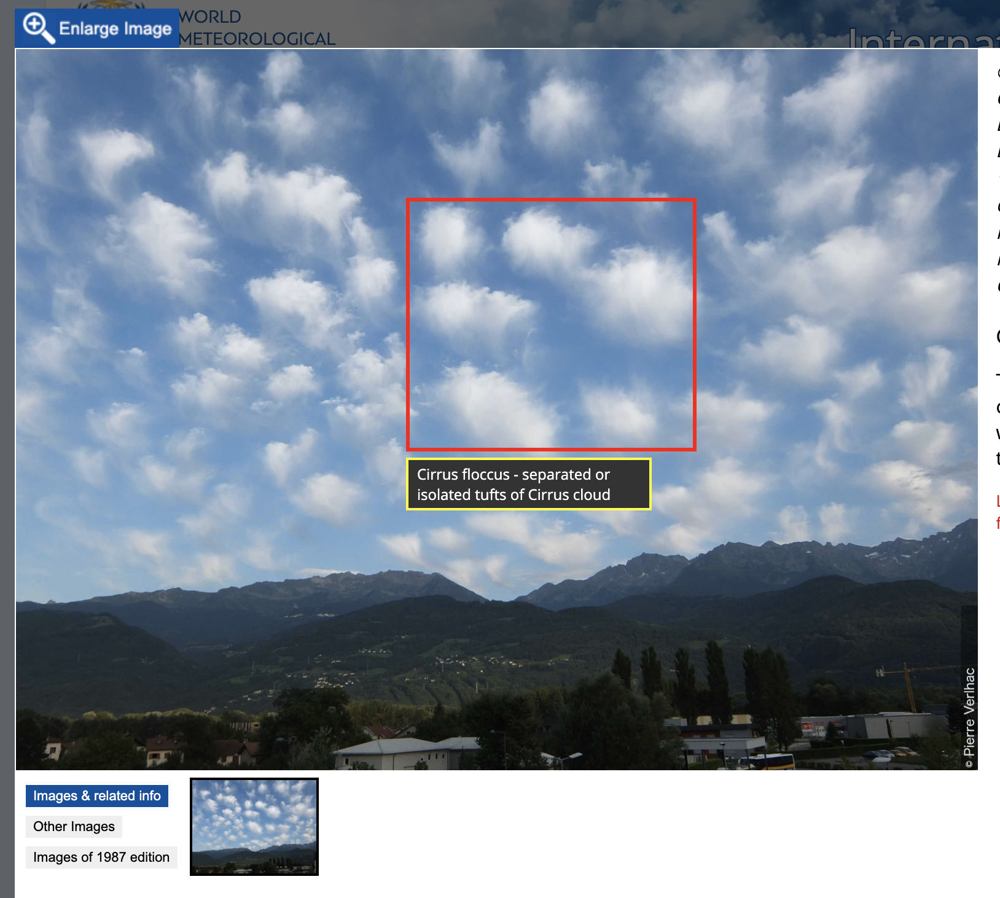

# 翻訳版作成にあたって

## 謝辞
この翻訳は，私（北の黒猫）および各種AI群によって作成された． 
Gemini Proは主に翻訳を，Claudeはcss，htmlへの整形，Gemini Flash，SWE(Windsurf提供)はMarkdown原版での様々なコード補完を行ってくれた．このWMO「国際雲図帳」の翻訳版作成は，AI群の協力なしには実現できなかっただろう．協力してくれたAI群にこの場を借りて感謝申し上げる．

## 制約
しかしながら，時間的制約からいくつかの重要な元サイトの機能を再現できていない．特に，元サイトの主たる機能の一つである写真にアノテーションを付す機能（以下画像）および，その写真が撮られた際の気象学的状況を示す機能は再現できなかった．

写真にアノテーションを付す機能

アノテーション機能については，技術的に不可能であるというよりは，時間的制約に依るところが大きい．全ての写真についてアノテーションが付せられた状況をスクリーンショットする必要があり，ICAの写真ギャラリーの膨大な写真全てにそれを行うのは現実的に不可能である．

## 今後
翻訳文もほぼチェックを行っていないため，誤りが存在する可能性がある．誤りやおかしな訳があった場合は連絡を頂きたい．アノテーションやその他の機能については，On Demandで実装することを検討している．この写真にはアノテーションを付すべきだと感ずるものがあった場合は，連絡を頂きたい．